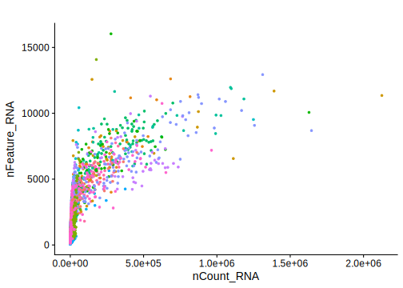
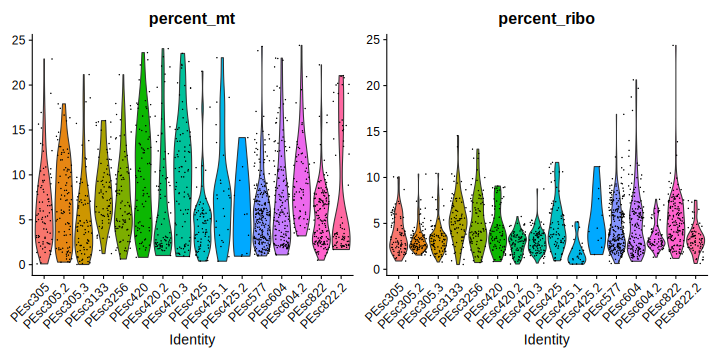
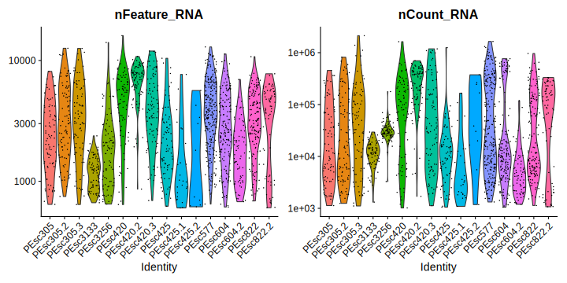
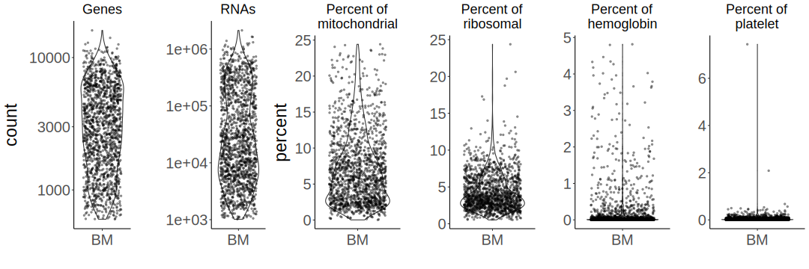
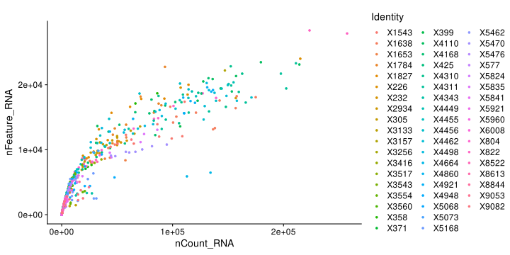
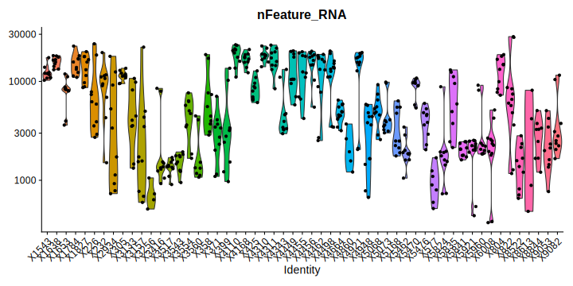
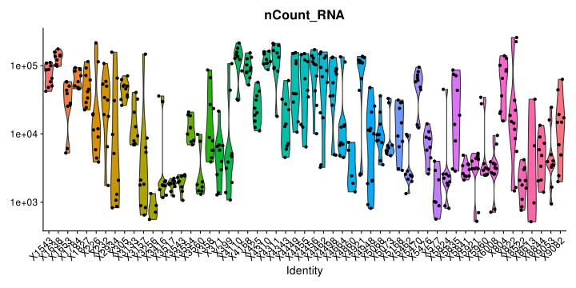

This script identifies lineages of EVs among cells from pleural effusion
samples.

------------------------------------------------------------------------

## Prepare the workign enviornment:

-   install and load packages
-   set %notin% and %notlike%
    -   set ggplot’s theme
-   set the working directory
-   set a plan for multithreading

``` r
#install.packages("Seurat")
#install.packages("remotes")
#BiocManager::install(version = '3.16')
#BiocManager::install("glmGamPoi")
#remotes::install_github("stephenturner/annotables")

library(Seurat)
library(dplyr)
library(data.table)
library(Matrix)
library(ggplot2)
library(ggpubr)
library(future)
library(annotables) # for turning Ensembl ID to symbol
library(sctransform) # for normalization
#library(glmGamPoi) # for normalization

"%notin%" <- Negate("%in%")
"%notlike%" <- Negate("%like%")


theme_set(new = theme_classic())
theme_update(
  axis.text.x = element_text(vjust = 0.5),
  strip.background = element_rect(fill = '#FFFFFF'),
plot.title = element_text(hjust = 0.5, size = 25),
axis.title = element_text(size = 23),
axis.text = element_text(size = 20),
legend.text = element_text(size = 18),
legend.key.size = unit(2, 'line'),
legend.title = element_text(size = 20)
)

wd <- "/disk2/user/radgro/projects/2023-06_pesc_analysis"

knitr::opts_knit$set(root.dir = wd)


# plan("multicore", workers = 8)
# plan()
```

``` r
# A demonstration of advantages of a sparse matrix ("d" for data).
d_dc <- as.matrix(read.csv("data/DC_matrix.txt", sep = "\t"))
s1 <- object.size(d_dc)
d_dc <- as(d_dc, "sparseMatrix")
s2 <- object.size(d_dc)
s1-s2
```

## Load and prepare the data and metadata.

``` r
# for EVs
d_dc <- as.sparse(read.csv("data/DC_matrix.txt", sep = "\t"))

# for cells
d_c <- as.sparse(read.csv("data/PEsc_matrix.txt", sep = "\t"))

# Gene names
gt <- fread("data/genes_title.txt", sep = "\t")

# get gene symbols from annotables
gt_s <- setDT(grch38[, c("ensgene", "symbol")])
colnames(gt_s)[1] <- "Geneid"
```

Join gene names with gene symbols and change symbols for Geneid when the
grch38 doesn’t include any particular ID, mult set to ‘first’, to
exclude duplicates/synonyms.

``` r
gt_mito <- readLines("code_for_daniel/human_mitochondrial_genes_list.txt")[-1] # Could be used for Daniel's approach
gt_join[Geneid %in% gt_mito] # same genes are mitochondrial here and in Daniel's table - all is fine
```

Insert joined gene names and symbols into datasets.

``` r
rownames(d_c) <- gt_sym
rownames(d_dc) <- gt_sym
```

# QC and filtering of cells.

``` r
ds_c <- CreateSeuratObject(count = d_c, min.cells = 0, min.features = 1, project = "cells")
```

    ## Warning: Non-unique features (rownames) present in the input matrix, making
    ## unique

    ## Warning: Feature names cannot have underscores ('_'), replacing with dashes
    ## ('-')

``` r
rm(d_c)
suppressMessages(gc())
```

    ##            used  (Mb) gc trigger   (Mb)  max used   (Mb)
    ## Ncells  3272220 174.8    5028774  268.6   5028774  268.6
    ## Vcells 21792047 166.3  236431272 1803.9 293687900 2240.7

``` r
ds_c <- PercentageFeatureSet(ds_c, pattern = "^MT-", col.name = "percent_mt")
ds_c <- PercentageFeatureSet(ds_c, "^RP[SL]", col.name = "percent_ribo")
ds_c <- PercentageFeatureSet(ds_c, "^HB[^(P)]", col.name = "percent_hb")
ds_c <- PercentageFeatureSet(ds_c, "PECAM1|PF4", col.name = "percent_plat")
```

## Plotting

### Main QC plots

``` r
VlnPlot(ds_c, features = c('nCount_RNA','nFeature_RNA', 'percent_mt', 'percent_hb', "percent_ribo", "percent_plat"), pt.size = 1.3, ncol = 1) +  NoLegend()
```


### Other QC plots

``` r
FeatureScatter(ds_c, "nCount_RNA", "nFeature_RNA", pt.size = 1, plot.cor = F) + scale_x_continuous(labels = scales::scientific) + NoLegend()
```



------------------------------------------------------------------------

## Filtering

How many cells have more than 800 RNAs or more than 1000 RNAs and genes
found.

``` r
length(WhichCells(ds_c, expression = nCount_RNA > 800))
```

    ## [1] 1765

``` r
length(WhichCells(ds_c, expression = nCount_RNA > 1000 & nFeature_RNA > 600))
```

    ## [1] 1622

Filter out cells that have \<=1000 features and UMIs as they are the
only ones You can work with (subsetting on the percentages of different
transcript types can be done later).

The percent of ribosomal genes might be low due to low transcriptional
activity of the cells (5%, which was a threshold used before, removes
too many cells).

``` r
ds_cf <- subset(x = ds_c, subset = nCount_RNA > 1000 & nFeature_RNA > 600 & percent_mt < 25 & percent_ribo > .5
                & percent_hb < 5)
rm(ds_c)
suppressMessages(gc())
```

    ##            used  (Mb) gc trigger   (Mb)  max used   (Mb)
    ## Ncells  3483069 186.1    6503105  347.4   5028774  268.6
    ## Vcells 30065482 229.4  189145018 1443.1 293687900 2240.7

### Find which genes contribute to the nCount_RNA the most

``` r
C <- ds_cf@assays$RNA@counts
C <- Matrix::t(Matrix::t(C)/Matrix::colSums(C)) * 100
most_expressed <- order(apply(C, 1, median), decreasing = T)[20:1]

par(mar=c(5,10,1,1))
boxplot(as.matrix(t(C[most_expressed,])), cex = 1, las = 1, xlab = "% total count per cell",
        col = (scales::hue_pal())(20)[20:1], horizontal = TRUE)
```


### QC plotting of filtered reads

``` r
VlnPlot(ds_cf, features = c('percent_mt', "percent_ribo"))
```



``` r
VlnPlot(ds_cf, features = c('nFeature_RNA','nCount_RNA'), log = T) ## UGLY
```



### QC plotting of filtered reads with ggplot

``` r
p1 <- ggplot(as.data.table(ds_cf$nFeature_RNA)) +
  geom_violin(aes(x = "BM", y = V1)) +
  geom_jitter(aes(x = "BM", y = V1), size = .9, alpha = .4) + 
  scale_y_log10() +
  ggtitle('Genes') +
  theme(plot.title = element_text(size = 18)) +
  xlab("") +
  ylab("count")

p2 <- ggplot(as.data.table(ds_cf$nCount_RNA)) +
  geom_violin(aes(x = "BM", y = V1)) +
  geom_jitter(aes(x = "BM", y = V1), size = .9, alpha = .4) + 
  scale_y_log10() +
  ggtitle('RNAs') +
  theme(plot.title = element_text(size = 18)) +
  xlab("") +
  ylab("")

p3 <- ggplot(as.data.table(ds_cf$percent_mt)) +
  geom_violin(aes(x = "BM", y = V1)) +
  geom_jitter(aes(x = "BM", y = V1), size = .9, alpha = .4) + 
  ggtitle('Percent of\nmitochondrial') +
  theme(plot.title = element_text(size = 18)) +
  xlab("") +
  ylab("percent")

p4 <- ggplot(as.data.table(ds_cf$percent_ribo)) +
  geom_violin(aes(x = "BM", y = V1)) +
  geom_jitter(aes(x = "BM", y = V1), size = .9, alpha = .4) + 
  ggtitle('Percent of\nribosomal') +
  theme(plot.title = element_text(size = 18)) +
  xlab("") +
  ylab("")

p5 <- ggplot(as.data.table(ds_cf$percent_hb)) +
  geom_violin(aes(x = "BM", y = V1)) +
  geom_jitter(aes(x = "BM", y = V1), size = .9, alpha = .4) + 
  ggtitle('Percent of\nhemoglobin') +
  theme(plot.title = element_text(size = 18)) +
  xlab("") +
  ylab("")

p6 <- ggplot(as.data.table(ds_cf$percent_plat)) +
  geom_violin(aes(x = "BM", y = V1)) +
  geom_jitter(aes(x = "BM", y = V1), size = .9, alpha = .4) + 
  ggtitle('Percent of\nplatelet') +
  theme(plot.title = element_text(size = 18)) +
  xlab("") +
  ylab("")


ggarrange(p1, p2, p3, p4, p5, p6, nrow = 1)
```



``` r
# ggarrange(ggarrange(p1, p2), 
          # ggarrange(p3, p4, p5, p6, ncol = 2, nrow = 2, widths = 2),
          # nrow = 2)

#ggsave("qc_violins_filt_p3.png", qcplots, device = 'png', dpi = "retina", width = 21, height = 12, bg = "white")
```

------------------------------------------------------------------------

# QC and filtering of EVs.

``` r
ds_dc <- CreateSeuratObject(count = d_dc, min.cells = 0, min.features = 1, project = "ev")
```

    ## Warning: Non-unique features (rownames) present in the input matrix, making
    ## unique

    ## Warning: Feature names cannot have underscores ('_'), replacing with dashes
    ## ('-')

``` r
rm(d_dc)
suppressMessages(gc())
```

    ##            used  (Mb) gc trigger   (Mb)  max used   (Mb)
    ## Ncells  3524338 188.3    6503105  347.4   6503105  347.4
    ## Vcells 38604068 294.6  254963849 1945.3 293687900 2240.7

``` r
ds_dc <- PercentageFeatureSet(ds_dc, pattern = "^MT-", col.name = "percent_mt")
ds_dc <- PercentageFeatureSet(ds_dc, "^RP[SL]", col.name = "percent_ribo")
ds_dc <- PercentageFeatureSet(ds_dc, "^HB[^(P)]", col.name = "percent_hb")
ds_dc <- PercentageFeatureSet(ds_dc, "PECAM1|PF4", col.name = "percent_plat")
```

``` r
VlnPlot(ds_dc, features = c('nCount_RNA','nFeature_RNA', 'percent_mt', 'percent_hb', "percent_ribo", "percent_plat"), pt.size = 1.3, ncol = 1) +  NoLegend()
```


### Other qc plots

``` r
FeatureScatter(ds_dc, "nCount_RNA", "nFeature_RNA", pt.size = 1, plot.cor = F) + 
  scale_x_continuous(labels = scales::scientific) + 
  scale_y_continuous(labels = scales::scientific)
```


\_\_\_ ## Filtering

``` r
length(WhichCells(ds_dc, expression = nFeature_RNA > 100))
```

    ## [1] 569

``` r
length(WhichCells(ds_dc, expression = nFeature_RNA > 100 & nCount_RNA > 500))
```

    ## [1] 541

``` r
# most common genes for cells:
sort(Matrix::rowSums(ds_cf), decreasing = T)[1:10]
```

    ## MT-RNR2  MALAT1    ACTB MT-RNR1    CD74  MT-ND4  MT-CYB     FTL     B2M    PSAP 
    ## 1142527  795294  738633  664680  579049  568926  517594  490462  480441  432383

``` r
# most common genes for EVs
sort(Matrix::rowSums(ds_dc), decreasing = T)[1:10]
```

    ##         HELLPAR         MT-RNR2 ENSG00000279010 ENSG00000280156 ENSG00000279184 
    ##           72147           57170           55177           47776           36823 
    ##         MT-RNR1 ENSG00000279080 ENSG00000279738          MT-ND5          MT-ND4 
    ##           34482           29941           28346           23232           23109

## filter out EV samples that have x features and UMIs

``` r
ds_dcf <- subset(x = ds_dc, subset = nCount_RNA > 500 & nFeature_RNA > 100 & percent_mt < 90 & percent_ribo < 90)
rm(ds_dc)
suppressMessages(gc())
```

    ##            used  (Mb) gc trigger   (Mb)  max used   (Mb)
    ## Ncells  3525613 188.3    6503105  347.4   6503105  347.4
    ## Vcells 44663805 340.8  203971080 1556.2 293687900 2240.7

## Find which genes contribute to the nCount_RNA the most

``` r
C <- ds_dcf@assays$RNA@counts
C <- Matrix::t(Matrix::t(C)/Matrix::colSums(C)) * 100
most_expressed <- order(apply(C, 1, median), decreasing = T)[20:1]

par(mar=c(5,10,1,1))
boxplot(as.matrix(t(C[most_expressed,])), cex = 1, las = 1, xlab = "% total count per fraction",
        col = (scales::hue_pal())(20)[20:1], horizontal = TRUE)
```


------------------------------------------------------------------------

## QC plotting of filtered reads

**Logarithmic axes.**

``` r
VlnPlot(ds_dcf, features = 'nFeature_RNA', pt.size = 1.3, log = T) +  NoLegend()
```



``` r
VlnPlot(ds_dcf, features = 'nCount_RNA', pt.size = 1.3, log = T) +  NoLegend()
```



# knitr::knit_exit()

``` r
knitr::knit_exit()
```
