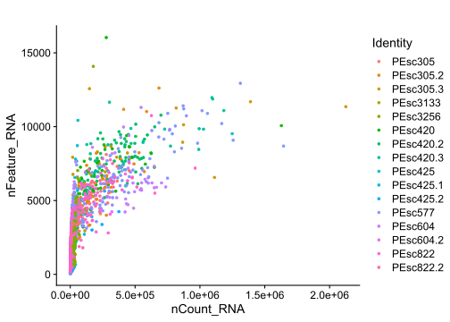
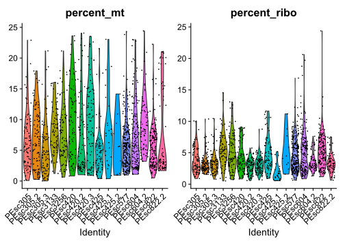
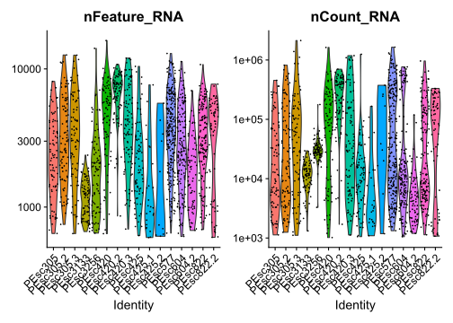

06-23_pesc_ev_analysis
================
true
2023-06-22

This script identifies lineages of EVs among cells from pleural effusion
samples.

------------------------------------------------------------------------

# Prepare the workign enviornment:

-   install and load packages
-   set %notin% and %notlike%
    -   set ggplot’s theme
-   set the working directory
-   set a plan for multithreading

``` r
#install.packages("Seurat")
#install.packages("remotes")
#BiocManager::install("glmGamPoi")
#remotes::install_github("stephenturner/annotables")

library(Seurat)
library(dplyr)
library(data.table)
library(Matrix)
library(ggplot2)
library(ggpubr)
library(future)
library(annotables) # for turning Ensembl ID to symbol
library(sctransform) # for normalization
library(glmGamPoi) # for normalization

"%notin%" <- Negate("%in%")
"%notlike%" <- Negate("%like%")


theme_set(new = theme_classic())
theme_update(
  axis.text.x = element_text(vjust = 0.5),
  strip.background = element_rect(fill = '#FFFFFF'),
plot.title = element_text(hjust = 0.5, size = 25),
axis.title = element_text(size = 23),
axis.text = element_text(size = 20),
legend.text = element_text(size = 18),
legend.key.size = unit(2, 'line'),
legend.title = element_text(size = 20)
)

wd <- "~/OneDrive - Karolinska Institutet/Dokument/nord_lab/seq/06-23_pesc/"

knitr::opts_knit$set(root.dir = wd)


plan("multicore", workers = 8)
plan()
```

    ## multicore:
    ## - args: function (..., workers = 8, envir = parent.frame())
    ## - tweaked: TRUE
    ## - call: plan("multicore", workers = 8)

``` r
# A demonstration of advantages of a sparse matrix ("d" for data).
d_dc <- as.matrix(read.csv("data/DC_matrix.txt", sep = "\t"))
s1 <- object.size(d_dc)
d_dc <- as(d_dc, "sparseMatrix")
s2 <- object.size(d_dc)
s1-s2
```

# Load and prepare the data and metadata.

``` r
# for EVs
d_dc <- as.sparse(read.csv("data/DC_matrix.txt", sep = "\t"))

# for cells
d_c <- as.sparse(read.csv("data/PEsc_matrix.txt", sep = "\t"))

# Gene names
gt <- fread("data/genes_title.txt", sep = "\t")

# get gene symbols from annotables
gt_s <- setDT(grch38[, c("ensgene", "symbol")])
colnames(gt_s)[1] <- "Geneid"
```

Join gene names with gene symbols and change symbols for Geneid when the
grch38 doesn’t include any particular ID, mult set to ‘first’, to
exclude duplicates/synonyms.

``` r
gt_mito <- readLines("code_for_daniel/human_mitochondrial_genes_list.txt")[-1] # Could be used for Daniel's approach
gt_join[Geneid %in% gt_mito] # same genes are mitochondrial here and in Daniel's table - all is fine
```

Insert joined gene names and symbols into datasets.

``` r
rownames(d_c) <- gt_sym
rownames(d_dc) <- gt_sym
```

# QC and filtering of cells.

``` r
ds_c <- CreateSeuratObject(count = d_c, min.cells = 0, min.features = 1, project = "cells")
```

    ## Warning: Non-unique features (rownames) present in the input matrix, making
    ## unique

    ## Warning: Feature names cannot have underscores ('_'), replacing with dashes
    ## ('-')

``` r
rm(d_c)
suppressMessages(gc())
```

    ##            used  (Mb) gc trigger   (Mb)  max used   (Mb)
    ## Ncells  6636428 354.5   11972267  639.4   7525297  401.9
    ## Vcells 27402135 209.1  241818248 1845.0 302234598 2305.9

``` r
ds_c <- PercentageFeatureSet(ds_c, pattern = "^MT-", col.name = "percent_mt")
ds_c <- PercentageFeatureSet(ds_c, "^RP[SL]", col.name = "percent_ribo")
ds_c <- PercentageFeatureSet(ds_c, "^HB[^(P)]", col.name = "percent_hb")
ds_c <- PercentageFeatureSet(ds_c, "PECAM1|PF4", col.name = "percent_plat")
```

## Plotting

### Main QC plots

``` r
VlnPlot(ds_c, features = c('percent_mt', 'percent_hb', "percent_ribo", "percent_plat"), ncol = 4) # unfiltered
```

<!-- -->

``` r
VlnPlot(ds_c, features = c('nFeature_RNA','nCount_RNA'), log = T) # UGLY
```

<!-- -->

### Other QC plots

``` r
FeatureScatter(ds_c, "nCount_RNA", "nFeature_RNA", pt.size = 1, plot.cor = F) + scale_x_continuous(labels = scales::scientific)
```

<!-- -->

------------------------------------------------------------------------

## Filtering

How many cells have more than 800 RNAs or more than 1000 RNAs and genes
found.

``` r
length(WhichCells(ds_c, expression = nCount_RNA > 800))
```

    ## [1] 1765

``` r
length(WhichCells(ds_c, expression = nCount_RNA > 1000 & nFeature_RNA > 600))
```

    ## [1] 1622

Filter out cells that have \<=1000 features and UMIs as they are the
only ones You can work with (subsetting on the percentages of different
transcript types can be done later).

The percent of ribosomal genes might be low due to low transcriptional
activity of the cells (5%, which was a threshold used before removes too
many cells).

``` r
ds_cf <- subset(x = ds_c, subset = nCount_RNA > 1000 & nFeature_RNA > 600 & percent_mt < 25 & percent_ribo > .5
                & percent_hb < 5)
rm(ds_c)
suppressMessages(gc())
```

    ##            used  (Mb) gc trigger   (Mb)  max used   (Mb)
    ## Ncells  6854637 366.1   11972267  639.4  11972267  639.4
    ## Vcells 35690716 272.3  193454599 1476.0 302234598 2305.9

### Find which genes contribute to the nCount_RNA the most

``` r
C <- ds_cf@assays$RNA@counts
C <- Matrix::t(Matrix::t(C)/Matrix::colSums(C)) * 100
most_expressed <- order(apply(C, 1, median), decreasing = T)[20:1]

#png("most_expr_filt.png", width = 15, height = 12, bg = "white", units = "in", res = 320)
boxplot(as.matrix(t(C[most_expressed,])), cex = 1, las = 1, xlab = "% total count per cell",
        col = (scales::hue_pal())(20)[20:1], horizontal = TRUE)
```

<!-- -->

``` r
#dev.off()
```

### QC plotting of filtered reads

``` r
VlnPlot(ds_cf, features = c('percent_mt', "percent_ribo"))
```

<!-- -->

``` r
VlnPlot(ds_cf, features = c('nFeature_RNA','nCount_RNA'), log = T) ## UGLY
```

<!-- -->

### QC plotting of filtered reads with ggplot

``` r
p1 <- ggplot(as.data.table(ds_cf$nFeature_RNA)) +
  geom_violin(aes(x = "BM", y = V1)) +
  geom_jitter(aes(x = "BM", y = V1), size = .9, alpha = .4) + 
  scale_y_log10() +
  ggtitle('Genes') +
  xlab("") +
  ylab("count")

p2 <- ggplot(as.data.table(ds_cf$nCount_RNA)) +
  geom_violin(aes(x = "BM", y = V1)) +
  geom_jitter(aes(x = "BM", y = V1), size = .9, alpha = .4) + 
  scale_y_log10() +
  ggtitle('RNAs') +
  xlab("") +
  ylab("")

p3 <- ggplot(as.data.table(ds_cf$percent_mt)) +
  geom_violin(aes(x = "BM", y = V1)) +
  geom_jitter(aes(x = "BM", y = V1), size = .9, alpha = .4) + 
  ggtitle('Percent of mitochondrial') +
  xlab("") +
  ylab("percent")

p4 <- ggplot(as.data.table(ds_cf$percent_ribo)) +
  geom_violin(aes(x = "BM", y = V1)) +
  geom_jitter(aes(x = "BM", y = V1), size = .9, alpha = .4) + 
  ggtitle('Percent of ribosomal') +
  xlab("") +
  ylab("")

p5 <- ggplot(as.data.table(ds_cf$percent_hb)) +
  geom_violin(aes(x = "BM", y = V1)) +
  geom_jitter(aes(x = "BM", y = V1), size = .9, alpha = .4) + 
  ggtitle('Percent of hemoglobin') +
  xlab("") +
  ylab("")

p6 <- ggplot(as.data.table(ds_cf$percent_plat)) +
  geom_violin(aes(x = "BM", y = V1)) +
  geom_jitter(aes(x = "BM", y = V1), size = .9, alpha = .4) + 
  ggtitle('Percent of platelet') +
  xlab("") +
  ylab("")

ggarrange(p1, p2, p3, p4, p5, p6, nrow = 1)
```

<!-- -->

``` r
#ggsave("qc_violins_filt_p3.png", qcplots, device = 'png', dpi = "retina", width = 21, height = 12, bg = "white")
```

------------------------------------------------------------------------

# QC and filtering of EVs.

``` r
ds_dc <- CreateSeuratObject(count = d_dc, min.cells = 0, min.features = 1, project = "ev")
```

    ## Warning: Non-unique features (rownames) present in the input matrix, making
    ## unique

    ## Warning: Feature names cannot have underscores ('_'), replacing with dashes
    ## ('-')

``` r
rm(d_dc)
suppressMessages(gc())
```

    ##            used  (Mb) gc trigger   (Mb)  max used   (Mb)
    ## Ncells  6893971 368.2   11972267  639.4  11972267  639.4
    ## Vcells 44224620 337.5  261443835 1994.7 326804667 2493.4

``` r
VlnPlot(ds_dc, features = c('nFeature_RNA','nCount_RNA'), ncol = 1)
```

<!-- -->

------------------------------------------------------------------------

# separate

percentages

``` r
VlnPlot(ds_dc, features = c('nCount_RNA','nFeature_RNA'), pt.size = 1.3, ncol = 1) +  NoLegend()
```

<!-- -->

# knitr::knit_exit()

``` r
knitr::knit_exit()
```
