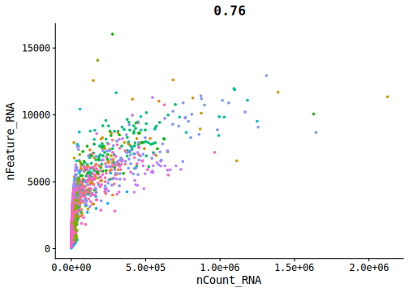
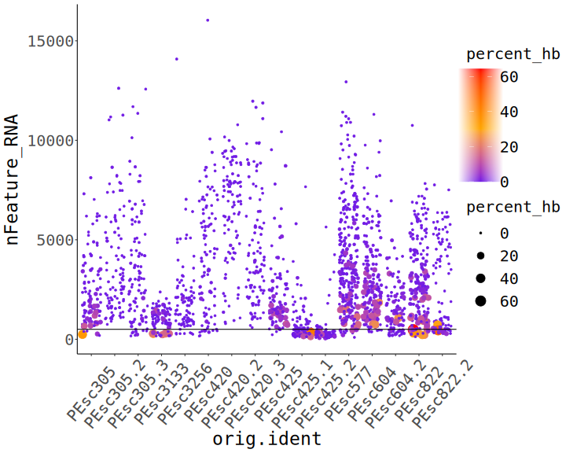
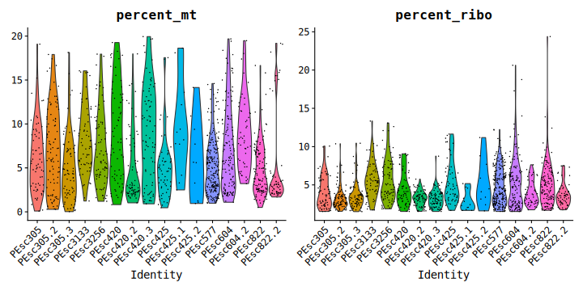
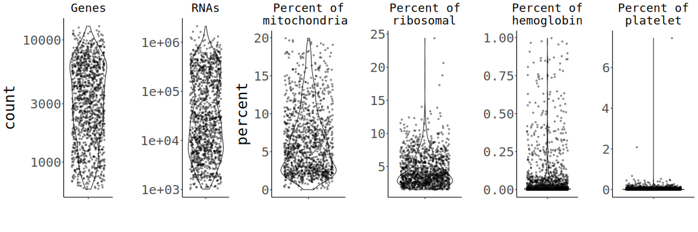
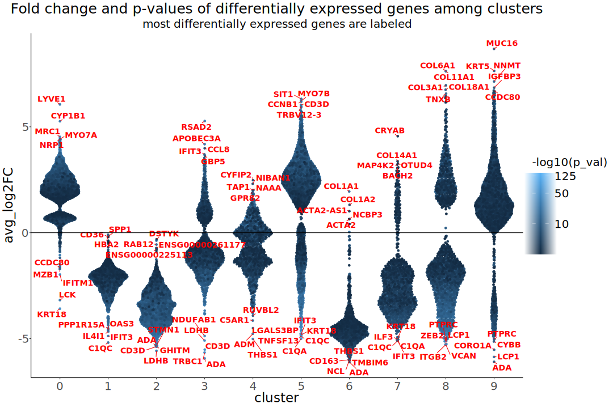

06-23_pesc_ev_analysis
================
2023-06-22

<body style="background-color:FloralWhite;">

This script identifies lineages of EVs among cells from pleural effusion
samples.

------------------------------------------------------------------------

# Prepare the workign enviornment:

-   install and load packages
-   set %notin% and %notlike%
    -   set ggplot’s theme
-   set the working directory
-   set a plan for multithreading

``` r
# install.packages("Seurat")
# install.packages("remotes")
# BiocManager::install(version = '3.16')
# BiocManager::install("glmGamPoi")
# remotes::install_github("stephenturner/annotables")
# install.packages("glmGamPoi")
# BiocManager::install("DESeq2")


library(Seurat)
library(dplyr)
library(data.table)
library(Matrix)
library(ggplot2)
library(scales) # to better customize Seurat's plots
library(ggpubr)
library(ggrepel)
library(patchwork)
library(ggbeeswarm) # for better positioning of arrows on log2 change plots
library(future)
library(annotables) # for turning Ensembl ID to symbol
library(sctransform) # for normalization  
library(glmGamPoi) # for SCTransform
# library(svglite) # for vectorized, lightweight plotting
library(systemfonts) # to set the font for svg outputs
library(DESeq2)

"%notin%" <- Negate("%in%")
"%notlike%" <- Negate("%like%")


# set the theme for plotting (Seurat uses ggplot's themes)
theme_set(new = theme_classic())
theme_update(
  axis.text.x = element_text(vjust = 0.5),
  strip.background = element_rect(fill = '#FFFFFF'),
  plot.title = element_text(hjust = 0.5, size = 25),
  plot.subtitle = element_text(size = 20, hjust = .5),
  axis.title = element_text(size = 23),
  axis.text = element_text(size = 20),
  legend.text = element_text(size = 18),
  legend.key.size = unit(2, 'line'),
  legend.title = element_text(size = 20)
  # text = element_text(family= "mono")
)

# That's not necessary (rmarkdown sets its directory as the one the .Rmd file is in.)
wd <- "/disk2/user/radgro/projects/2023-06_pesc_analysis"
knitr::opts_knit$set(root.dir = wd)


fonts <- list(
  mono = "Consolas",
  sans = "Lato"
)

# set svglite as a default for all the plots
# knitr::opts_chunk$set(knitr.chunk.dev = 'svglite')
# knitr::opts_chunk$set(dev = 'svglite', system_fonts = fonts)
knitr::opts_chunk$set(dev = 'svglite', dev.args = list(system_fonts = fonts),
                      cache = T, cache.path = "pesc_analysis_1_cache/gfm/") # cache of a github_document doesn't work if the path to the gfm folder is not provided!!!


# plan("multicore", workers = 8) # Not allowed on the server
# plan()
```

## Load and prepare the data and metadata.

``` r
# for EVs
d_dc <- as.sparse(read.csv("data/DC_matrix.txt", sep = "\t"))

# for cells
d_c <- as.sparse(read.csv("data/PEsc_matrix.txt", sep = "\t"))

# Gene names
gt <- fread("data/genes_title.txt", sep = "\t")

# get gene symbols from annotables
gt_s <- setDT(grch38[, c("ensgene", "symbol")])
colnames(gt_s)[1] <- "Geneid"
```

Join gene names with gene symbols and change symbols for Geneids when
the grch38 doesn’t include any particular ID, mult set to ‘first’, to
exclude duplicates/synonyms.

``` r
gt_join <- gt_s[gt, on = .(Geneid), mult = 'first'][symbol %in% NA | symbol == "", symbol := Geneid]
gt_sym <- gt_join[, symbol]
```

``` r
gt_mito <- readLines("code_for_daniel/human_mitochondrial_genes_list.txt")[-1] # Could be used for Daniel's approach
gt_join[Geneid %in% gt_mito] # same genes are mitochondrial here and in Daniel's table - all is fine
```

Insert joined gene names and symbols into datasets.

``` r
rownames(d_c) <- gt_sym
rownames(d_dc) <- gt_sym

rm(list = c("gt", "gt_s", "gt_sym"))
```

# QC and filtering of cells.

``` r
ds_c <- CreateSeuratObject(count = d_c, min.cells = 0, min.features = 1, project = "cells")
```

    ## Warning: Non-unique features (rownames) present in the input matrix, making
    ## unique

    ## Warning: Feature names cannot have underscores ('_'), replacing with dashes
    ## ('-')

``` r
rm(d_c)
suppressMessages(gc())
```

    ##            used  (Mb) gc trigger   (Mb)  max used   (Mb)
    ## Ncells  6679317 356.8   12136614  648.2   7478701  399.5
    ## Vcells 27639360 210.9  242108892 1847.2 299738434 2286.9

``` r
ds_c <- PercentageFeatureSet(ds_c, pattern = "^MT-", col.name = "percent_mt")
ds_c <- PercentageFeatureSet(ds_c, "^RP[SL]", col.name = "percent_ribo")
ds_c <- PercentageFeatureSet(ds_c, "^HB[^(P)]", col.name = "percent_hb")
ds_c <- PercentageFeatureSet(ds_c, "PECAM1|PF4", col.name = "percent_plat")
```

## Plotting

### Main QC plots

``` r
VlnPlot(ds_c, features = c('nCount_RNA','nFeature_RNA', 'percent_mt', 'percent_hb', "percent_ribo", "percent_plat"), pt.size = 1.3, ncol = 1) +  NoLegend()
```

<!-- -->

### UMI-gene count correlation

``` r
FeatureScatter(ds_c, "nCount_RNA", "nFeature_RNA", pt.size = 1, plot.cor = T) + scale_x_continuous(labels = scales::scientific) + NoLegend()
```

<!-- -->

### Hemoglobin content

``` r
c_hemo <- ds_c[[c("orig.ident", "nFeature_RNA", "percent_hb")]]

ggplot(c_hemo) +
  geom_jitter(aes(x = orig.ident, y = nFeature_RNA, size = percent_hb, color = percent_hb)) +
  scale_color_gradient2(midpoint = 30, mid = "orange", low="blue", high="red", ) +
  theme(axis.text.x = element_text(angle = 50)) +
  geom_hline(yintercept = 500)
```

<!-- -->

``` r
rm(c_hemo)
```

------------------------------------------------------------------------

## Filtering

How many cells have more than 800 RNAs or more than 1000 RNAs and genes
found.

``` r
length(WhichCells(ds_c, expression = nCount_RNA > 800))
```

    ## [1] 1765

``` r
length(WhichCells(ds_c, expression = nCount_RNA > 800 & nFeature_RNA > 500 & nCount_RNA > 1000 & nFeature_RNA > 600 & percent_mt < 25 & percent_ribo > 1.5
                & percent_hb < 1))
```

    ## [1] 1292

Filter out cells that have \<=800 features and 500 UMIs (subsetting on
the percentages of different transcript types can be done later).

The percent of ribosomal genes might be low due to low transcriptional
activity of the cells (5%, which was a threshold used before, removes
too many cells).

``` r
ds_cf <- subset(x = ds_c, subset = nCount_RNA > 1000 & nFeature_RNA > 600 & percent_mt < 20 & percent_ribo > 1.5
                & percent_hb < 1)
rm(ds_c)
suppressMessages(gc())
```

    ##            used  (Mb) gc trigger   (Mb)  max used   (Mb)
    ## Ncells  6907749 369.0   12136614  648.2  12136614  648.2
    ## Vcells 34065420 259.9  193687114 1477.8 299738434 2286.9

### Find which genes contribute to the nCount_RNA the most

``` r
counts_cells <- ds_cf@assays$RNA@counts
counts_cells <- Matrix::t(Matrix::t(counts_cells)/Matrix::colSums(counts_cells)) * 100

most_expr_cells <- order(apply(counts_cells, 1, median), decreasing = T)[20:1]
most_expr_counts_cells <- as.matrix(t(counts_cells[most_expr_cells,]))

rm(list = c("counts_cells", "most_expressed_cells"))
```

    ## Warning in rm(list = c("counts_cells", "most_expressed_cells")): object
    ## 'most_expressed_cells' not found

``` r
par(mar=c(5,10,1,1))
boxplot(most_expr_counts_cells, cex = 1, las = 1, xlab = "% total count per cell",
        col = (scales::hue_pal())(20)[20:1], horizontal = TRUE)
```

<!-- -->

### QC plotting of filtered reads

``` r
VlnPlot(ds_cf, features = c('nFeature_RNA','nCount_RNA'), log = T) ## UGLY
```

<!-- -->

``` r
VlnPlot(ds_cf, features = c('percent_mt', "percent_ribo"))
```

<!-- -->

### QC plotting of filtered reads with ggplot

``` r
p1 <- ggplot(as.data.table(ds_cf$nFeature_RNA)) +
  geom_violin(aes(x = "", y = V1)) +
  geom_jitter(aes(x = "", y = V1), size = .9, alpha = .4) + 
  scale_y_log10() +
  ggtitle('Genes') +
  theme(plot.title = element_text(size = 18)) +
  xlab("") +
  ylab("count")

p2 <- ggplot(as.data.table(ds_cf$nCount_RNA)) +
  geom_violin(aes(x = "", y = V1)) +
  geom_jitter(aes(x = "", y = V1), size = .9, alpha = .4) + 
  scale_y_log10() +
  ggtitle('RNAs') +
  theme(plot.title = element_text(size = 18)) +
  xlab("") +
  ylab("")

p3 <- ggplot(as.data.table(ds_cf$percent_mt)) +
  geom_violin(aes(x = "", y = V1)) +
  geom_jitter(aes(x = "", y = V1), size = .9, alpha = .4) + 
  ggtitle('Percent of\nmitochondrial') +
  theme(plot.title = element_text(size = 18)) +
  xlab("") +
  ylab("percent")

p4 <- ggplot(as.data.table(ds_cf$percent_ribo)) +
  geom_violin(aes(x = "", y = V1)) +
  geom_jitter(aes(x = "", y = V1), size = .9, alpha = .4) + 
  ggtitle('Percent of\nribosomal') +
  theme(plot.title = element_text(size = 18)) +
  xlab("") +
  ylab("")

p5 <- ggplot(as.data.table(ds_cf$percent_hb)) +
  geom_violin(aes(x = "", y = V1)) +
  geom_jitter(aes(x = "", y = V1), size = .9, alpha = .4) + 
  ggtitle('Percent of\nhemoglobin') +
  theme(plot.title = element_text(size = 18)) +
  xlab("") +
  ylab("")

p6 <- ggplot(as.data.table(ds_cf$percent_plat)) +
  geom_violin(aes(x = "", y = V1)) +
  geom_jitter(aes(x = "", y = V1), size = .9, alpha = .4) + 
  ggtitle('Percent of\nplatelet') +
  theme(plot.title = element_text(size = 18)) +
  xlab("") +
  ylab("")


ggarrange(p1, p2, p3, p4, p5, p6, nrow = 1)
```

<!-- -->

``` r
# ggarrange(ggarrange(p1, p2), 
          # ggarrange(p3, p4, p5, p6, ncol = 2, nrow = 2, widths = 2),
          # nrow = 2)

#ggsave("qc_violins_filt_p3.png", qcplots, device = 'png', dpi = "retina", width = 21, height = 12, bg = "white")
```

### UMI-gene count correlation

``` r
FeatureScatter(ds_cf, "nCount_RNA", "nFeature_RNA", pt.size = 1, plot.cor = T) + scale_x_continuous(labels = scales::scientific) + NoLegend()
```

<!-- -->

### Hemoglobin content

``` r
cf_hemo <- ds_cf[[c("orig.ident", "nFeature_RNA", "percent_hb")]]

ggplot(cf_hemo) +
  geom_jitter(aes(x = orig.ident, y = nFeature_RNA, size = percent_hb, color = percent_hb)) +
  scale_color_gradient2(midpoint = .5, mid = "orange", low="blue", high="red", ) +
  theme(axis.text.x = element_text(angle = 50))
```

<!-- -->

``` r
rm(cf_hemo)
```

------------------------------------------------------------------------

# QC and filtering of EVs.

``` r
ds_dc <- CreateSeuratObject(count = d_dc, min.cells = 0, min.features = 1, project = "ev")
```

    ## Warning: Non-unique features (rownames) present in the input matrix, making
    ## unique

    ## Warning: Feature names cannot have underscores ('_'), replacing with dashes
    ## ('-')

``` r
rm(d_dc)
suppressMessages(gc())
```

    ##            used  (Mb) gc trigger  (Mb) max used  (Mb)
    ## Ncells  6790216 362.7   12535812 669.5 10082339 538.5
    ## Vcells 59501028 454.0   98968996 755.1 97846734 746.6

``` r
ds_dc <- PercentageFeatureSet(ds_dc, pattern = "^MT-", col.name = "percent_mt")
ds_dc <- PercentageFeatureSet(ds_dc, "^RP[SL]", col.name = "percent_ribo")
ds_dc <- PercentageFeatureSet(ds_dc, "^HB[^(P)]", col.name = "percent_hb")
ds_dc <- PercentageFeatureSet(ds_dc, "PECAM1|PF4", col.name = "percent_plat")
```

``` r
VlnPlot(ds_dc, features = c('nCount_RNA','nFeature_RNA', 'percent_mt', 'percent_hb', "percent_ribo", "percent_plat"), pt.size = 1.3, ncol = 1) +  NoLegend()
```

<!-- -->

### Other qc plots

``` r
FeatureScatter(ds_dc, "nCount_RNA", "nFeature_RNA", pt.size = 1, plot.cor = T) + 
  scale_x_continuous(labels = scales::scientific) + 
  scale_y_continuous(labels = scales::scientific)
```

<!-- -->
\_\_\_ ## Filtering

``` r
length(WhichCells(ds_dc, expression = nFeature_RNA > 100))
```

    ## [1] 569

``` r
length(WhichCells(ds_dc, expression = nFeature_RNA > 100 & nCount_RNA > 500))
```

    ## [1] 541

``` r
# most common genes for cells:
sort(Matrix::rowSums(ds_cf), decreasing = T)[1:10]
```

    ## MT-RNR2  MALAT1    ACTB MT-RNR1    CD74  MT-ND4  MT-CYB     FTL     B2M    PSAP 
    ## 1020525  734223  713029  585686  554177  512719  463503  460913  459010  416967

``` r
# most common genes for EVs
sort(Matrix::rowSums(ds_dc), decreasing = T)[1:10]
```

    ##         HELLPAR         MT-RNR2 ENSG00000279010 ENSG00000280156 ENSG00000279184 
    ##           72147           57170           55177           47776           36823 
    ##         MT-RNR1 ENSG00000279080 ENSG00000279738          MT-ND5          MT-ND4 
    ##           34482           29941           28346           23232           23109

## filter out EV samples that have x features and UMIs

``` r
ds_dcf <- subset(x = ds_dc, subset = nCount_RNA > 500 & nFeature_RNA > 100 & percent_mt < 90 & percent_ribo < 90)
rm(ds_dc)
suppressMessages(gc())
```

    ##            used  (Mb) gc trigger  (Mb) max used  (Mb)
    ## Ncells  6837112 365.2   12535812 669.5 12535812 669.5
    ## Vcells 65730114 501.5   98968996 755.1 98960718 755.1

## Find which genes contribute to the nCount_RNA the most

``` r
C <- ds_dcf@assays$RNA@counts
C <- Matrix::t(Matrix::t(C)/Matrix::colSums(C)) * 100
most_expressed <- order(apply(C, 1, median), decreasing = T)[20:1]

par(mar=c(5,10,1,1))
boxplot(as.matrix(t(C[most_expressed,])), cex = 1, las = 1, xlab = "% total count per fraction",
        col = (scales::hue_pal())(20)[20:1], horizontal = TRUE)
```

<!-- -->

------------------------------------------------------------------------

## QC plotting of filtered reads

**Logarithmic axes.**

``` r
VlnPlot(ds_dcf, features = 'nFeature_RNA', pt.size = 1.3, log = T) +  NoLegend()
```

<!-- -->

``` r
VlnPlot(ds_dcf, features = 'nCount_RNA', pt.size = 1.3, log = T) +  NoLegend()
```

<!-- -->

------------------------------------------------------------------------

### Other qc plots

``` r
FeatureScatter(ds_dcf, "nCount_RNA", "nFeature_RNA", pt.size = 1, plot.cor = T) + 
  scale_x_continuous(labels = scales::scientific) +
  scale_y_continuous(labels = scales::scientific)
```

<!-- -->

# Ratio of well annotated genes (with symbols) to the rest

**On both graphs there’re two dots per cell or EV sample - one for genes
with and one for genes without a symbol.**

``` r
ratc <- as.data.table(ds_cf@assays$RNA@counts, keep.rownames = T)
ratc <- melt(ratc, id.vars = "rn")

ratc[, "code_symb" := ifelse(rn %like% "ENSG", "ens", "symb")]
ratc <- ratc[, sum(value), by = .(variable, code_symb)]
ratc[, "ratio" := V1/sum(V1), by = .(variable)]

ratc[code_symb == "ens", mean(ratio)]
```

    ## [1] 0.06248185

``` r
ggplot(ratc) +
  geom_point(aes(x = V1, y = ratio, color = code_symb)) +
  guides(color = guide_legend(title = "", size = 19, override.aes = list(size = 5))) +
  xlab("RNA count") +
  ylab("ratio to all genes per cell") +
  ggtitle("Ratios of RNA counts with and without a symbol - cells") +
  theme(plot.title = element_text(size = 18), axis.text = element_text(size = 15), axis.title = element_text(size = 17))
```

<!-- -->

``` r
ratev <- as.data.table(ds_dcf@assays$RNA@counts, keep.rownames = T)
ratev <- melt(ratev, id.vars = "rn")

ratev[, "code_symb" := ifelse(rn %like% "ENSG", "ens", "symb")]
ratev <- ratev[, sum(value), by = .(variable, code_symb)]
ratev[, "ratio" := V1/sum(V1), by = .(variable)]
ratev[code_symb == "ens", mean(ratio)]
```

    ## [1] 0.1342733

``` r
ggplot(ratev) +
  geom_point(aes(x = V1, y = ratio, color = code_symb)) +
  guides(color = guide_legend(title = "", size = 19, override.aes = list(size = 5))) +
  xlab("RNA count") +
  ylab("ratio to all genes per EV sample") +
  ggtitle("Ratios of RNA counts with and without a symbol - EVs") +
  theme(plot.title = element_text(size = 18), axis.text = element_text(size = 15), axis.title = element_text(size = 17))
```

<!-- -->

``` r
rm(list = c('ratev', 'ratc'))
suppressMessages(gc())
```

    ##            used  (Mb) gc trigger   (Mb)  max used   (Mb)
    ## Ncells  6871932 367.1   12535812  669.5  12535812  669.5
    ## Vcells 65872346 502.6  603832016 4606.9 754772198 5758.5

------------------------------------------------------------------------

# Metadata

## Cells

Assign cells to the patient, …

``` r
full_names <- colnames(ds_cf)
reg.pat <- regmatches(full_names, regexpr("PEsc[0-9]{1,6}", full_names))
reg.pat <- gsub("PEsc", "", reg.pat)
ds_cf@meta.data$pat <- reg.pat
```

…the replicate…

``` r
reg.rep <- regmatches(full_names, regexpr("PEsc[0-9]{1,6}(.|_)[0-9]", full_names))
reg.rep <- gsub("PEsc[0-9]{1,6}(.|_)", "", reg.rep)
ds_cf@meta.data$rep <- reg.rep
```

…and diagnosis and type of biopsy.

``` r
metd <- fread("PEpatients_sorted.csv")
metd[, c("type", "diag") := lapply(.SD, factor), .SDcols = c("type", 'diag')]
metd[, pat_numb := regmatches(metd[, pat_numb], regexpr("[0-9]{3,5}", metd[, pat_numb]))]

# replace missing type values ("") with "unknown".
metd[type == "", type := "unknown"]

patd <- as.data.table(reg.pat)
colnames(patd) <- "pat_numb"
met.full <- metd[patd, on = .(pat_numb)]


ds_cf@meta.data$type <- met.full[, type]
ds_cf@meta.data$diag <- met.full[, diag]

rm(list = c("reg.rep", "reg.pat"))
```

## EVs

Assign EVs to the fraction they’re from,…

``` r
full_names <- colnames(ds_dcf)
reg.frac <- regmatches(full_names, regexpr("_[A-Z]{1,2}_", full_names))
reg.frac <- gsub("_", "", reg.frac)
ds_dcf@meta.data$frac <- reg.frac
```

…the patient and the type of biopsy.

``` r
reg.pat <- regmatches(full_names, regexpr("X[0-9]{1,6}", full_names))
reg.pat <- gsub("X", "", reg.pat)
reg.pat[reg.pat == 804] <- 604 # a patient number correction
ds_dcf@meta.data$pat <- reg.pat


patd <- as.data.table(reg.pat)
colnames(patd) <- "pat_numb"
met.full <- metd[patd, on = .(pat_numb)]

ds_dcf@meta.data$type <- met.full[, type]
ds_dcf@meta.data$diag <- met.full[, diag]
```

------------------------------------------------------------------------

# Clustering analysis

## Cells

### Normalization, scaling and dimensionality reduction

**Normalization was done using the SC transform described here:
<https://genomebiology.biomedcentral.com/articles/10.1186/s13059-019-1874-1>
as it is supposed to be depth-independent, which justifies its use in
Smartseq3 EV sequencing.**

**During the analysis a change in mapping occurred, without
significantly affecting its overall profile, possibly due to package
update.**

``` r
ds_cf <- SCTransform(ds_cf, vst.flavor = "v2", verbose = FALSE) %>%
  RunPCA(npcs = 30, verbose = FALSE) %>%
  RunUMAP(reduction = "pca", dims = 1:30, verbose = FALSE)
```

    ## Warning: useNames = NA is deprecated. Instead, specify either useNames = TRUE or
    ## useNames = TRUE.

    ## Warning: useNames = NA is deprecated. Instead, specify either useNames = TRUE or
    ## useNames = TRUE.

    ## Warning: useNames = NA is deprecated. Instead, specify either useNames = TRUE or
    ## useNames = TRUE.

    ## Warning: useNames = NA is deprecated. Instead, specify either useNames = TRUE or
    ## useNames = TRUE.

    ## Warning: useNames = NA is deprecated. Instead, specify either useNames = TRUE or
    ## useNames = TRUE.

    ## Warning: useNames = NA is deprecated. Instead, specify either useNames = TRUE or
    ## useNames = TRUE.

    ## Warning: useNames = NA is deprecated. Instead, specify either useNames = TRUE or
    ## useNames = TRUE.

    ## Warning: useNames = NA is deprecated. Instead, specify either useNames = TRUE or
    ## useNames = TRUE.

    ## Warning: useNames = NA is deprecated. Instead, specify either useNames = TRUE or
    ## useNames = TRUE.

    ## Warning: useNames = NA is deprecated. Instead, specify either useNames = TRUE or
    ## useNames = TRUE.

    ## Warning: useNames = NA is deprecated. Instead, specify either useNames = TRUE or
    ## useNames = TRUE.

    ## Warning: useNames = NA is deprecated. Instead, specify either useNames = TRUE or
    ## useNames = TRUE.

    ## Warning: useNames = NA is deprecated. Instead, specify either useNames = TRUE or
    ## useNames = TRUE.

    ## Warning: useNames = NA is deprecated. Instead, specify either useNames = TRUE or
    ## useNames = TRUE.

    ## Warning: useNames = NA is deprecated. Instead, specify either useNames = TRUE or
    ## useNames = TRUE.

    ## Warning: useNames = NA is deprecated. Instead, specify either useNames = TRUE or
    ## useNames = TRUE.

    ## Warning: useNames = NA is deprecated. Instead, specify either useNames = TRUE or
    ## useNames = TRUE.

    ## Warning: useNames = NA is deprecated. Instead, specify either useNames = TRUE or
    ## useNames = TRUE.

    ## Warning: useNames = NA is deprecated. Instead, specify either useNames = TRUE or
    ## useNames = TRUE.

    ## Warning: useNames = NA is deprecated. Instead, specify either useNames = TRUE or
    ## useNames = TRUE.

    ## Warning: useNames = NA is deprecated. Instead, specify either useNames = TRUE or
    ## useNames = TRUE.

    ## Warning: useNames = NA is deprecated. Instead, specify either useNames = TRUE or
    ## useNames = TRUE.

    ## Warning: useNames = NA is deprecated. Instead, specify either useNames = TRUE or
    ## useNames = TRUE.

    ## Warning: useNames = NA is deprecated. Instead, specify either useNames = TRUE or
    ## useNames = TRUE.

    ## Warning: The default method for RunUMAP has changed from calling Python UMAP via reticulate to the R-native UWOT using the cosine metric
    ## To use Python UMAP via reticulate, set umap.method to 'umap-learn' and metric to 'correlation'
    ## This message will be shown once per session

``` r
  # RunUMAP(reduction = "pca", dims = 1:30, verbose = FALSE, n.components = 2)
# table(ds_cf@meta.data[c("pat", "diag", "type")])
```

Data allows to stratify cells according to their origin and diagnosis,
however different populations seem to be too mixed.

``` r
DimPlot(ds_cf, group.by = c("pat", "diag", "type", "rep"))
```

<!-- -->

### PCs

**Inspect PCs - Jackstraw doesn’t work with SCTransformed data.**

**Elbow Plot** Around 10 top PCAs should be enough to obtain proper
clustering.

``` r
ElbowPlot(ds_cf)
```

<!-- -->

### Variable features

**Top 10 most variable genes:**

| Gene            | Protein                                        | Description (from genecards)                                                                                                                                                                         |
|-----------------|------------------------------------------------|------------------------------------------------------------------------------------------------------------------------------------------------------------------------------------------------------|
| COL1A1, COL1A2  | Collagen 1                                     |                                                                                                                                                                                                      |
| SFTPB           | pulmonary-associated surfactant protein B      |                                                                                                                                                                                                      |
| SPARC           | cysteine-rich acidic matrix-associated protein | involved in extracellular matrix synthesis                                                                                                                                                           |
| SPP1            | Secreted Phosphoprotein 1                      | bone-osteoclasts interaction and a cytokine that upregulates expression of interferon-gamma and interleukin-12                                                                                       |
| ENSG00000203396 | WDR45-like pseudogene                          |                                                                                                                                                                                                      |
| TAGLN           | Transgelin                                     | calponin, a shape change and transformation sensitive actin-binding protein, early marker of smooth muscle differentiation, a tumor suppressor                                                       |
| IGFBP4          | insulin-like growth factor binding protein 4   | binds both insulin-like growth factors I and II and circulates in the plasma prolonging their half-life and changing interactions                                                                    |
| IGF2            | Insulin Like Growth Factor 2                   | epigenetic changes at its locus are associated with Wilms tumour, Beckwith-Wiedemann syndrome, rhabdomyosarcoma, and Silver-Russell syndrome, involved in Apoptotic Pathways in Synovial Fibroblasts |
| COL6A1          | Collagen Type VI Alpha 1 Chain                 | its mutations result in Bethlem myopathy and Ullrich muscular dystrophy, involved in platelet-derived growth factor binding                                                                          |

``` r
top10_c <- head(VariableFeatures(ds_cf), 10) # No need to use FindVariableFeatures, as SCTransform does that

p_var_c <- VariableFeaturePlot(ds_cf)
LabelPoints(p_var_c, points = top10_c, repel = T)
```

    ## When using repel, set xnudge and ynudge to 0 for optimal results

<!-- -->

**Top 10 variable genes and gene and RNA counts.** Most of the variable
genes are upregulated in cells from patients 3133 and 3256.

``` r
FeaturePlot(ds_cf, features = c('nFeature_RNA','nCount_RNA', top10_c), pt.size = 1, reduction = 'umap', slot = "scale.data")
```

<!-- -->

### Feature plot - Umap

**RNA and gene counts seem to not influence the clustering outcome**

``` r
FeaturePlot(ds_cf, features = c("nCount_RNA", "nFeature_RNA"), pt.size = 2, reduction = 'umap')
```

<!-- -->

### Clustering

``` r
ds_cf <- FindNeighbors(ds_cf, reduction = "umap", verbose = FALSE, dims = 1:2) %>%
  FindClusters(resolution = 0.5, verbose = FALSE)

p1 <- DimPlot(ds_cf, group.by = c("pat", "diag", "type"), pt.size = 1.5, reduction = "umap")

alpha_colors <- hue_pal()(27) #  number of colors equal to number of clusters - required to change the alpha

p2 <- DimPlot(ds_cf, pt.size = 2, label = T, cols = alpha(alpha_colors, .6), reduction = "umap") + 
  labs(title = "clusters") + 
  theme(plot.title = element_text(hjust = .5))


p1 + p2
```

<!-- -->

**If clusters are found using PCA:**

``` r
ds_cf <- FindNeighbors(ds_cf, reduction = "pca", dims = 1:10, verbose = FALSE) %>%
  FindClusters(resolution = 0.7, verbose = FALSE)

p1 <- DimPlot(ds_cf, group.by = c("pat", "diag", "type"), pt.size = 1.5, reduction = "umap")


alpha_colors <- hue_pal()(14) #  number of colors equal to number of clusters - required to change the alpha

p2 <- DimPlot(ds_cf, pt.size = 2, label = T, cols = alpha(alpha_colors, .6), reduction = "umap") + 
  labs(title = "clusters") + 
  theme(plot.title = element_text(hjust = .5))


p1 + p2
```

<!-- -->

### Post-clustering QC

**Data was further explored to exclude possible confounding effects in
data quality:**

#### Inter-replicate variance

``` r
p1 <- DimPlot(ds_cf, split.by = "pat", group.by = "rep", reduction = "pca")
p2 <- DimPlot(ds_cf, split.by = "pat", group.by = "rep")

p1 + p2
```

<!-- -->

#### Heatmaps of genes with highest PC scores.

##### All patients.

``` r
dim_plot_pca <- DimHeatmap(ds_cf, dims = 1:6, balanced = TRUE, reduction = "pca", fast = F, combine = F)

for (i in 1:length(dim_plot_pca)) {
  
  pc <- paste0("PC_", i)
  
  dim_plot_pca[[i]] <- dim_plot_pca[[i]] + theme(legend.position = "none", axis.text.y = element_text(size = 11),
          plot.title = element_text(size = 14)) +
          ggtitle(label = pc)
  
}

ggarrange(plotlist = dim_plot_pca, align = "v", common.legend = T, legend = "right")
```

<!-- -->

##### PC1 of each patient.

``` r
plot_pat_dim_heat <- function (data, patient) {

  DimHeatmap(subset(data, subset = pat == patient), nfeatures = 30,  dims = 1, balanced = TRUE, fast = F) +
    theme(legend.position = "none", axis.text.y = element_text(size = 11),
          plot.title = element_text(size = 14)) +
    ggtitle(label = patient)

  }

pat_dim_heat <- lapply(unique(ds_cf$pat), plot_pat_dim_heat, data = ds_cf)
ggarrange(plotlist  = pat_dim_heat, common.legend = T, legend = "right")
```

<!-- -->

#### Patients 3133 and 3256.

**Cells of patients 3133, 3256 have nearly identical expression profile
despite different diagnoses - Both patients will be removed from the
analysis.**

``` r
list_heatmaps <- DimHeatmap(subset(ds_cf, subset = pat %in% c(3133, 3256)), dims = 1:6, balanced = TRUE, fast = F, combine = F) 
  

plot_dim_heat <- function (x) {
  
  heatmap_x <- list_heatmaps[[x]] + 
    ggtitle(paste0("PC_", x)) +
    theme(axis.text.y = element_text(size = 12),
          plot.title = element_text(size = 14),
          legend.position = "none")
  
  return(heatmap_x)
}

heatmaps <- lapply(1:length(list_heatmaps), plot_dim_heat)

ggarrange(plotlist = heatmaps, align = "v", common.legend = T, legend = "right")
```

<!-- -->

#### All patients - most expressed and most variable genes.

``` r
list_heatmap <- names(sort(colSums(most_expr_counts_cells), decreasing = T))

p1 <- DoHeatmap(ds_cf, features = list_heatmap, group.by = "pat", slot = 'counts') + 
    guides(color = "none") +
    theme(axis.text.y = element_text(size = 11), title = element_text(size = 13)) +
    ggtitle(label = "top 10 most expressed")
p2 <- DoHeatmap(ds_cf, features = top10_c, group.by = "pat", slot = "scale.data") + 
    guides(color = "none") +
    theme(axis.text.y = element_text(size = 11), title = element_text(size = 13)) +
    ggtitle(label = "top 10 most variable (scaled data)")

p1 + p2
```

<!-- -->

``` r
DimPlot(ds_cf, group.by = c("pat", "diag", "type", "rep"))
```

## Cells without patients 3133 and 3256.

### PCA

``` r
# Subset the dataset
pat2 <- unique(ds_cf$pat)
pat2 <- pat2[1:6]

ds_cf2 <- subset(ds_cf, subset = pat %in% pat2)

ds_cf2 <- SCTransform(ds_cf2, vst.flavor = "v2", verbose = FALSE) %>%
  RunPCA(npcs = 30, verbose = FALSE) %>%
  RunUMAP(reduction = "pca", dims = 1:15, verbose = FALSE)
```

    ## Warning: useNames = NA is deprecated. Instead, specify either useNames = TRUE or
    ## useNames = TRUE.

    ## Warning: useNames = NA is deprecated. Instead, specify either useNames = TRUE or
    ## useNames = TRUE.

    ## Warning: useNames = NA is deprecated. Instead, specify either useNames = TRUE or
    ## useNames = TRUE.

    ## Warning: useNames = NA is deprecated. Instead, specify either useNames = TRUE or
    ## useNames = TRUE.

    ## Warning: useNames = NA is deprecated. Instead, specify either useNames = TRUE or
    ## useNames = TRUE.

    ## Warning: useNames = NA is deprecated. Instead, specify either useNames = TRUE or
    ## useNames = TRUE.

    ## Warning: useNames = NA is deprecated. Instead, specify either useNames = TRUE or
    ## useNames = TRUE.

    ## Warning: useNames = NA is deprecated. Instead, specify either useNames = TRUE or
    ## useNames = TRUE.

    ## Warning: useNames = NA is deprecated. Instead, specify either useNames = TRUE or
    ## useNames = TRUE.

    ## Warning: useNames = NA is deprecated. Instead, specify either useNames = TRUE or
    ## useNames = TRUE.

    ## Warning: useNames = NA is deprecated. Instead, specify either useNames = TRUE or
    ## useNames = TRUE.

    ## Warning: useNames = NA is deprecated. Instead, specify either useNames = TRUE or
    ## useNames = TRUE.

    ## Warning: useNames = NA is deprecated. Instead, specify either useNames = TRUE or
    ## useNames = TRUE.

    ## Warning: useNames = NA is deprecated. Instead, specify either useNames = TRUE or
    ## useNames = TRUE.

    ## Warning: useNames = NA is deprecated. Instead, specify either useNames = TRUE or
    ## useNames = TRUE.

    ## Warning: useNames = NA is deprecated. Instead, specify either useNames = TRUE or
    ## useNames = TRUE.

    ## Warning: useNames = NA is deprecated. Instead, specify either useNames = TRUE or
    ## useNames = TRUE.

    ## Warning: useNames = NA is deprecated. Instead, specify either useNames = TRUE or
    ## useNames = TRUE.

    ## Warning: useNames = NA is deprecated. Instead, specify either useNames = TRUE or
    ## useNames = TRUE.

    ## Warning: useNames = NA is deprecated. Instead, specify either useNames = TRUE or
    ## useNames = TRUE.

    ## Warning: useNames = NA is deprecated. Instead, specify either useNames = TRUE or
    ## useNames = TRUE.

    ## Warning: useNames = NA is deprecated. Instead, specify either useNames = TRUE or
    ## useNames = TRUE.

    ## Warning: useNames = NA is deprecated. Instead, specify either useNames = TRUE or
    ## useNames = TRUE.

    ## Warning: useNames = NA is deprecated. Instead, specify either useNames = TRUE or
    ## useNames = TRUE.

    ## Warning: The default method for RunUMAP has changed from calling Python UMAP via reticulate to the R-native UWOT using the cosine metric
    ## To use Python UMAP via reticulate, set umap.method to 'umap-learn' and metric to 'correlation'
    ## This message will be shown once per session

### Elbow Plot

Around 15 top PCAs should be enough to obtain proper clustering.

``` r
ElbowPlot(ds_cf2, ndims = 30)
```

<!-- -->

**10 PCAs was allowing to obtain lesser separation of cells with regard
to replicates, however, 15 provided with better resolution of
clusters.**

### Umap

``` r
title_list <- c("patient", "diagnosis", "type of biopsy", "replicate")
plot_list <- DimPlot(ds_cf2, group.by = c("pat", "diag", "type", "rep"), combine = F)

for (i in 1:length(plot_list)) {

  plot_list[[i]] <- plot_list[[i]] + ggtitle(label = title_list[i])
}

plot <- ggarrange(plotlist = plot_list, align = "v")

annotate_figure(plot, top = text_grob("UMAP of PCA results", face = "bold", size = 18))
```

<!-- -->

### Correlation of metadata and PCs

``` r
# adapted from https://jdblischak.github.io/singlecell-qtl/pca-variable.html
get_r2 <- function(x, y) {
  stopifnot(length(x) == length(y))
  model <- lm(y ~ x)
  stats <- summary(model)
  return(stats$adj.r.squared)
}
covariates <- ds_cf2@meta.data

pcs <- ds_cf2@reductions$pca@cell.embeddings[,1:30]

r2 <- matrix(NA, nrow = ncol(covariates), ncol = ncol(pcs),
             dimnames = list(colnames(covariates), colnames(pcs)))
for (cov in colnames(covariates)) {
  for (pc in colnames(pcs)) {
    r2[cov, pc] <- get_r2(covariates[, cov], pcs[, pc])
  }
}

heatmap(r2, cexCol = 1)
```

<!-- -->

### PCs

``` r
DimPlot(ds_cf2, group.by = c("pat", "diag", "type", "rep"), reduction = "pca")
```

<!-- -->

### Inter-replicate variance

``` r
p1 <- DimPlot(ds_cf2, split.by = "pat", group.by = "rep", reduction = "pca")
p2 <- DimPlot(ds_cf2, split.by = "pat", group.by = "rep")

p1 + p2
```

<!-- -->

### Heatmaps of genes with highest PC scores.

#### First 20 PCs of all patients

``` r
dim_plot_pca <- DimHeatmap(ds_cf2, dims = 1:20, nfeatures = 20, balanced = TRUE, fast = F, combine = F)

for (i in 1:length(dim_plot_pca)) {
  
  pc <- paste0("PC_", i)
  
  dim_plot_pca[[i]] <- dim_plot_pca[[i]] + theme(legend.position = "none", axis.text.y = element_text(size = 11),
          plot.title = element_text(size = 14)) +
          ggtitle(label = pc)
  
}

ggarrange(plotlist = dim_plot_pca, align = "v", ncol = 3, nrow = 7, common.legend = T, legend = "right")
```

<!-- -->

#### PC1 of each patient.

``` r
plot_pat_dim_heat <- function (data, patient) {

  DimHeatmap(subset(data, subset = pat == patient), nfeatures = 30,  dims = 1, balanced = TRUE, fast = F) +
    theme(legend.position = "none", axis.text.y = element_text(size = 11),
          plot.title = element_text(size = 14)) +
    ggtitle(label = patient)

  }

pat_dim_heat <- lapply(unique(ds_cf2$pat), plot_pat_dim_heat, data = ds_cf)
ggarrange(plotlist  = pat_dim_heat, align = "v", common.legend = T, legend = "right")
```

<!-- -->

### Variable features

Top 22 variable genes are annotated.

``` r
top22_c <- head(VariableFeatures(ds_cf2), 22)

p_var_c <- VariableFeaturePlot(ds_cf2)
LabelPoints(p_var_c, points = top22_c, repel = T, xnudge = .2, ynudge = 1, max.overlaps = 20)
```

    ## When using repel, set xnudge and ynudge to 0 for optimal results

<!-- -->

Top 22 variable genes and

``` r
FeaturePlot(ds_cf2, features = c('nFeature_RNA','nCount_RNA', top22_c), pt.size = 1, reduction = 'umap', slot = "scale.data") & 
  theme(plot.title = element_text(size = 12),
        legend.text = element_text(size = 9),
        axis.title = element_text(size = 10))
```

<!-- -->

``` r
top22_c_an <- data.table(symbol = top22_c)
gt_s_an <- setDT(grch38[c("symbol", "description")])

top22_c_an <- gt_s_an[top22_c_an, on = .(symbol), mult = 'first']

knitr::kable(top22_c_an, caption = "**Top 22 most variable genes**")
```

| symbol          | description                                              |
|:----------------|:---------------------------------------------------------|
| SPP1            | secreted phosphoprotein 1                                |
| SFTPB           | surfactant protein B                                     |
| ENSG00000203396 | NA                                                       |
| KRT18           | keratin 18                                               |
| ZNF717          | zinc finger protein 717                                  |
| COL14A1         | collagen type XIV alpha 1 chain                          |
| COL6A1          | collagen type VI alpha 1 chain                           |
| KRT19           | keratin 19                                               |
| CRYAB           | crystallin alpha B                                       |
| COL3A1          | collagen type III alpha 1 chain                          |
| ISG15           | ISG15 ubiquitin like modifier                            |
| LTBP2           | latent transforming growth factor beta binding protein 2 |
| COL18A1         | collagen type XVIII alpha 1 chain                        |
| SAA1            | serum amyloid A1                                         |
| COL1A1          | collagen type I alpha 1 chain                            |
| LTB             | lymphotoxin beta                                         |
| IGF2            | insulin like growth factor 2                             |
| SAMD15          | sterile alpha motif domain containing 15                 |
| COL11A1         | collagen type XI alpha 1 chain                           |
| PTGDS           | prostaglandin D2 synthase                                |
| AHNAK2          | AHNAK nucleoprotein 2                                    |
| COL1A2          | collagen type I alpha 2 chain                            |

**Top 22 most variable genes**

### Clustering

``` r
ds_cf2 <- FindNeighbors(ds_cf2, verbose = FALSE, dims = 1:15) %>%
  FindClusters(resolution = 0.5, verbose = FALSE)

title_list <- c("patient", "diagnosis", "type of biopsy", "replicate")
plot_list <- DimPlot(ds_cf2, group.by = c("pat", "diag", "type", "rep"),  pt.size = 1, combine = F)

for (i in 1:length(plot_list)) {

  plot_list[[i]] <- plot_list[[i]] + ggtitle(label = title_list[i])
}

p1 <- ggarrange(plotlist = plot_list, align = "v")

alpha_colors <- hue_pal()(10) #  number of colors equal to number of clusters - required to change the alpha

p2 <- DimPlot(ds_cf2, pt.size = 2, label = T, cols = alpha(alpha_colors, .6), reduction = "umap") + 
  labs(title = "clusters") + 
  theme(plot.title = element_text(hjust = .5))


plot <- ggarrange(p1, p2, widths = c(3, 2))

annotate_figure(plot, top = text_grob("UMAP of PCA results and clustering analysis", face = "bold", size = 18))
```

<!-- -->

## DE analysis

### DESeq2 - high minimum detection rate - .4

``` r
c_markers <- FindAllMarkers(ds_cf2, assay = "RNA", test.use = "DESeq2", min.pct = 0.4, verbose = F) # minimal feature frequency of 40%
```

    ## converting counts to integer mode

    ## gene-wise dispersion estimates

    ## mean-dispersion relationship

    ## final dispersion estimates

    ## converting counts to integer mode

    ## gene-wise dispersion estimates

    ## mean-dispersion relationship

    ## final dispersion estimates

    ## converting counts to integer mode

    ## gene-wise dispersion estimates

    ## mean-dispersion relationship

    ## final dispersion estimates

    ## converting counts to integer mode

    ## gene-wise dispersion estimates

    ## mean-dispersion relationship

    ## final dispersion estimates

    ## converting counts to integer mode

    ## gene-wise dispersion estimates

    ## mean-dispersion relationship

    ## final dispersion estimates

    ## converting counts to integer mode

    ## gene-wise dispersion estimates

    ## mean-dispersion relationship

    ## final dispersion estimates

    ## converting counts to integer mode

    ## gene-wise dispersion estimates

    ## mean-dispersion relationship

    ## final dispersion estimates

    ## converting counts to integer mode

    ## gene-wise dispersion estimates

    ## mean-dispersion relationship

    ## final dispersion estimates

    ## converting counts to integer mode

    ## gene-wise dispersion estimates

    ## mean-dispersion relationship

    ## final dispersion estimates

    ## converting counts to integer mode

    ## gene-wise dispersion estimates

    ## mean-dispersion relationship

    ## final dispersion estimates

``` r
for(i in levels(c_markers$cluster)) {print(head(c_markers[c_markers$cluster == i,], 10))}
```

    ##                         p_val avg_log2FC pct.1 pct.2     p_val_adj cluster
    ## ENSG00000203396 1.235922e-127  0.2494837 1.000 0.998 7.495375e-123       0
    ## VCAN             4.302573e-82  3.9834992 0.991 0.924  2.609339e-77       0
    ## LYZ              1.743229e-60  3.4172989 1.000 0.950  1.057199e-55       0
    ## KRT18            7.394905e-60 -3.5856447 0.430 0.396  4.484714e-55       0
    ## ENSG00000225840  7.069004e-59  1.0782675 1.000 1.000  4.287068e-54       0
    ## LRP1             6.967884e-56  3.6896046 0.973 0.697  4.225743e-51       0
    ## TSPAN14          8.839293e-56  4.1477852 0.964 0.510  5.360678e-51       0
    ## ENSG00000257764  1.290534e-53  3.2562057 1.000 0.921  7.826575e-49       0
    ## FCN1             1.236280e-49  3.5802657 0.996 0.871  7.497544e-45       0
    ## CD163            6.558915e-49  3.7559701 0.973 0.772  3.977719e-44       0
    ##                            gene
    ## ENSG00000203396 ENSG00000203396
    ## VCAN                       VCAN
    ## LYZ                         LYZ
    ## KRT18                     KRT18
    ## ENSG00000225840 ENSG00000225840
    ## LRP1                       LRP1
    ## TSPAN14                 TSPAN14
    ## ENSG00000257764 ENSG00000257764
    ## FCN1                       FCN1
    ## CD163                     CD163
    ##                 p_val avg_log2FC pct.1 pct.2    p_val_adj cluster   gene
    ## MALAT1   6.239694e-50  -2.503081 1.000 1.000 3.784125e-45       1 MALAT1
    ## IFITM3   1.091602e-34  -3.146241 0.625 0.839 6.620129e-30       1 IFITM3
    ## TYMP     1.185351e-31  -3.020210 0.349 0.680 7.188681e-27       1   TYMP
    ## IFIT3.1  2.720667e-31  -4.875938 0.172 0.525 1.649976e-26       1  IFIT3
    ## WSB1.1   2.848614e-31  -4.196256 0.349 0.664 1.727570e-26       1   WSB1
    ## IFITM2.1 6.010718e-31  -2.502264 0.766 0.886 3.645260e-26       1 IFITM2
    ## C1QC.1   2.361459e-28  -5.185559 0.427 0.663 1.432131e-23       1   C1QC
    ## SAT1.1   2.994959e-28  -3.180255 0.807 0.897 1.816323e-23       1   SAT1
    ## C1QA.1   5.148484e-28  -4.132543 0.417 0.667 3.122350e-23       1   C1QA
    ## PRRC2C.1 7.883150e-27  -3.299124 0.589 0.726 4.780815e-22       1 PRRC2C
    ##                   p_val avg_log2FC pct.1 pct.2    p_val_adj cluster     gene
    ## MT-ND4.1   2.022665e-54  -3.422082 0.995 0.999 1.226665e-49       2   MT-ND4
    ## RPL30.1    6.459883e-48  -3.862570 0.574 0.915 3.917660e-43       2    RPL30
    ## RPL31.2    5.697548e-47  -3.391173 0.732 0.954 3.455335e-42       2    RPL31
    ## HSP90AA1.1 7.090952e-46  -3.924425 0.826 0.927 4.300379e-41       2 HSP90AA1
    ## PTMA.2     8.519069e-46  -3.713746 0.958 0.981 5.166475e-41       2     PTMA
    ## RPS27.1    1.693456e-45  -3.455320 0.795 0.973 1.027013e-40       2    RPS27
    ## RPL21.1    2.436547e-45  -4.014991 0.589 0.887 1.477668e-40       2    RPL21
    ## PPIA       8.465292e-45  -4.057196 0.558 0.876 5.133861e-40       2     PPIA
    ## RPS23      9.835531e-45  -3.865537 0.474 0.877 5.964856e-40       2    RPS23
    ## RPL13.1    6.272910e-43  -3.811412 0.858 0.958 3.804269e-38       2    RPL13
    ##                   p_val avg_log2FC pct.1 pct.2    p_val_adj cluster     gene
    ## TRBC1.1    2.310672e-58  -5.656654 0.007 0.407 1.401330e-53       3    TRBC1
    ## LDHB.2     3.170291e-58  -5.091953 0.142 0.560 1.922654e-53       3     LDHB
    ## NDUFAB1.1  5.610423e-58  -4.877129 0.104 0.496 3.402497e-53       3  NDUFAB1
    ## ADA.2      7.917755e-58  -5.933801 0.082 0.457 4.801802e-53       3      ADA
    ## CD3D.1     2.682385e-55  -5.520279 0.045 0.411 1.626759e-50       3     CD3D
    ## MTND4P12.2 2.884600e-45  -2.105285 0.179 0.511 1.749395e-40       3 MTND4P12
    ## NME1.1     2.698877e-43  -3.808433 0.328 0.645 1.636761e-38       3     NME1
    ## HLA-DRB6.1 5.536584e-39  -3.200401 0.299 0.547 3.357717e-34       3 HLA-DRB6
    ## RPS13.1    1.886505e-38  -2.027940 0.724 0.857 1.144090e-33       3    RPS13
    ## RSAD2      7.348937e-38   5.271095 0.716 0.205 4.456837e-33       3    RSAD2
    ##                          p_val avg_log2FC pct.1 pct.2    p_val_adj cluster
    ## ENSG00000280156   1.466372e-83  0.6958773 0.917 0.787 8.892962e-79       4
    ## ENSG00000279184.3 7.290843e-55  0.3863899 0.879 0.725 4.421605e-50       4
    ## FRK               4.134429e-51  0.4839083 0.636 0.492 2.507366e-46       4
    ## HELLPAR.1         5.347116e-49  0.2364771 0.924 0.874 3.242812e-44       4
    ## TMEM45A.4         6.222316e-47  0.6650307 0.659 0.530 3.773586e-42       4
    ## TMEM212           1.200316e-42  0.7441643 0.545 0.408 7.279434e-38       4
    ## THBS1.3           3.807839e-40 -5.0157562 0.629 0.812 2.309302e-35       4
    ## LINC00506.3       6.709213e-37  0.3151980 0.788 0.610 4.068870e-32       4
    ## GPR82.3           1.261656e-34  1.9091665 0.455 0.366 7.651440e-30       4
    ## LINC02503.3       1.380023e-34  0.5296435 0.530 0.378 8.369290e-30       4
    ##                              gene
    ## ENSG00000280156   ENSG00000280156
    ## ENSG00000279184.3 ENSG00000279184
    ## FRK                           FRK
    ## HELLPAR.1                 HELLPAR
    ## TMEM45A.4                 TMEM45A
    ## TMEM212                   TMEM212
    ## THBS1.3                     THBS1
    ## LINC00506.3             LINC00506
    ## GPR82.3                     GPR82
    ## LINC02503.3             LINC02503
    ##                    p_val avg_log2FC pct.1 pct.2     p_val_adj cluster     gene
    ## CD74.3     1.155940e-146  -3.024488 1.000 0.999 7.010314e-142       5     CD74
    ## HLA-DRB1.5  6.923823e-87  -3.425316 0.852 0.944  4.199022e-82       5 HLA-DRB1
    ## HLA-DRB5.4  4.668899e-84  -4.436377 0.761 0.862  2.831500e-79       5 HLA-DRB5
    ## HLA-DRA.4   1.779926e-79  -3.146490 0.920 0.967  1.079454e-74       5  HLA-DRA
    ## CD14.5      8.579360e-76  -3.396432 0.898 0.945  5.203039e-71       5     CD14
    ## H4C3.5      1.616971e-72  -4.352510 0.318 0.645  9.806282e-68       5     H4C3
    ## S100A11.4   1.614907e-69  -2.731509 0.807 0.919  9.793762e-65       5  S100A11
    ## RNASE1.3    3.806574e-69  -4.180163 0.659 0.839  2.308535e-64       5   RNASE1
    ## HLA-DPA1.3  1.271668e-68  -3.462826 0.830 0.932  7.712157e-64       5 HLA-DPA1
    ## S100A6.3    3.309768e-67  -2.849859 0.750 0.895  2.007242e-62       5   S100A6
    ##                          p_val  avg_log2FC pct.1 pct.2    p_val_adj cluster
    ## COL1A1            4.281709e-23  1.94473931 0.905 0.307 2.596685e-18       6
    ## ENSG00000203396.6 6.686773e-22  0.03415643 1.000 0.998 4.055261e-17       6
    ## RPLP1.4           3.957584e-20 -2.11042752 0.952 0.953 2.400116e-15       6
    ## ACTA2             5.560256e-19  0.64433557 0.643 0.341 3.372073e-14       6
    ## MALAT1.5          1.734394e-16 -1.95063829 1.000 1.000 1.051840e-11       6
    ## IFITM1.5          1.403691e-14 -1.02051055 0.595 0.658 8.512826e-10       6
    ## RAB12.5           6.898483e-14 -0.35158472 0.905 0.873 4.183654e-09       6
    ## ENO1.5            1.518346e-13 -5.89086231 0.643 0.962 9.208162e-09       6
    ## CALR.4            1.863717e-13 -5.78860074 0.310 0.833 1.130270e-08       6
    ## ATP5F1B.5         4.404716e-13 -5.40337500 0.167 0.766 2.671284e-08       6
    ##                              gene
    ## COL1A1                     COL1A1
    ## ENSG00000203396.6 ENSG00000203396
    ## RPLP1.4                     RPLP1
    ## ACTA2                       ACTA2
    ## MALAT1.5                   MALAT1
    ## IFITM1.5                   IFITM1
    ## RAB12.5                     RAB12
    ## ENO1.5                       ENO1
    ## CALR.4                       CALR
    ## ATP5F1B.5                 ATP5F1B
    ##                        p_val avg_log2FC pct.1 pct.2    p_val_adj cluster
    ## KRT18.7         1.666599e-23  -5.026599 0.024 0.417 1.010726e-18       7
    ## MASP1           1.746217e-19   2.712824 0.537 0.142 1.059011e-14       7
    ## ENSG00000271755 5.101603e-19   2.772774 0.512 0.216 3.093918e-14       7
    ## RPL32.5         8.327378e-19  -3.886041 0.756 0.871 5.050222e-14       7
    ## RPL10.5         2.596391e-18  -3.511016 0.732 0.902 1.574608e-13       7
    ## RPS2.4          8.145019e-17  -4.039560 0.561 0.844 4.939628e-12       7
    ## IFI6.4          1.115938e-15  -4.002690 0.341 0.693 6.767716e-11       7
    ## RPL37A.6        1.261386e-15  -3.162829 0.707 0.856 7.649801e-11       7
    ## IFITM1.6        1.440559e-15  -4.630566 0.488 0.662 8.736414e-11       7
    ## HLA-DRB5.5      4.324511e-15  -4.578505 0.707 0.860 2.622643e-10       7
    ##                            gene
    ## KRT18.7                   KRT18
    ## MASP1                     MASP1
    ## ENSG00000271755 ENSG00000271755
    ## RPL32.5                   RPL32
    ## RPL10.5                   RPL10
    ## RPS2.4                     RPS2
    ## IFI6.4                     IFI6
    ## RPL37A.6                 RPL37A
    ## IFITM1.6                 IFITM1
    ## HLA-DRB5.5             HLA-DRB5
    ##                   p_val avg_log2FC pct.1 pct.2    p_val_adj cluster     gene
    ## SH3BGRL3.3 2.186615e-58  -4.139841 0.925 0.978 1.326095e-53       8 SH3BGRL3
    ## FTH1.1     5.957040e-53  -2.412484 1.000 0.997 3.612707e-48       8     FTH1
    ## LAPTM5.4   1.478047e-50  -4.679298 0.900 0.968 8.963765e-46       8   LAPTM5
    ## AIF1.4     3.933603e-50  -4.262550 0.875 0.933 2.385573e-45       8     AIF1
    ## BEST1.4    3.118025e-49  -2.335897 1.000 0.993 1.890957e-44       8    BEST1
    ## SRGN.6     3.975572e-48  -4.857831 0.925 0.925 2.411026e-43       8     SRGN
    ## MT-TV.2    6.161026e-48   2.363973 1.000 0.685 3.736416e-43       8    MT-TV
    ## UBXN11.3   5.253893e-45  -3.989877 0.825 0.879 3.186276e-40       8   UBXN11
    ## CD74.6     8.579547e-45  -3.038895 1.000 0.999 5.203152e-40       8     CD74
    ## ITGB2.7    3.291466e-44  -5.283311 0.850 0.881 1.996142e-39       8    ITGB2
    ##                          p_val avg_log2FC pct.1 pct.2    p_val_adj cluster
    ## LINC01133         1.940179e-29  4.1335853 0.743 0.229 1.176641e-24       9
    ## FHL2              2.433426e-26  5.1115023 0.800 0.351 1.475776e-21       9
    ## ENSG00000269968.7 2.859236e-26  0.8596984 1.000 0.990 1.734012e-21       9
    ## GAPDH.6           4.767163e-24  0.8550964 1.000 0.994 2.891094e-19       9
    ## PBX1              7.208767e-24  4.8328967 0.657 0.341 4.371829e-19       9
    ## LCP1.6            2.072786e-23 -5.8648775 0.543 0.870 1.257062e-18       9
    ## CCDC80.1          2.230179e-22  6.7209945 0.886 0.311 1.352514e-17       9
    ## PTGIS.1           4.672434e-22  5.6694100 0.457 0.314 2.833644e-17       9
    ## GPRC5A            1.051502e-20  6.1581310 0.914 0.310 6.376940e-16       9
    ## LETM2             3.011602e-20  4.7571728 0.486 0.201 1.826416e-15       9
    ##                              gene
    ## LINC01133               LINC01133
    ## FHL2                         FHL2
    ## ENSG00000269968.7 ENSG00000269968
    ## GAPDH.6                     GAPDH
    ## PBX1                         PBX1
    ## LCP1.6                       LCP1
    ## CCDC80.1                   CCDC80
    ## PTGIS.1                     PTGIS
    ## GPRC5A                     GPRC5A
    ## LETM2                       LETM2

Plot most differentially expressed genes

``` r
setDT(c_markers)
highest_de <- c_markers[order(avg_log2FC, decreasing = T), .SD[1:5] ,by = cluster][p_val < 5e-2][order(cluster)]
lowest_de <- c_markers[order(avg_log2FC), .SD[1:5] ,by = cluster][p_val < 5e-2][order(cluster)]

most_diff_c <- merge(highest_de, lowest_de, all = T)

ggplot(c_markers, aes(x = cluster, y = avg_log2FC, color = -log10(p_val))) +
  geom_point(position = position_quasirandom()) +
  geom_text_repel(most_diff_c, mapping = aes(label = gene),
                  size = 5, color = "red", fontface = "bold", 
                  force = 3, min.segment.length = 0) +
  geom_hline(yintercept = 0) +
  scale_color_continuous(trans = "log", breaks = c(1, 10, 50, 125)) + 
  ggtitle(label = "Fold change and p-values of differentially expressed genes among clusters", 
          subtitle = "most differentially expressed genes are labeled")
```

    ## Warning: ggrepel: 3 unlabeled data points (too many overlaps). Consider
    ## increasing max.overlaps

<!-- -->

``` r
highest_de <- c_markers[order(avg_log2FC, decreasing = T), .SD[1:10] ,by = cluster][p_val < 5e-2][order(cluster)]


DoHeatmap(ds_cf2, group.by = "seurat_clusters", features = highest_de$gene) + 
  NoLegend() + 
  ggtitle(label = "Expression of top markers of clusters of cells found in the dataset")
```

    ## Warning in DoHeatmap(ds_cf2, group.by = "seurat_clusters", features =
    ## highest_de$gene): The following features were omitted as they were not found
    ## in the scale.data slot for the SCT assay: DBR1, TMEM52B, SHPK, ENSG00000269044,
    ## MAP4K2, OTUD4, LINC02503, LINC00504, NCBP3, GIHCG, TRBV12-3, INTS6, CIITA,
    ## HLA-DQA1, ASB3, GPR82, TAP1, NAAA, NIBAN1, MT-TE, DSE, ASB11, LINC02242,
    ## ENSG00000225113, ENSG00000261177, DSTYK, MMS22L, RAB12, ANAPC5, RCN2,
    ## ENSG00000280138, HBA2, CD36, ENSG00000256618, F13A1, TMEM176B, TNFSF13, CMKLR1,
    ## NRP1, MRC1

<!-- -->

Genes:
`DBR1, TMEM52B, SHPK, ENSG00000269044, MAP4K2, OTUD4, LINC02503, LINC00504, NCBP3, GIHCG, TRBV12-3, INTS6, CIITA, HLA-DQA1, ASB3, GPR82, TAP1, NAAA, NIBAN1, MT-TE, DSE, ASB11, LINC02242, ENSG00000225113, ENSG00000261177, DSTYK, MMS22L, RAB12, ANAPC5, RCN2, ENSG00000280138, HBA2, CD36, ENSG00000256618, F13A1, TMEM176B, TNFSF13, CMKLR1, NRP1, MRC1`
were present in the differentially expressed set but not among the most
variable genes which might indicate, that the .4 minimum detection rate
might have been too high and excluded too many genes from the DESeq
analysis.

### DESeq2 - low minimum detection rate - .25

``` r
c_markers2 <- FindAllMarkers(ds_cf2, assay = "RNA", test.use = "DESeq2", min.pct = .25, verbose = T) # minimal feature frequency of 25%

for(i in levels(c_markers$cluster)) {
  
  print(head(c_markers[c_markers$cluster == i,], 10))
  
  }
```

    ##             p_val avg_log2FC pct.1 pct.2     p_val_adj cluster            gene
    ##  1: 1.235922e-127  0.2494837 1.000 0.998 7.495375e-123       0 ENSG00000203396
    ##  2:  4.302573e-82  3.9834992 0.991 0.924  2.609339e-77       0            VCAN
    ##  3:  1.743229e-60  3.4172989 1.000 0.950  1.057199e-55       0             LYZ
    ##  4:  7.394905e-60 -3.5856447 0.430 0.396  4.484714e-55       0           KRT18
    ##  5:  7.069004e-59  1.0782675 1.000 1.000  4.287068e-54       0 ENSG00000225840
    ##  6:  6.967884e-56  3.6896046 0.973 0.697  4.225743e-51       0            LRP1
    ##  7:  8.839293e-56  4.1477852 0.964 0.510  5.360678e-51       0         TSPAN14
    ##  8:  1.290534e-53  3.2562057 1.000 0.921  7.826575e-49       0 ENSG00000257764
    ##  9:  1.236280e-49  3.5802657 0.996 0.871  7.497544e-45       0            FCN1
    ## 10:  6.558915e-49  3.7559701 0.973 0.772  3.977719e-44       0           CD163
    ##            p_val avg_log2FC pct.1 pct.2    p_val_adj cluster   gene
    ##  1: 6.239694e-50  -2.503081 1.000 1.000 3.784125e-45       1 MALAT1
    ##  2: 1.091602e-34  -3.146241 0.625 0.839 6.620129e-30       1 IFITM3
    ##  3: 1.185351e-31  -3.020210 0.349 0.680 7.188681e-27       1   TYMP
    ##  4: 2.720667e-31  -4.875938 0.172 0.525 1.649976e-26       1  IFIT3
    ##  5: 2.848614e-31  -4.196256 0.349 0.664 1.727570e-26       1   WSB1
    ##  6: 6.010718e-31  -2.502264 0.766 0.886 3.645260e-26       1 IFITM2
    ##  7: 2.361459e-28  -5.185559 0.427 0.663 1.432131e-23       1   C1QC
    ##  8: 2.994959e-28  -3.180255 0.807 0.897 1.816323e-23       1   SAT1
    ##  9: 5.148484e-28  -4.132543 0.417 0.667 3.122350e-23       1   C1QA
    ## 10: 7.883150e-27  -3.299124 0.589 0.726 4.780815e-22       1 PRRC2C
    ##            p_val avg_log2FC pct.1 pct.2    p_val_adj cluster     gene
    ##  1: 2.022665e-54  -3.422082 0.995 0.999 1.226665e-49       2   MT-ND4
    ##  2: 6.459883e-48  -3.862570 0.574 0.915 3.917660e-43       2    RPL30
    ##  3: 5.697548e-47  -3.391173 0.732 0.954 3.455335e-42       2    RPL31
    ##  4: 7.090952e-46  -3.924425 0.826 0.927 4.300379e-41       2 HSP90AA1
    ##  5: 8.519069e-46  -3.713746 0.958 0.981 5.166475e-41       2     PTMA
    ##  6: 1.693456e-45  -3.455320 0.795 0.973 1.027013e-40       2    RPS27
    ##  7: 2.436547e-45  -4.014991 0.589 0.887 1.477668e-40       2    RPL21
    ##  8: 8.465292e-45  -4.057196 0.558 0.876 5.133861e-40       2     PPIA
    ##  9: 9.835531e-45  -3.865537 0.474 0.877 5.964856e-40       2    RPS23
    ## 10: 6.272910e-43  -3.811412 0.858 0.958 3.804269e-38       2    RPL13
    ##            p_val avg_log2FC pct.1 pct.2    p_val_adj cluster     gene
    ##  1: 2.310672e-58  -5.656654 0.007 0.407 1.401330e-53       3    TRBC1
    ##  2: 3.170291e-58  -5.091953 0.142 0.560 1.922654e-53       3     LDHB
    ##  3: 5.610423e-58  -4.877129 0.104 0.496 3.402497e-53       3  NDUFAB1
    ##  4: 7.917755e-58  -5.933801 0.082 0.457 4.801802e-53       3      ADA
    ##  5: 2.682385e-55  -5.520279 0.045 0.411 1.626759e-50       3     CD3D
    ##  6: 2.884600e-45  -2.105285 0.179 0.511 1.749395e-40       3 MTND4P12
    ##  7: 2.698877e-43  -3.808433 0.328 0.645 1.636761e-38       3     NME1
    ##  8: 5.536584e-39  -3.200401 0.299 0.547 3.357717e-34       3 HLA-DRB6
    ##  9: 1.886505e-38  -2.027940 0.724 0.857 1.144090e-33       3    RPS13
    ## 10: 7.348937e-38   5.271095 0.716 0.205 4.456837e-33       3    RSAD2
    ##            p_val avg_log2FC pct.1 pct.2    p_val_adj cluster            gene
    ##  1: 1.466372e-83  0.6958773 0.917 0.787 8.892962e-79       4 ENSG00000280156
    ##  2: 7.290843e-55  0.3863899 0.879 0.725 4.421605e-50       4 ENSG00000279184
    ##  3: 4.134429e-51  0.4839083 0.636 0.492 2.507366e-46       4             FRK
    ##  4: 5.347116e-49  0.2364771 0.924 0.874 3.242812e-44       4         HELLPAR
    ##  5: 6.222316e-47  0.6650307 0.659 0.530 3.773586e-42       4         TMEM45A
    ##  6: 1.200316e-42  0.7441643 0.545 0.408 7.279434e-38       4         TMEM212
    ##  7: 3.807839e-40 -5.0157562 0.629 0.812 2.309302e-35       4           THBS1
    ##  8: 6.709213e-37  0.3151980 0.788 0.610 4.068870e-32       4       LINC00506
    ##  9: 1.261656e-34  1.9091665 0.455 0.366 7.651440e-30       4           GPR82
    ## 10: 1.380023e-34  0.5296435 0.530 0.378 8.369290e-30       4       LINC02503
    ##             p_val avg_log2FC pct.1 pct.2     p_val_adj cluster     gene
    ##  1: 1.155940e-146  -3.024488 1.000 0.999 7.010314e-142       5     CD74
    ##  2:  6.923823e-87  -3.425316 0.852 0.944  4.199022e-82       5 HLA-DRB1
    ##  3:  4.668899e-84  -4.436377 0.761 0.862  2.831500e-79       5 HLA-DRB5
    ##  4:  1.779926e-79  -3.146490 0.920 0.967  1.079454e-74       5  HLA-DRA
    ##  5:  8.579360e-76  -3.396432 0.898 0.945  5.203039e-71       5     CD14
    ##  6:  1.616971e-72  -4.352510 0.318 0.645  9.806282e-68       5     H4C3
    ##  7:  1.614907e-69  -2.731509 0.807 0.919  9.793762e-65       5  S100A11
    ##  8:  3.806574e-69  -4.180163 0.659 0.839  2.308535e-64       5   RNASE1
    ##  9:  1.271668e-68  -3.462826 0.830 0.932  7.712157e-64       5 HLA-DPA1
    ## 10:  3.309768e-67  -2.849859 0.750 0.895  2.007242e-62       5   S100A6
    ##            p_val  avg_log2FC pct.1 pct.2    p_val_adj cluster            gene
    ##  1: 4.281709e-23  1.94473931 0.905 0.307 2.596685e-18       6          COL1A1
    ##  2: 6.686773e-22  0.03415643 1.000 0.998 4.055261e-17       6 ENSG00000203396
    ##  3: 3.957584e-20 -2.11042752 0.952 0.953 2.400116e-15       6           RPLP1
    ##  4: 5.560256e-19  0.64433557 0.643 0.341 3.372073e-14       6           ACTA2
    ##  5: 1.734394e-16 -1.95063829 1.000 1.000 1.051840e-11       6          MALAT1
    ##  6: 1.403691e-14 -1.02051055 0.595 0.658 8.512826e-10       6          IFITM1
    ##  7: 6.898483e-14 -0.35158472 0.905 0.873 4.183654e-09       6           RAB12
    ##  8: 1.518346e-13 -5.89086231 0.643 0.962 9.208162e-09       6            ENO1
    ##  9: 1.863717e-13 -5.78860074 0.310 0.833 1.130270e-08       6            CALR
    ## 10: 4.404716e-13 -5.40337500 0.167 0.766 2.671284e-08       6         ATP5F1B
    ##            p_val avg_log2FC pct.1 pct.2    p_val_adj cluster            gene
    ##  1: 1.666599e-23  -5.026599 0.024 0.417 1.010726e-18       7           KRT18
    ##  2: 1.746217e-19   2.712824 0.537 0.142 1.059011e-14       7           MASP1
    ##  3: 5.101603e-19   2.772774 0.512 0.216 3.093918e-14       7 ENSG00000271755
    ##  4: 8.327378e-19  -3.886041 0.756 0.871 5.050222e-14       7           RPL32
    ##  5: 2.596391e-18  -3.511016 0.732 0.902 1.574608e-13       7           RPL10
    ##  6: 8.145019e-17  -4.039560 0.561 0.844 4.939628e-12       7            RPS2
    ##  7: 1.115938e-15  -4.002690 0.341 0.693 6.767716e-11       7            IFI6
    ##  8: 1.261386e-15  -3.162829 0.707 0.856 7.649801e-11       7          RPL37A
    ##  9: 1.440559e-15  -4.630566 0.488 0.662 8.736414e-11       7          IFITM1
    ## 10: 4.324511e-15  -4.578505 0.707 0.860 2.622643e-10       7        HLA-DRB5
    ##            p_val avg_log2FC pct.1 pct.2    p_val_adj cluster     gene
    ##  1: 2.186615e-58  -4.139841 0.925 0.978 1.326095e-53       8 SH3BGRL3
    ##  2: 5.957040e-53  -2.412484 1.000 0.997 3.612707e-48       8     FTH1
    ##  3: 1.478047e-50  -4.679298 0.900 0.968 8.963765e-46       8   LAPTM5
    ##  4: 3.933603e-50  -4.262550 0.875 0.933 2.385573e-45       8     AIF1
    ##  5: 3.118025e-49  -2.335897 1.000 0.993 1.890957e-44       8    BEST1
    ##  6: 3.975572e-48  -4.857831 0.925 0.925 2.411026e-43       8     SRGN
    ##  7: 6.161026e-48   2.363973 1.000 0.685 3.736416e-43       8    MT-TV
    ##  8: 5.253893e-45  -3.989877 0.825 0.879 3.186276e-40       8   UBXN11
    ##  9: 8.579547e-45  -3.038895 1.000 0.999 5.203152e-40       8     CD74
    ## 10: 3.291466e-44  -5.283311 0.850 0.881 1.996142e-39       8    ITGB2
    ##            p_val avg_log2FC pct.1 pct.2    p_val_adj cluster            gene
    ##  1: 1.940179e-29  4.1335853 0.743 0.229 1.176641e-24       9       LINC01133
    ##  2: 2.433426e-26  5.1115023 0.800 0.351 1.475776e-21       9            FHL2
    ##  3: 2.859236e-26  0.8596984 1.000 0.990 1.734012e-21       9 ENSG00000269968
    ##  4: 4.767163e-24  0.8550964 1.000 0.994 2.891094e-19       9           GAPDH
    ##  5: 7.208767e-24  4.8328967 0.657 0.341 4.371829e-19       9            PBX1
    ##  6: 2.072786e-23 -5.8648775 0.543 0.870 1.257062e-18       9            LCP1
    ##  7: 2.230179e-22  6.7209945 0.886 0.311 1.352514e-17       9          CCDC80
    ##  8: 4.672434e-22  5.6694100 0.457 0.314 2.833644e-17       9           PTGIS
    ##  9: 1.051502e-20  6.1581310 0.914 0.310 6.376940e-16       9          GPRC5A
    ## 10: 3.011602e-20  4.7571728 0.486 0.201 1.826416e-15       9           LETM2

Plot most differentially expressed genes

``` r
setDT(c_markers2)
highest_de <- c_markers2[order(avg_log2FC, decreasing = T), .SD[1:5] ,by = cluster][p_val < 5e-2][order(cluster)]
lowest_de <- c_markers2[order(avg_log2FC), .SD[1:5] ,by = cluster][p_val < 5e-2][order(cluster)]

most_diff_c <- merge(highest_de, lowest_de, all = T)

ggplot(c_markers2, aes(x = cluster, y = avg_log2FC, color = -log10(p_val))) +
  geom_point(position = position_quasirandom()) +
  geom_text_repel(most_diff_c, mapping = aes(label = gene),
                  size = 5, color = "red", fontface = "bold", 
                  force = 3, min.segment.length = 0) +
  geom_hline(yintercept = 0) +
  scale_color_continuous(trans = "log", breaks = c(1, 10, 50, 125)) + 
  ggtitle(label = "Fold change and p-values of differentially expressed genes among clusters", 
          subtitle = "most differentially expressed genes are labeled")  
```

    ## Warning: ggrepel: 6 unlabeled data points (too many overlaps). Consider
    ## increasing max.overlaps

<!-- -->

``` r
highest_de <- c_markers2[order(avg_log2FC, decreasing = T), .SD[1:10] ,by = cluster][p_val < 5e-2][order(cluster)]


DoHeatmap(ds_cf2, group.by = "seurat_clusters", features = highest_de$gene) + 
  NoLegend() + 
  ggtitle(label = "Expression of top markers of clusters of cells found in the dataset")
```

    ## Warning in DoHeatmap(ds_cf2, group.by = "seurat_clusters", features =
    ## highest_de$gene): The following features were omitted as they were not found
    ## in the scale.data slot for the SCT assay: DBR1, TMEM52B, SHPK, ENSG00000269044,
    ## MAP4K2, OTUD4, KCTD7, NOA1, RNF125, CEP97, FAM102B, MICAL3, KNTC1, ADAT1,
    ## ENSG00000250132, GIHCG, TRBV12-3, NIBAN1, DAPP1, NDRG2, HLA-DOA, SPIB,
    ## ENSG00000260646, MTCO1P40, TFAP4, LIPG, KNG1, ENSG00000260949, SDR42E1, DSTYK,
    ## LINC00598, HBA2, CD36, ENSG00000270605, ENSG00000256618, ZNF444, EIF2AK4,
    ## TMEM176B, TNFSF13, CMKLR1, NRP1, EGR2, MRC1, GPR34

<!-- -->

### DE with Wilcoxon test

``` r
c_markers3 <- FindAllMarkers(ds_cf2, verbose = T)

# for(i in levels(c_markers$cluster)) {print(head(c_markers[c_markers$cluster == i,], 10))}
```

Plot most differentially expressed genes

``` r
setDT(c_markers3)
highest_de <- c_markers3[order(avg_log2FC, decreasing = T), .SD[1:5] ,by = cluster][p_val < 5e-2][order(cluster)]
lowest_de <- c_markers3[order(avg_log2FC), .SD[1:5] ,by = cluster][p_val < 5e-2][order(cluster)]

most_diff_c <- merge(highest_de, lowest_de, all = T)

ggplot(c_markers3, aes(x = cluster, y = avg_log2FC, color = -log10(p_val))) +
  geom_point(position = position_quasirandom()) +
  geom_text_repel(most_diff_c, mapping = aes(label = gene),
                  size = 5, color = "red", fontface = "bold", 
                  force = 3, min.segment.length = 0) +
  geom_hline(yintercept = 0) +
  scale_color_continuous(trans = "log", breaks = c(1, 10, 50, 125)) + 
  ggtitle(label = "Fold change and p-values of differentially expressed genes among clusters", 
          subtitle = "most differentially expressed genes are labeled")
```

    ## Warning: ggrepel: 3 unlabeled data points (too many overlaps). Consider
    ## increasing max.overlaps

<!-- -->

``` r
highest_de <- c_markers3[order(avg_log2FC, decreasing = T), .SD[1:10] ,by = cluster][p_val < 5e-2][order(cluster)]


DoHeatmap(ds_cf2, group.by = "seurat_clusters", features = highest_de$gene, angle = 0) + 
  NoLegend() + 
  ggtitle(label = "Expression of top markers of clusters of cells found in the dataset") 
```

    ## Warning in DoHeatmap(ds_cf2, group.by = "seurat_clusters", features =
    ## highest_de$gene, : The following features were omitted as they were not found
    ## in the scale.data slot for the SCT assay: SLC5A3, ENSG00000268854, MASP1,
    ## ENSG00000271755, SDC2, GPAM, FARP1, STK24, COL8A1, HHIP-AS1, CENPW, PTTG1,
    ## STMN1, KDELR2, FOXK1, KARS1, DSE, EMC3, LDLR, HNRNPAB, MCRIP2, ZNF273, BICD2,
    ## TGFBR2, LRP1, TNFSF12-TNFSF13, MRC1, TNFSF13, ITGAM

<!-- -->

``` r
# ds_cf2 <- PrepSCTFindMarkers(ds_cf2)
# 
# aggr_exp <- Matrix::rowSums(ds_cf@assays$SCT)
# hist(aggr_exp[aggr_exp > 50], breaks = 500)
# ggplot(as.data.table(aggr_exp)) +
  # geom_histogram()
```

``` r
knitr::knit_exit()
```
