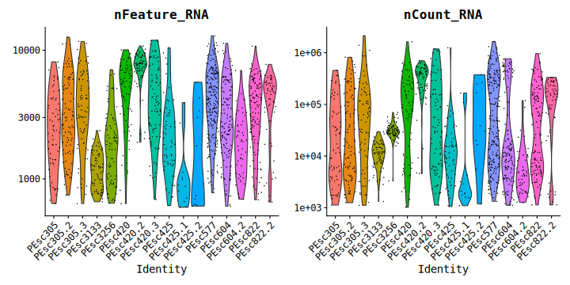
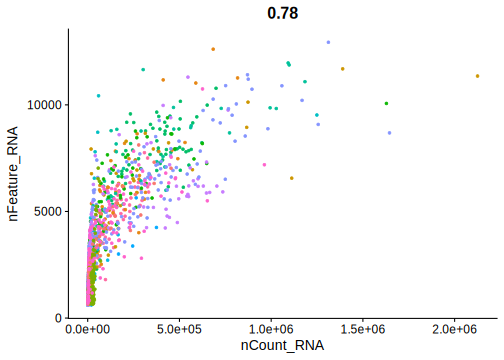
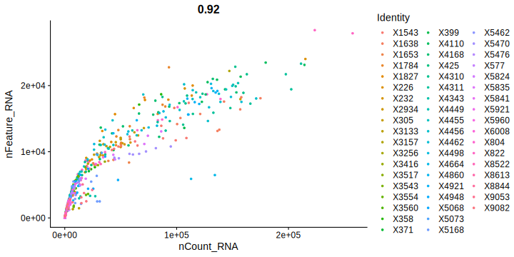
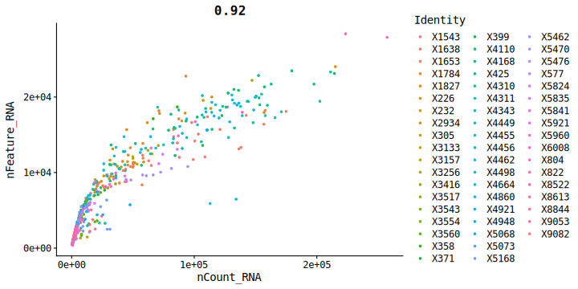
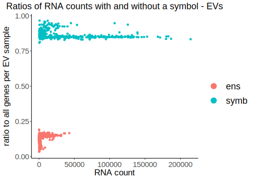

06-23_pesc_ev_analysis
================
2023-06-22

This script identifies lineages of EVs among cells from pleural effusion
samples.

------------------------------------------------------------------------

# Prepare the workign enviornment:

-   install and load packages
-   set %notin% and %notlike%
    -   set ggplot’s theme
-   set the working directory
-   set a plan for multithreading

``` r
# install.packages("Seurat")
# install.packages("remotes")
# BiocManager::install(version = '3.16')
# BiocManager::install("glmGamPoi")
# remotes::install_github("stephenturner/annotables")
# install.packages("glmGamPoi")


library(Seurat)
library(dplyr)
library(data.table)
library(Matrix)
library(ggplot2)
library(scales) # to better customize Seurat's plots
library(ggpubr)
library(future)
library(annotables) # for turning Ensembl ID to symbol
library(sctransform) # for normalization  
library(glmGamPoi) # for normalization
# library(svglite) # for vectorized, lightweight plotting
library(systemfonts) # to set the font for svg outputs

"%notin%" <- Negate("%in%")
"%notlike%" <- Negate("%like%")


# set the theme for plotting (Seurat uses ggplot's themes)
theme_set(new = theme_classic())
theme_update(
  axis.text.x = element_text(vjust = 0.5),
  strip.background = element_rect(fill = '#FFFFFF'),
  plot.title = element_text(hjust = 0.5, size = 25),
  axis.title = element_text(size = 23),
  axis.text = element_text(size = 20),
  legend.text = element_text(size = 18),
  legend.key.size = unit(2, 'line'),
  legend.title = element_text(size = 20)
  # text = element_text(family= "mono")
)

# That's not necessary (rmarkdown sets its directory as the one the .Rmd file is in.)
wd <- "/disk2/user/radgro/projects/2023-06_pesc_analysis"
knitr::opts_knit$set(root.dir = wd)


fonts <- list(
  mono = "Consolas",
  sans = "Lato"
)

# set svglite as a default for all the plots
# knitr::opts_chunk$set(knitr.chunk.dev = 'svglite')
# knitr::opts_chunk$set(dev = 'svglite', system_fonts = fonts)
knitr::opts_chunk$set(dev = 'svglite', dev.args = list(system_fonts = fonts))


# plan("multicore", workers = 8)
# plan()
```

``` r
# A demonstration of advantages of a sparse matrix ("d" for data).
d_dc <- as.matrix(read.csv("data/DC_matrix.txt", sep = "\t"))
s1 <- object.size(d_dc)
d_dc <- as(d_dc, "sparseMatrix")
s2 <- object.size(d_dc)
s1-s2
```

## Load and prepare the data and metadata.

``` r
# for EVs
d_dc <- as.sparse(read.csv("data/DC_matrix.txt", sep = "\t"))

# for cells
d_c <- as.sparse(read.csv("data/PEsc_matrix.txt", sep = "\t"))

# Gene names
gt <- fread("data/genes_title.txt", sep = "\t")

# get gene symbols from annotables
gt_s <- setDT(grch38[, c("ensgene", "symbol")])
colnames(gt_s)[1] <- "Geneid"
```

Join gene names with gene symbols and change symbols for Geneid when the
grch38 doesn’t include any particular ID, mult set to ‘first’, to
exclude duplicates/synonyms.

``` r
gt_mito <- readLines("code_for_daniel/human_mitochondrial_genes_list.txt")[-1] # Could be used for Daniel's approach
gt_join[Geneid %in% gt_mito] # same genes are mitochondrial here and in Daniel's table - all is fine
```

Insert joined gene names and symbols into datasets.

``` r
rownames(d_c) <- gt_sym
rownames(d_dc) <- gt_sym

rm(list = c("gt", "gt_s", "gt_sym"))
```

# QC and filtering of cells.

``` r
ds_c <- CreateSeuratObject(count = d_c, min.cells = 0, min.features = 1, project = "cells")
```

    ## Warning: Non-unique features (rownames) present in the input matrix, making
    ## unique

    ## Warning: Feature names cannot have underscores ('_'), replacing with dashes
    ## ('-')

``` r
rm(d_c)
suppressMessages(gc())
```

    ##            used  (Mb) gc trigger   (Mb)  max used   (Mb)
    ## Ncells  6679317 356.8   12136614  648.2   7478701  399.5
    ## Vcells 27639360 210.9  242108892 1847.2 299738434 2286.9

``` r
ds_c <- PercentageFeatureSet(ds_c, pattern = "^MT-", col.name = "percent_mt")
ds_c <- PercentageFeatureSet(ds_c, "^RP[SL]", col.name = "percent_ribo")
ds_c <- PercentageFeatureSet(ds_c, "^HB[^(P)]", col.name = "percent_hb")
ds_c <- PercentageFeatureSet(ds_c, "PECAM1|PF4", col.name = "percent_plat")
```

## Plotting

### Main QC plots

``` r
VlnPlot(ds_c, features = c('nCount_RNA','nFeature_RNA', 'percent_mt', 'percent_hb', "percent_ribo", "percent_plat"), pt.size = 1.3, ncol = 1) +  NoLegend()
```

<!-- -->

### UMI-gene count correlation

``` r
FeatureScatter(ds_c, "nCount_RNA", "nFeature_RNA", pt.size = 1, plot.cor = T) + scale_x_continuous(labels = scales::scientific) + NoLegend()
```

<!-- -->

### Hemoglobin content

``` r
c_hemo <- ds_c[[c("orig.ident", "nFeature_RNA", "percent_hb")]]

ggplot(c_hemo) +
  geom_jitter(aes(x = orig.ident, y = nFeature_RNA, size = percent_hb, color = percent_hb)) +
  scale_color_gradient2(midpoint = 30, mid = "orange", low="blue", high="red", ) +
  theme(axis.text.x = element_text(angle = 50)) +
  geom_hline(yintercept = 500)
```

<!-- -->

``` r
rm(c_hemo)
```

------------------------------------------------------------------------

## Filtering

How many cells have more than 800 RNAs or more than 1000 RNAs and genes
found.

``` r
length(WhichCells(ds_c, expression = nCount_RNA > 800))
```

    ## [1] 1765

``` r
length(WhichCells(ds_c, expression = nCount_RNA > 800 & nFeature_RNA > 500 & nCount_RNA > 1000 & nFeature_RNA > 600 & percent_mt < 25 & percent_ribo > 1.5
                & percent_hb < 1))
```

    ## [1] 1292

Filter out cells that have \<=800 features and 500 UMIs (subsetting on
the percentages of different transcript types can be done later).

The percent of ribosomal genes might be low due to low transcriptional
activity of the cells (5%, which was a threshold used before, removes
too many cells).

``` r
ds_cf <- subset(x = ds_c, subset = nCount_RNA > 1000 & nFeature_RNA > 600 & percent_mt < 20 & percent_ribo > 1.5
                & percent_hb < 1)
rm(ds_c)
suppressMessages(gc())
```

    ##            used  (Mb) gc trigger   (Mb)  max used   (Mb)
    ## Ncells  6907749 369.0   12136614  648.2  12136614  648.2
    ## Vcells 34065420 259.9  193687114 1477.8 299738434 2286.9

### Find which genes contribute to the nCount_RNA the most

``` r
counts_cells <- ds_cf@assays$RNA@counts
counts_cells <- Matrix::t(Matrix::t(counts_cells)/Matrix::colSums(counts_cells)) * 100

most_expr_cells <- order(apply(counts_cells, 1, median), decreasing = T)[20:1]
most_expr_counts_cells <- as.matrix(t(counts_cells[most_expr_cells,]))

rm(list = c("counts_cells", "most_expressed_cells"))
```

    ## Warning in rm(list = c("counts_cells", "most_expressed_cells")): object
    ## 'most_expressed_cells' not found

``` r
par(mar=c(5,10,1,1))
boxplot(most_expr_counts_cells, cex = 1, las = 1, xlab = "% total count per cell",
        col = (scales::hue_pal())(20)[20:1], horizontal = TRUE)
```

<!-- -->

### QC plotting of filtered reads

``` r
VlnPlot(ds_cf, features = c('nFeature_RNA','nCount_RNA'), log = T) ## UGLY
```

<!-- -->

``` r
VlnPlot(ds_cf, features = c('percent_mt', "percent_ribo"))
```

<!-- -->

### QC plotting of filtered reads with ggplot

``` r
p1 <- ggplot(as.data.table(ds_cf$nFeature_RNA)) +
  geom_violin(aes(x = "", y = V1)) +
  geom_jitter(aes(x = "", y = V1), size = .9, alpha = .4) + 
  scale_y_log10() +
  ggtitle('Genes') +
  theme(plot.title = element_text(size = 18)) +
  xlab("") +
  ylab("count")

p2 <- ggplot(as.data.table(ds_cf$nCount_RNA)) +
  geom_violin(aes(x = "", y = V1)) +
  geom_jitter(aes(x = "", y = V1), size = .9, alpha = .4) + 
  scale_y_log10() +
  ggtitle('RNAs') +
  theme(plot.title = element_text(size = 18)) +
  xlab("") +
  ylab("")

p3 <- ggplot(as.data.table(ds_cf$percent_mt)) +
  geom_violin(aes(x = "", y = V1)) +
  geom_jitter(aes(x = "", y = V1), size = .9, alpha = .4) + 
  ggtitle('Percent of\nmitochondrial') +
  theme(plot.title = element_text(size = 18)) +
  xlab("") +
  ylab("percent")

p4 <- ggplot(as.data.table(ds_cf$percent_ribo)) +
  geom_violin(aes(x = "", y = V1)) +
  geom_jitter(aes(x = "", y = V1), size = .9, alpha = .4) + 
  ggtitle('Percent of\nribosomal') +
  theme(plot.title = element_text(size = 18)) +
  xlab("") +
  ylab("")

p5 <- ggplot(as.data.table(ds_cf$percent_hb)) +
  geom_violin(aes(x = "", y = V1)) +
  geom_jitter(aes(x = "", y = V1), size = .9, alpha = .4) + 
  ggtitle('Percent of\nhemoglobin') +
  theme(plot.title = element_text(size = 18)) +
  xlab("") +
  ylab("")

p6 <- ggplot(as.data.table(ds_cf$percent_plat)) +
  geom_violin(aes(x = "", y = V1)) +
  geom_jitter(aes(x = "", y = V1), size = .9, alpha = .4) + 
  ggtitle('Percent of\nplatelet') +
  theme(plot.title = element_text(size = 18)) +
  xlab("") +
  ylab("")


ggarrange(p1, p2, p3, p4, p5, p6, nrow = 1)
```

<!-- -->

``` r
# ggarrange(ggarrange(p1, p2), 
          # ggarrange(p3, p4, p5, p6, ncol = 2, nrow = 2, widths = 2),
          # nrow = 2)

#ggsave("qc_violins_filt_p3.png", qcplots, device = 'png', dpi = "retina", width = 21, height = 12, bg = "white")
```

### UMI-gene count correlation

``` r
FeatureScatter(ds_cf, "nCount_RNA", "nFeature_RNA", pt.size = 1, plot.cor = T) + scale_x_continuous(labels = scales::scientific) + NoLegend()
```

<!-- -->

### Hemoglobin content

``` r
cf_hemo <- ds_cf[[c("orig.ident", "nFeature_RNA", "percent_hb")]]

ggplot(cf_hemo) +
  geom_jitter(aes(x = orig.ident, y = nFeature_RNA, size = percent_hb, color = percent_hb)) +
  scale_color_gradient2(midpoint = .5, mid = "orange", low="blue", high="red", ) +
  theme(axis.text.x = element_text(angle = 50))
```

<!-- -->

``` r
rm(cf_hemo)
```

------------------------------------------------------------------------

# QC and filtering of EVs.

``` r
ds_dc <- CreateSeuratObject(count = d_dc, min.cells = 0, min.features = 1, project = "ev")
```

    ## Warning: Non-unique features (rownames) present in the input matrix, making
    ## unique

    ## Warning: Feature names cannot have underscores ('_'), replacing with dashes
    ## ('-')

``` r
rm(d_dc)
suppressMessages(gc())
```

    ##            used  (Mb) gc trigger   (Mb)  max used   (Mb)
    ## Ncells  6933375 370.3   12136614  648.2  12136614  648.2
    ## Vcells 34206201 261.0  180746639 1379.0 299738434 2286.9

``` r
ds_dc <- PercentageFeatureSet(ds_dc, pattern = "^MT-", col.name = "percent_mt")
ds_dc <- PercentageFeatureSet(ds_dc, "^RP[SL]", col.name = "percent_ribo")
ds_dc <- PercentageFeatureSet(ds_dc, "^HB[^(P)]", col.name = "percent_hb")
ds_dc <- PercentageFeatureSet(ds_dc, "PECAM1|PF4", col.name = "percent_plat")
```

``` r
VlnPlot(ds_dc, features = c('nCount_RNA','nFeature_RNA', 'percent_mt', 'percent_hb', "percent_ribo", "percent_plat"), pt.size = 1.3, ncol = 1) +  NoLegend()
```

<!-- -->

### Other qc plots

``` r
FeatureScatter(ds_dc, "nCount_RNA", "nFeature_RNA", pt.size = 1, plot.cor = T) + 
  scale_x_continuous(labels = scales::scientific) + 
  scale_y_continuous(labels = scales::scientific)
```

<!-- -->
\_\_\_ ## Filtering

``` r
length(WhichCells(ds_dc, expression = nFeature_RNA > 100))
```

    ## [1] 569

``` r
length(WhichCells(ds_dc, expression = nFeature_RNA > 100 & nCount_RNA > 500))
```

    ## [1] 541

``` r
# most common genes for cells:
sort(Matrix::rowSums(ds_cf), decreasing = T)[1:10]
```

    ## MT-RNR2  MALAT1    ACTB MT-RNR1    CD74  MT-ND4  MT-CYB     FTL     B2M    PSAP 
    ## 1020525  734223  713029  585686  554177  512719  463503  460913  459010  416967

``` r
# most common genes for EVs
sort(Matrix::rowSums(ds_dc), decreasing = T)[1:10]
```

    ##         HELLPAR         MT-RNR2 ENSG00000279010 ENSG00000280156 ENSG00000279184 
    ##           72147           57170           55177           47776           36823 
    ##         MT-RNR1 ENSG00000279080 ENSG00000279738          MT-ND5          MT-ND4 
    ##           34482           29941           28346           23232           23109

## filter out EV samples that have x features and UMIs

``` r
ds_dcf <- subset(x = ds_dc, subset = nCount_RNA > 500 & nFeature_RNA > 100 & percent_mt < 90 & percent_ribo < 90)
rm(ds_dc)
suppressMessages(gc())
```

    ##            used  (Mb) gc trigger   (Mb)  max used   (Mb)
    ## Ncells  6935101 370.4   12136614  648.2  12136614  648.2
    ## Vcells 40343357 307.8  144597312 1103.2 299738434 2286.9

## Find which genes contribute to the nCount_RNA the most

``` r
C <- ds_dcf@assays$RNA@counts
C <- Matrix::t(Matrix::t(C)/Matrix::colSums(C)) * 100
most_expressed <- order(apply(C, 1, median), decreasing = T)[20:1]

par(mar=c(5,10,1,1))
boxplot(as.matrix(t(C[most_expressed,])), cex = 1, las = 1, xlab = "% total count per fraction",
        col = (scales::hue_pal())(20)[20:1], horizontal = TRUE)
```

<!-- -->

------------------------------------------------------------------------

## QC plotting of filtered reads

**Logarithmic axes.**

``` r
VlnPlot(ds_dcf, features = 'nFeature_RNA', pt.size = 1.3, log = T) +  NoLegend()
```

<!-- -->

``` r
VlnPlot(ds_dcf, features = 'nCount_RNA', pt.size = 1.3, log = T) +  NoLegend()
```

<!-- -->

------------------------------------------------------------------------

### Other qc plots

``` r
FeatureScatter(ds_dcf, "nCount_RNA", "nFeature_RNA", pt.size = 1, plot.cor = T) + 
  scale_x_continuous(labels = scales::scientific) +
  scale_y_continuous(labels = scales::scientific)
```

<!-- -->

# Ratio of well annotated genes (with symbols) to the rest

**On both graphs there’re two dots per cell or EV sample - one for genes
with and one for genes without a symbol.**

``` r
ratc <- as.data.table(ds_cf@assays$RNA@counts, keep.rownames = T)
ratc <- melt(ratc, id.vars = "rn")

ratc[, "code_symb" := ifelse(rn %like% "ENSG", "ens", "symb")]
ratc <- ratc[, sum(value), by = .(variable, code_symb)]
ratc[, "ratio" := V1/sum(V1), by = .(variable)]

ratc[code_symb == "ens", mean(ratio)]
```

    ## [1] 0.06248185

``` r
ggplot(ratc) +
  geom_point(aes(x = V1, y = ratio, color = code_symb)) +
  guides(color = guide_legend(title = "", size = 19, override.aes = list(size = 5))) +
  xlab("RNA count") +
  ylab("ratio to all genes per cell") +
  ggtitle("Ratios of RNA counts with and without a symbol - cells") +
  theme(plot.title = element_text(size = 18), axis.text = element_text(size = 15), axis.title = element_text(size = 17))
```

<!-- -->

``` r
ratev <- as.data.table(ds_dcf@assays$RNA@counts, keep.rownames = T)
ratev <- melt(ratev, id.vars = "rn")

ratev[, "code_symb" := ifelse(rn %like% "ENSG", "ens", "symb")]
ratev <- ratev[, sum(value), by = .(variable, code_symb)]
ratev[, "ratio" := V1/sum(V1), by = .(variable)]
ratev[code_symb == "ens", mean(ratio)]
```

    ## [1] 0.1342733

``` r
ggplot(ratev) +
  geom_point(aes(x = V1, y = ratio, color = code_symb)) +
  guides(color = guide_legend(title = "", size = 19, override.aes = list(size = 5))) +
  xlab("RNA count") +
  ylab("ratio to all genes per EV sample") +
  ggtitle("Ratios of RNA counts with and without a symbol - EVs") +
  theme(plot.title = element_text(size = 18), axis.text = element_text(size = 15), axis.title = element_text(size = 17))
```

<!-- -->

``` r
rm(list = c('ratev', 'ratc'))
suppressMessages(gc())
```

    ##            used  (Mb) gc trigger   (Mb)  max used   (Mb)
    ## Ncells  6966304 372.1   12136614  648.2  12136614  648.2
    ## Vcells 46551795 355.2  448169100 3419.3 700250130 5342.5

------------------------------------------------------------------------

# Metadata

## Cells

Assign cells to the patient, …

``` r
full_names <- colnames(ds_cf)
reg.pat <- regmatches(full_names, regexpr("PEsc[0-9]{1,6}", full_names))
reg.pat <- gsub("PEsc", "", reg.pat)
ds_cf@meta.data$pat <- reg.pat
```

…the replicate…

``` r
reg.rep <- regmatches(full_names, regexpr("PEsc[0-9]{1,6}(.|_)[0-9]", full_names))
reg.rep <- gsub("PEsc[0-9]{1,6}(.|_)", "", reg.rep)
ds_cf@meta.data$rep <- reg.rep
```

…and diagnosis and type of biopsy.

``` r
metd <- fread("PEpatients_sorted.csv")
metd[, c("type", "diag") := lapply(.SD, factor), .SDcols = c("type", 'diag')]
metd[, pat_numb := regmatches(metd[, pat_numb], regexpr("[0-9]{3,5}", metd[, pat_numb]))]

# replace missing type values ("") with "unknown".
metd[type == "", type := "unknown"]

patd <- as.data.table(reg.pat)
colnames(patd) <- "pat_numb"
met.full <- metd[patd, on = .(pat_numb)]


ds_cf@meta.data$type <- met.full[, type]
ds_cf@meta.data$diag <- met.full[, diag]

rm(list = c("reg.rep", "reg.pat"))
```

## EVs

Assign EVs to the fraction they’re from,…

``` r
full_names <- colnames(ds_dcf)
reg.frac <- regmatches(full_names, regexpr("_[A-Z]{1,2}_", full_names))
reg.frac <- gsub("_", "", reg.frac)
ds_dcf@meta.data$frac <- reg.frac
```

…the patient and the type of biopsy.

``` r
reg.pat <- regmatches(full_names, regexpr("X[0-9]{1,6}", full_names))
reg.pat <- gsub("X", "", reg.pat)
reg.pat[reg.pat == 804] <- 604 # a patient number correction
ds_dcf@meta.data$pat <- reg.pat


patd <- as.data.table(reg.pat)
colnames(patd) <- "pat_numb"
met.full <- metd[patd, on = .(pat_numb)]

ds_dcf@meta.data$type <- met.full[, type]
ds_dcf@meta.data$diag <- met.full[, diag]
```

------------------------------------------------------------------------

# Clustering analysis

## Cells

### Normalization, scaling and dimensionality reduction

**Normalization was done using the SC transform described here:
<https://genomebiology.biomedcentral.com/articles/10.1186/s13059-019-1874-1>
as it is supposed to be depth-independent, which justifies its use in
Smartseq3 EV sequencing.**

**During the analysis a change in mapping occurred, without
significantly affecting its overall profile, possibly due to package
update.**

``` r
ds_cf <- SCTransform(ds_cf, vst.flavor = "v2", verbose = FALSE) %>%
  RunPCA(npcs = 30, verbose = FALSE) %>%
  RunUMAP(reduction = "pca", dims = 1:30, verbose = FALSE)
```

    ## Warning: useNames = NA is deprecated. Instead, specify either useNames = TRUE or
    ## useNames = TRUE.

    ## Warning: useNames = NA is deprecated. Instead, specify either useNames = TRUE or
    ## useNames = TRUE.

    ## Warning: useNames = NA is deprecated. Instead, specify either useNames = TRUE or
    ## useNames = TRUE.

    ## Warning: useNames = NA is deprecated. Instead, specify either useNames = TRUE or
    ## useNames = TRUE.

    ## Warning: useNames = NA is deprecated. Instead, specify either useNames = TRUE or
    ## useNames = TRUE.

    ## Warning: useNames = NA is deprecated. Instead, specify either useNames = TRUE or
    ## useNames = TRUE.

    ## Warning: useNames = NA is deprecated. Instead, specify either useNames = TRUE or
    ## useNames = TRUE.

    ## Warning: useNames = NA is deprecated. Instead, specify either useNames = TRUE or
    ## useNames = TRUE.

    ## Warning: useNames = NA is deprecated. Instead, specify either useNames = TRUE or
    ## useNames = TRUE.

    ## Warning: useNames = NA is deprecated. Instead, specify either useNames = TRUE or
    ## useNames = TRUE.

    ## Warning: useNames = NA is deprecated. Instead, specify either useNames = TRUE or
    ## useNames = TRUE.

    ## Warning: useNames = NA is deprecated. Instead, specify either useNames = TRUE or
    ## useNames = TRUE.

    ## Warning: useNames = NA is deprecated. Instead, specify either useNames = TRUE or
    ## useNames = TRUE.

    ## Warning: useNames = NA is deprecated. Instead, specify either useNames = TRUE or
    ## useNames = TRUE.

    ## Warning: useNames = NA is deprecated. Instead, specify either useNames = TRUE or
    ## useNames = TRUE.

    ## Warning: useNames = NA is deprecated. Instead, specify either useNames = TRUE or
    ## useNames = TRUE.

    ## Warning: useNames = NA is deprecated. Instead, specify either useNames = TRUE or
    ## useNames = TRUE.

    ## Warning: useNames = NA is deprecated. Instead, specify either useNames = TRUE or
    ## useNames = TRUE.

    ## Warning: useNames = NA is deprecated. Instead, specify either useNames = TRUE or
    ## useNames = TRUE.

    ## Warning: useNames = NA is deprecated. Instead, specify either useNames = TRUE or
    ## useNames = TRUE.

    ## Warning: useNames = NA is deprecated. Instead, specify either useNames = TRUE or
    ## useNames = TRUE.

    ## Warning: useNames = NA is deprecated. Instead, specify either useNames = TRUE or
    ## useNames = TRUE.

    ## Warning: useNames = NA is deprecated. Instead, specify either useNames = TRUE or
    ## useNames = TRUE.

    ## Warning: useNames = NA is deprecated. Instead, specify either useNames = TRUE or
    ## useNames = TRUE.

    ## Warning: The default method for RunUMAP has changed from calling Python UMAP via reticulate to the R-native UWOT using the cosine metric
    ## To use Python UMAP via reticulate, set umap.method to 'umap-learn' and metric to 'correlation'
    ## This message will be shown once per session

``` r
  # RunUMAP(reduction = "pca", dims = 1:30, verbose = FALSE, n.components = 2)
# table(ds_cf@meta.data[c("pat", "diag", "type")])
```

Data allows to stratify cells according to their origin and diagnosis,
however different populations seem to be too mixed.

``` r
DimPlot(ds_cf, group.by = c("pat", "diag", "type", "rep"))
```

<!-- -->

FOLLOWING CHUNKS ARE OBSOLETE - but still useful.

``` r
rep_plot <- list()

# Appending to the list doesn't work, otherwise really cool.
# for (i in unique(ds_cf$pat)) {
#   
#   print(i)
#   rep_plot_single <- paste0("rep_plot_single_", i)
#   
#   assign(rep_plot_single, DimPlot(subset(ds_cf, pat == i)) +
#                                     labs(title = i) +
#                                     theme(plot.title = element_text(hjust = .5))
#   )
#   
#   print(rep_plot_single)
#   
#   rep_plot[i] <- get(rep_plot_single)
#   rm(list = rep_plot_single)
#   
# }


plot_data_column = function (data, column) {
    ggplot(data, aes_string(x = column)) +
        geom_histogram(fill = "lightgreen") +
        xlab(column)
}

# how to remove bad plots
# rm(list = ls()[ls() %like% "rep_plot"])
```

``` r
rep_plot <- list()

plot_reps <- function (data, patient) {
  
  DimPlot(subset(data, pat == patient), group.by = "rep") +
    scale_x_continuous(limits = c(-18, 12)) +
    scale_y_continuous(limits = c(-12, 12)) +
    labs(title = patient) +
    theme(plot.title = element_text(hjust = .5))
  
}

rep_plot <- lapply(unique(ds_cf$pat), plot_reps, data = ds_cf)

ggarrange(plotlist  = rep_plot)
```

**Inspect PCs - Jackstraw doesn’t work with SCTransformed data.**

**JackStraw plots doesn’t work on SCtransformed data**

``` r
ds_cf <- JackStraw(ds_cf, num.replicate = 100) 
ds_cf <- ScoreJackStraw(ds_cf, dims = 1:20) 

JackStrawPlot(ds_cf, dims = 1:15)
```

**Elbow Plot** Around 10 top PCAs should be enough to obtain proper
clustering.

``` r
ElbowPlot(ds_cf)
```

<!-- -->

### Variable features.

**Top 10 most variable genes** \|Gene\|Protein\|Description (from
genecards)\| \|—\|—\|—\| \|COL1A1, COL1A2\|Collagen 1\|\|
\|SFTPB\|pulmonary-associated surfactant protein B\|\|
\|SPARC\|cysteine-rich acidic matrix-associated protein\|involved in
extracellular matrix synthesis\| \|SPP1\|Secreted Phosphoprotein
1\|bone-osteoclasts interaction and a cytokine that upregulates
expression of interferon-gamma and interleukin-12\|
\|ENSG00000203396\|WDR45-like pseudogene\|\|
\|TAGLN\|Transgelin\|calponin, a shape change and transformation
sensitive actin-binding protein, early marker of smooth muscle
differentiation, a tumor suppressor\| \|IGFBP4\|insulin-like growth
factor binding protein 4\|binds both insulin-like growth factors I and
II and circulates in the plasma prolonging their half-life and changing
interactions\| \|IGF2\|Insulin Like Growth Factor 2\|epigenetic changes
at its locus are associated with Wilms tumour, Beckwith-Wiedemann
syndrome, rhabdomyosarcoma, and Silver-Russell syndrome, involved in
Apoptotic Pathways in Synovial Fibroblasts\| \|COL6A1\|Collagen Type VI
Alpha 1 Chain\|its mutations result in Bethlem myopathy and Ullrich
muscular dystrophy, involved in platelet-derived growth factor binding\|

Top 10 variable genes are annotated.

``` r
top10_c <- head(VariableFeatures(ds_cf), 10)

p_var_c <- VariableFeaturePlot(ds_cf)
LabelPoints(p_var_c, points = top10_c, repel = T)
```

    ## When using repel, set xnudge and ynudge to 0 for optimal results

<!-- -->

**Top 10 variable genes and gene and RNA counts.** Most of the variable
genes are upregulated in cells from patients 3133 and 3256.

``` r
FeaturePlot(ds_cf, features = c('nFeature_RNA','nCount_RNA', top10_c), pt.size = 2, reduction = 'umap')
```

<!-- -->

``` r
knitr::knit_exit()
```
