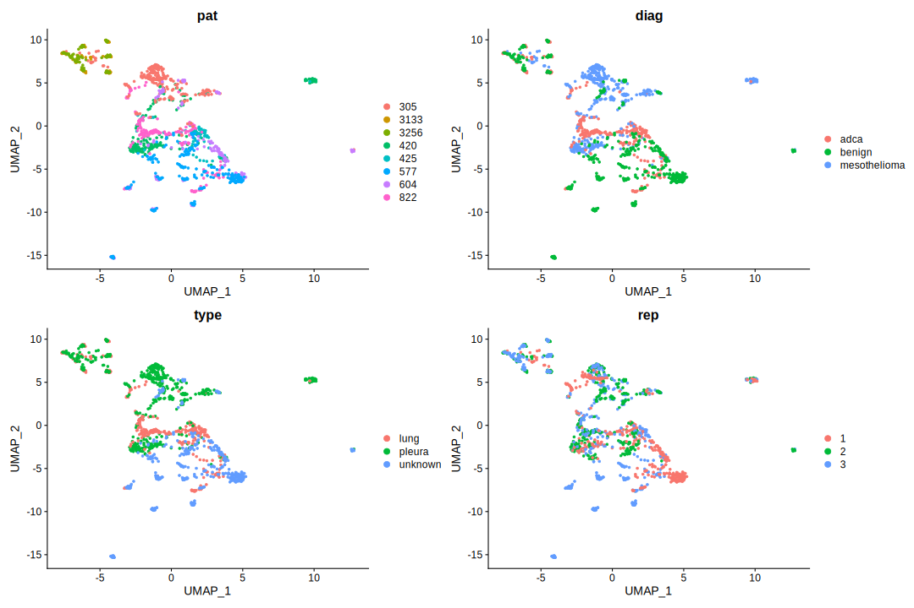
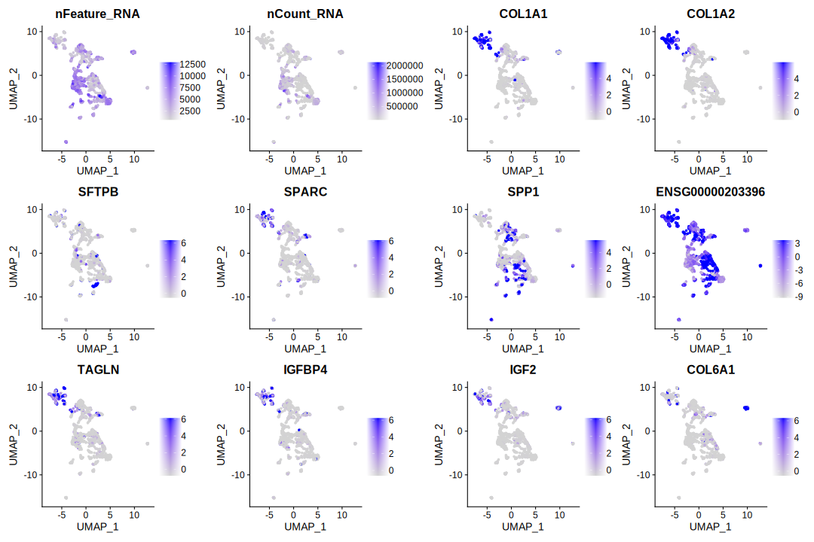
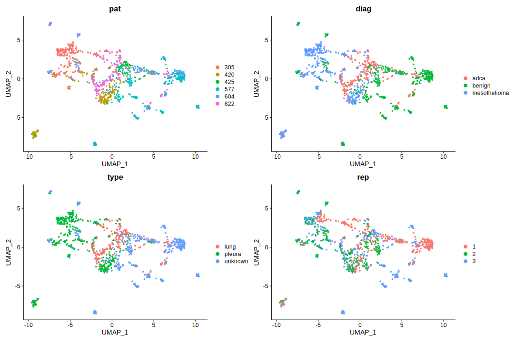

pesc_integration_analysis
================

<body style="background-color:FloralWhite;">

This script tries to integrate patient and replicate datasets instead of
treating them them as homogeneous. According to:
<https://satijalab.org/seurat/articles/integration_introduction.html>.

------------------------------------------------------------------------

# Prepare the workign enviornment:

-   install and load packages
-   set %notin% and %notlike%
    -   set ggplot’s theme
-   set the working directory
-   set a plan for multithreading

# Data QC

**All the data QC is taken from the main script and is not included in
this document.**

``` r
d_c <- as.sparse(read.csv("data/PEsc_matrix.txt", sep = "\t"))
# Gene names
gt <- fread("data/genes_title.txt", sep = "\t")

# get gene symbols from annotables
gt_s <- setDT(grch38[, c("ensgene", "symbol")])
colnames(gt_s)[1] <- "Geneid"
```

``` r
gt_mito <- readLines("code_for_daniel/human_mitochondrial_genes_list.txt")[-1] # Could be used for Daniel's approach
gt_join[Geneid %in% gt_mito] # same genes are mitochondrial here and in Daniel's table - all is fine
```

``` r
rownames(d_c) <- gt_sym

rm(list = c("gt", "gt_s", "gt_sym"))
```

``` r
ds_c <- CreateSeuratObject(count = d_c, min.cells = 0, min.features = 1, project = "cells")
```

    ## Warning: Non-unique features (rownames) present in the input matrix, making
    ## unique

    ## Warning: Feature names cannot have underscores ('_'), replacing with dashes
    ## ('-')

``` r
rm(d_c)
suppressMessages(gc())
```

    ##            used  (Mb) gc trigger  (Mb) max used  (Mb)
    ## Ncells  6598933 352.5   12567494 671.2  7641302 408.1
    ## Vcells 20431481 155.9   48256356 368.2 47650828 363.6

``` r
ds_c <- PercentageFeatureSet(ds_c, pattern = "^MT-", col.name = "percent_mt")
ds_c <- PercentageFeatureSet(ds_c, "^RP[SL]", col.name = "percent_ribo")
ds_c <- PercentageFeatureSet(ds_c, "^HB[^(P)]", col.name = "percent_hb")
ds_c <- PercentageFeatureSet(ds_c, "PECAM1|PF4", col.name = "percent_plat")
```

``` r
ds_cf <- subset(x = ds_c, subset = nCount_RNA > 1000 & nFeature_RNA > 600 & percent_mt < 20 & percent_ribo > 1.5
                & percent_hb < 1)
rm(ds_c)
suppressMessages(gc())
```

    ##            used  (Mb) gc trigger   (Mb)  max used   (Mb)
    ## Ncells  6720477 359.0   12584027  672.1   7987379  426.6
    ## Vcells 27509759 209.9  188943655 1441.6 294532711 2247.2

``` r
full_names <- colnames(ds_cf)
reg.pat <- regmatches(full_names, regexpr("PEsc[0-9]{1,6}", full_names))
reg.pat <- gsub("PEsc", "", reg.pat)
ds_cf@meta.data$pat <- reg.pat
```

``` r
reg.rep <- regmatches(full_names, regexpr("PEsc[0-9]{1,6}(.|_)[0-9]", full_names))
reg.rep <- gsub("PEsc[0-9]{1,6}(.|_)", "", reg.rep)
ds_cf@meta.data$rep <- reg.rep
```

``` r
metd <- fread("PEpatients_sorted.csv")
metd[, c("type", "diag") := lapply(.SD, factor), .SDcols = c("type", 'diag')]
metd[, pat_numb := regmatches(metd[, pat_numb], regexpr("[0-9]{3,5}", metd[, pat_numb]))]

# replace missing type values ("") with "unknown".
metd[type == "", type := "unknown"]

patd <- as.data.table(reg.pat)
colnames(patd) <- "pat_numb"
met.full <- metd[patd, on = .(pat_numb)]


ds_cf@meta.data$type <- met.full[, type]
ds_cf@meta.data$diag <- met.full[, diag]

rm(list = c("reg.rep", "reg.pat"))
```

``` r
# Subset the dataset
pat2 <- unique(ds_cf$pat)
pat2 <- pat2[1:6]

ds_cf2 <- subset(ds_cf, subset = pat %in% pat2)
```

``` r
knitr::opts_chunk$set(include = T)
```

# Integrate datasets

``` r
ds_cf_split <- SplitObject(ds_cf, split.by = "pat")
ds_cf_split <- lapply(X = ds_cf_split, FUN = SCTransform)

features <- SelectIntegrationFeatures(object.list = ds_cf_split, nfeatures = 3000)
ds_cf_split <- PrepSCTIntegration(object.list = ds_cf_split, anchor.features = features)
ds_cf_anchors <- FindIntegrationAnchors(object.list = ds_cf_split, anchor.features = features, normalization.method = "SCT")

# k.weight changed to 66 as patient 3133 has the least cells
ds_cf_comb <- IntegrateData(anchorset = ds_cf_anchors, k.weight = 66,  normalization.method = "SCT")
```

## Dim Reduc

``` r
DefaultAssay(ds_cf_comb) <- "integrated"

ds_cf_comb <- SCTransform(ds_cf_comb, vst.flavor = "v2", verbose = FALSE) %>%
  RunPCA( npcs = 30, verbose = FALSE) %>%
  RunUMAP(reduction = "pca", dims = 1:30, verbose = FALSE)
```

### UMAP

``` r
DimPlot(ds_cf_comb, group.by = c("pat", "diag", "type", "rep"))
```

<!-- -->

### PCA

``` r
DimPlot(ds_cf_comb, group.by = c("pat", "diag", "type", "rep"), reduction = "pca") + labs(tittle = "PCA")
```

<!-- -->

**Data allows to stratify cells according to their origin and
diagnosis.** ## Top 10 variable genes

``` r
top10_c <- head(VariableFeatures(ds_cf_comb), 10)

p_var_c <- VariableFeaturePlot(ds_cf_comb)
LabelPoints(p_var_c, points = top10_c, repel = T)
```

<!-- -->

Most of the variable genes are upregulated in cells from patients 3133
and 3256.

``` r
FeaturePlot(ds_cf_comb, features = c('nFeature_RNA','nCount_RNA', top10_c), pt.size = 1, reduction = 'umap', slot = "scale.data")
```

<!-- -->

# Integrate datasets - withot patients 3133 and 3256

``` r
ds_cf_split <- SplitObject(ds_cf2, split.by = "pat")
ds_cf_split <- lapply(X = ds_cf_split, FUN = SCTransform)

features <- SelectIntegrationFeatures(object.list = ds_cf_split, nfeatures = 3000)
ds_cf_split <- PrepSCTIntegration(object.list = ds_cf_split, anchor.features = features)
ds_cf_anchors <- FindIntegrationAnchors(object.list = ds_cf_split, anchor.features = features, normalization.method = "SCT")

# k.weight changed to 80 as patient 425 has the least cells
ds_cf_comb <- IntegrateData(anchorset = ds_cf_anchors, k.weight = 80, normalization.method = "SCT")
```

## Dim Reduc

``` r
DefaultAssay(ds_cf_comb) <- "integrated"

ds_cf_comb <- SCTransform(ds_cf_comb, vst.flavor = "v2", verbose = FALSE) %>%
  RunPCA( npcs = 30, verbose = FALSE) %>%
  RunUMAP(reduction = "pca", dims = 1:30, verbose = FALSE)
```

Data allows to stratify cells according to their origin and diagnosis.

### UMAP

``` r
DimPlot(ds_cf_comb, group.by = c("pat", "diag", "type", "rep"))
```

<!-- -->

**How it looks compared to unintegrated dataset (with 3133 and 3256
removed)?**

<!-- -->

### PCA

``` r
DimPlot(ds_cf_comb, group.by = c("pat", "diag", "type", "rep"), reduction = "pca") + labs(tittle = "PCA")
```

<!-- -->

## Top 10 variable genes

``` r
top10_c <- head(VariableFeatures(ds_cf_comb), 10)

p_var_c <- VariableFeaturePlot(ds_cf_comb)
LabelPoints(p_var_c, points = top10_c, repel = T)
```

    ## When using repel, set xnudge and ynudge to 0 for optimal results

<!-- -->

``` r
FeaturePlot(ds_cf_comb, features = c('nFeature_RNA','nCount_RNA', top10_c), pt.size = 1, reduction = 'umap', slot = "scale.data")
```

<!-- -->

# Conlusion

**The integration of data from different patients was not used as it had
negligible impact on the mapping results when compared to direct
analysis.**
