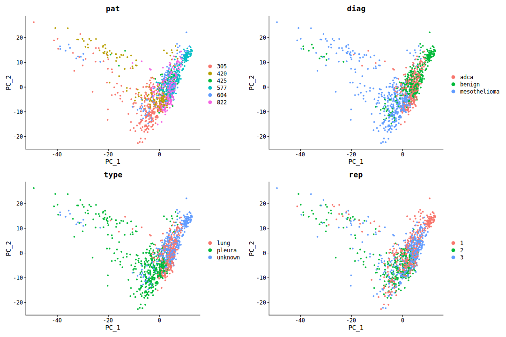

pesc_integration_analysis
================

<body style="background-color:FloralWhite;">

This script tries to integrate patient and replicate datasets instead of
treating them them as homogeneous. According to:
<https://satijalab.org/seurat/articles/integration_introduction.html>.

------------------------------------------------------------------------

# Prepare the workign enviornment:

-   install and load packages
-   set %notin% and %notlike%
    -   set ggplot’s theme
-   set the working directory
-   set a plan for multithreading

# Data QC

**All the data QC is taken from the main script and is not included in
this document.**

# Integrate datasets

``` r
ds_cf_split <- SplitObject(ds_cf, split.by = "pat")
ds_cf_split <- lapply(X = ds_cf_split, FUN = SCTransform)

features <- SelectIntegrationFeatures(object.list = ds_cf_split, nfeatures = 3000)
ds_cf_split <- PrepSCTIntegration(object.list = ds_cf_split, anchor.features = features)
ds_cf_anchors <- FindIntegrationAnchors(object.list = ds_cf_split, anchor.features = features, normalization.method = "SCT")

# k.weight changed to 66 as patient 3133 has the least cells
ds_cf_comb <- IntegrateData(anchorset = ds_cf_anchors, k.weight = 66,  normalization.method = "SCT")
```

## Dim Reduc

``` r
DefaultAssay(ds_cf_comb) <- "integrated"

ds_cf_comb <- SCTransform(ds_cf_comb, vst.flavor = "v2", verbose = FALSE) %>%
  RunPCA( npcs = 30, verbose = FALSE) %>%
  RunUMAP(reduction = "pca", dims = 1:30, verbose = FALSE)
```

### UMAP

``` r
DimPlot(ds_cf_comb, group.by = c("pat", "diag", "type", "rep"))
```

<!-- -->

### PCA

``` r
DimPlot(ds_cf_comb, group.by = c("pat", "diag", "type", "rep"), reduction = "pca") + labs(tittle = "PCA")
```

<!-- -->

**Data allows to stratify cells according to their origin and
diagnosis.** ## Top 10 variable genes

``` r
top10_c <- head(VariableFeatures(ds_cf_comb), 10)

p_var_c <- VariableFeaturePlot(ds_cf_comb)
LabelPoints(p_var_c, points = top10_c, repel = T)
```

<!-- -->

Most of the variable genes are upregulated in cells from patients 3133
and 3256.

``` r
FeaturePlot(ds_cf_comb, features = c('nFeature_RNA','nCount_RNA', top10_c), pt.size = 1, reduction = 'umap', slot = "scale.data")
```

<!-- -->

# Integrate datasets - withot patients 3133 and 3256

``` r
ds_cf_split <- SplitObject(ds_cf2, split.by = "pat")
ds_cf_split <- lapply(X = ds_cf_split, FUN = SCTransform)

features <- SelectIntegrationFeatures(object.list = ds_cf_split, nfeatures = 3000)
ds_cf_split <- PrepSCTIntegration(object.list = ds_cf_split, anchor.features = features)
ds_cf_anchors <- FindIntegrationAnchors(object.list = ds_cf_split, anchor.features = features, normalization.method = "SCT")

# k.weight changed to 80 as patient 425 has the least cells
ds_cf_comb <- IntegrateData(anchorset = ds_cf_anchors, k.weight = 80, normalization.method = "SCT")
```

## Dim Reduc

``` r
DefaultAssay(ds_cf_comb) <- "integrated"

ds_cf_comb <- SCTransform(ds_cf_comb, vst.flavor = "v2", verbose = FALSE) %>%
  RunPCA( npcs = 30, verbose = FALSE) %>%
  RunUMAP(reduction = "pca", dims = 1:30, verbose = FALSE)
```

Data allows to stratify cells according to their origin and diagnosis.

### UMAP

``` r
DimPlot(ds_cf_comb, group.by = c("pat", "diag", "type", "rep"))
```

<!-- -->

**How it looks compared to unintegrated dataset (with 3133 and 3256
removed)?**

<!-- -->

### PCA

``` r
DimPlot(ds_cf_comb, group.by = c("pat", "diag", "type", "rep"), reduction = "pca") + labs(tittle = "PCA")
```

<!-- -->

## Top 10 variable genes

``` r
top10_c <- head(VariableFeatures(ds_cf_comb), 10)

p_var_c <- VariableFeaturePlot(ds_cf_comb)
LabelPoints(p_var_c, points = top10_c, repel = T)
```

    ## When using repel, set xnudge and ynudge to 0 for optimal results

<!-- -->

``` r
FeaturePlot(ds_cf_comb, features = c('nFeature_RNA','nCount_RNA', top10_c), pt.size = 1, reduction = 'umap', slot = "scale.data")
```

<!-- -->
