06-23_pesc_ev_analysis
================
2023-06-22


This script performs QC of cell data from the EV-pleural effusion study and explores its variance with regard to diagnosis

------------------------------------------------------------------------

# Prepare the workign enviornment:

-   install and load packages
-   set %notin% and %notlike%
-   set ggplot’s theme
-   set the working directory
-   set a plan for multithreading

``` r
# install.packages("Seurat")
# install.packages("remotes")
# BiocManager::install(version = '3.16')
# BiocManager::install("glmGamPoi")
# remotes::install_github("stephenturner/annotables")
# install.packages("glmGamPoi")
# BiocManager::install("DESeq2")
# install.packages("data.filt")

library(Seurat)
library(dplyr)
library(data.table)
library(Matrix)
library(ggplot2)
library(scales) # to better customize Seurat's plots
library(ggpubr)
library(ggrepel)
library(patchwork)
library(ggbeeswarm) # for better positioning of arrows on log2 change plots - position_jitter doesn't allow to mark points
library(future)
library(annotables) # for turning Ensembl ID to symbol
library(sctransform) # for normalization  
library(glmGamPoi) # for SCTransform
# library(svglite) # for vectorized, lightweight plotting
library(systemfonts) # to set the font for svg outputs
library(DESeq2)
library(MAST)
# library(data.filt) # <---------------- GET IT

"%notin%" <- Negate("%in%")
"%notlike%" <- Negate("%like%")


# set the theme for plotting (Seurat uses ggplot's themes)
theme_set(new = theme_classic())
theme_update(
  axis.text.x = element_text(vjust = 0.5),
  strip.background = element_rect(fill = '#FFFFFF'),
  plot.title = element_text(hjust = 0.5, size = 25),
  plot.subtitle = element_text(size = 20, hjust = .5),
  axis.title = element_text(size = 23),
  axis.text = element_text(size = 20),
  legend.text = element_text(size = 20),
  legend.key.size = unit(2, 'line'),
  legend.title = element_text(size = 20, hjust = .5, vjust = .5)
  # text = element_text(family= "mono")
)

# That's not necessary (rmarkdown sets its directory as the one the .Rmd file is in.)
wd <- "/disk2/user/radgro/projects/2023-06_pesc_analysis"
knitr::opts_knit$set(root.dir = wd)


fonts <- list(
  mono = "Consolas",
  sans = "Consolas"
  # sans = "Lato"
)

# set svglite as a default for all the plots
# knitr::opts_chunk$set(knitr.chunk.dev = 'svglite')
# knitr::opts_chunk$set(dev = 'svglite', system_fonts = fonts)
knitr::opts_chunk$set(dev = 'svglite', dev.args = list(system_fonts = fonts),
                       cache.path = "pesc_analysis_1_cache/gfm/", cache = T) # cache of a github_document doesn't work if the path to the gfm folder is not provided!!!

# knitr::opts_chunk$set(cache.extra = 1) # RESETS CACHE

# plan("multicore", workers = 8) # Not allowed on the server
# plan()
```

## Load and prepare the data and metadata.

``` r
# for cells
d_c <- as.sparse(read.csv("data/PEsc_matrix.txt", sep = "\t"))

# Gene names
gt <- fread("data/genes_title.txt", sep = "\t")

# get gene symbols from annotables
gt_s <- setDT(grch38[, c("ensgene", "symbol")])
colnames(gt_s)[1] <- "Geneid"
```

Join gene names with gene symbols and change symbols for Geneids when
the grch38 doesn’t include any particular ID, mult set to ‘first’, to
exclude duplicates/synonyms.

``` r
gt_join <- gt_s[gt, on = .(Geneid), mult = 'first'][symbol %in% NA | symbol == "", symbol := Geneid]
gt_sym <- gt_join[, symbol]
```

``` r
gt_mito <- readLines("code_for_daniel/human_mitochondrial_genes_list.txt")[-1] # Could be used for Daniel's approach
gt_join[Geneid %in% gt_mito] # same genes are mitochondrial here and in Daniel's table - all is fine
```

Insert joined gene names and symbols into datasets.

``` r
rownames(d_c) <- gt_sym
rownames(d_dc) <- gt_sym

rm(list = c("gt", "gt_s", "gt_sym"))
```

# QC and filtering of cells

``` r
ds_c <- CreateSeuratObject(count = d_c, min.cells = 0, min.features = 1, project = "cells")
```

    ## Warning: Non-unique features (rownames) present in the input matrix, making
    ## unique

    ## Warning: Feature names cannot have underscores ('_'), replacing with dashes
    ## ('-')

``` r
rm(d_c)
suppressMessages(gc())
```

    ##            used  (Mb) gc trigger   (Mb)  max used   (Mb)
    ## Ncells  8732344 466.4   14797731  790.3  10475863  559.5
    ## Vcells 31109950 237.4  245440144 1872.6 304890721 2326.2

``` r
ds_c <- PercentageFeatureSet(ds_c, pattern = "^MT-", col.name = "percent_mt")
ds_c <- PercentageFeatureSet(ds_c, "^RP[SL]", col.name = "percent_ribo")
ds_c <- PercentageFeatureSet(ds_c, "^HB[^(P)]", col.name = "percent_hb")
ds_c <- PercentageFeatureSet(ds_c, "PECAM1|PF4", col.name = "percent_plat")
```

## Plotting

### Main QC plots

``` r
VlnPlot(ds_c, features = c('nCount_RNA','nFeature_RNA', 'percent_mt', 'percent_hb', "percent_ribo", "percent_plat"), pt.size = 1.3, ncol = 1) +  NoLegend()
```

<!-- -->

### Barcode-gene count correlation

``` r
FeatureScatter(ds_c, "nCount_RNA", "nFeature_RNA", pt.size = 1, plot.cor = T) + scale_x_continuous(labels = scales::scientific) + NoLegend()
```

<!-- -->

### Hemoglobin content

``` r
c_hemo <- ds_c[[c("orig.ident", "nFeature_RNA", "percent_hb")]]

ggplot(c_hemo) +
  geom_jitter(aes(x = orig.ident, y = nFeature_RNA, size = percent_hb, color = percent_hb)) +
  scale_color_gradient2(midpoint = 30, mid = "orange", low="blue", high="red") +
  theme(axis.text.x = element_text(angle = 50)) +
  geom_hline(yintercept = 500)
```

<!-- -->

``` r
rm(c_hemo)
```

------------------------------------------------------------------------

## Filtering

How many cells have more than 800 RNAs or more than 1000 RNAs and genes
found.

``` r
length(WhichCells(ds_c, expression = nCount_RNA > 800))
```

    ## [1] 1765

``` r
length(WhichCells(ds_c, expression = nCount_RNA > 800 & nFeature_RNA > 500 & nCount_RNA > 1000 & nFeature_RNA > 600 & percent_mt < 25 & percent_ribo > 1.5
                & percent_hb < 1))
```

    ## [1] 1292

Filter out cells that have \<=800 features and 500 barcodes (subsetting on
the percentages of different transcript types can be done later).

The percent of ribosomal genes might be low due to low transcriptional
activity of the cells (5%, which was a threshold used before, removes
too many cells).

``` r
ds_cf <- subset(x = ds_c, subset = nCount_RNA > 1000 & nFeature_RNA > 600 & percent_mt < 20 & percent_ribo > 1.5
                & percent_hb < 1)
rm(ds_c)
suppressMessages(gc())
```

    ##            used  (Mb) gc trigger   (Mb)  max used   (Mb)
    ## Ncells  8957347 478.4   14797731  790.3  14797731  790.3
    ## Vcells 37530400 286.4  196352116 1498.1 304890721 2326.2

### Find which genes contribute to the nCount_RNA the most

``` r
counts_cells <- ds_cf@assays$RNA@counts
counts_cells <- Matrix::t(Matrix::t(counts_cells)/Matrix::colSums(counts_cells)) * 100

most_expr_cells <- order(apply(counts_cells, 1, median), decreasing = T)[20:1]
most_expr_counts_cells <- as.matrix(t(counts_cells[most_expr_cells,]))

rm(list = c("counts_cells", "most_expressed_cells"))
```

    ## Warning in rm(list = c("counts_cells", "most_expressed_cells")): object
    ## 'most_expressed_cells' not found

``` r
par(mar=c(5,10,1,1))
boxplot(most_expr_counts_cells, cex = 1, las = 1, xlab = "% total count per cell",
        col = (scales::hue_pal())(20)[20:1], horizontal = TRUE)
```

<!-- -->

### QC plotting of filtered reads

``` r
VlnPlot(ds_cf, features = c('nFeature_RNA','nCount_RNA'), log = T) ## UGLY
```

<!-- -->

``` r
VlnPlot(ds_cf, features = c('percent_mt', "percent_ribo"))
```

<!-- -->

### QC plotting of filtered reads with ggplot

``` r
p1 <- ggplot(as.data.table(ds_cf$nFeature_RNA)) +
  geom_violin(aes(x = "", y = V1)) +
  geom_jitter(aes(x = "", y = V1), size = .9, alpha = .4) + 
  scale_y_log10() +
  ggtitle('Genes') +
  theme(plot.title = element_text(size = 18)) +
  xlab("") +
  ylab("count")

p2 <- ggplot(as.data.table(ds_cf$nCount_RNA)) +
  geom_violin(aes(x = "", y = V1)) +
  geom_jitter(aes(x = "", y = V1), size = .9, alpha = .4) + 
  scale_y_log10() +
  ggtitle('RNAs') +
  theme(plot.title = element_text(size = 18)) +
  xlab("") +
  ylab("")

p3 <- ggplot(as.data.table(ds_cf$percent_mt)) +
  geom_violin(aes(x = "", y = V1)) +
  geom_jitter(aes(x = "", y = V1), size = .9, alpha = .4) + 
  ggtitle('Percent of\nmitochondrial') +
  theme(plot.title = element_text(size = 18)) +
  xlab("") +
  ylab("percent")

p4 <- ggplot(as.data.table(ds_cf$percent_ribo)) +
  geom_violin(aes(x = "", y = V1)) +
  geom_jitter(aes(x = "", y = V1), size = .9, alpha = .4) + 
  ggtitle('Percent of\nribosomal') +
  theme(plot.title = element_text(size = 18)) +
  xlab("") +
  ylab("")

p5 <- ggplot(as.data.table(ds_cf$percent_hb)) +
  geom_violin(aes(x = "", y = V1)) +
  geom_jitter(aes(x = "", y = V1), size = .9, alpha = .4) + 
  ggtitle('Percent of\nhemoglobin') +
  theme(plot.title = element_text(size = 18)) +
  xlab("") +
  ylab("")

p6 <- ggplot(as.data.table(ds_cf$percent_plat)) +
  geom_violin(aes(x = "", y = V1)) +
  geom_jitter(aes(x = "", y = V1), size = .9, alpha = .4) + 
  ggtitle('Percent of\nplatelet') +
  theme(plot.title = element_text(size = 18)) +
  xlab("") +
  ylab("")


ggarrange(p1, p2, p3, p4, p5, p6, nrow = 1)
```

<!-- -->

``` r
# ggarrange(ggarrange(p1, p2), 
          # ggarrange(p3, p4, p5, p6, ncol = 2, nrow = 2, widths = 2),
          # nrow = 2)

#ggsave("qc_violins_filt_p3.png", qcplots, device = 'png', dpi = "retina", width = 21, height = 12, bg = "white")
```

### Barcode-gene count correlation

``` r
FeatureScatter(ds_cf, "nCount_RNA", "nFeature_RNA", pt.size = 1, plot.cor = T) + scale_x_continuous(labels = scales::scientific) + NoLegend()
```

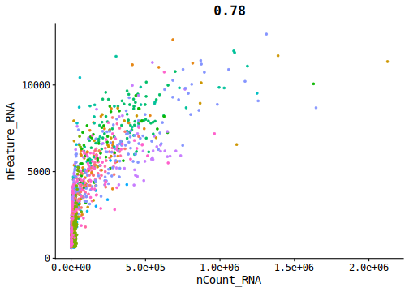<!-- -->

### Hemoglobin content

``` r
cf_hemo <- ds_cf[[c("orig.ident", "nFeature_RNA", "percent_hb")]]

ggplot(cf_hemo) +
  geom_jitter(aes(x = orig.ident, y = nFeature_RNA, size = percent_hb, color = percent_hb)) +
  scale_color_gradient2(midpoint = .5, mid = "orange", low="blue", high="red", ) +
  theme(axis.text.x = element_text(angle = 50))
```

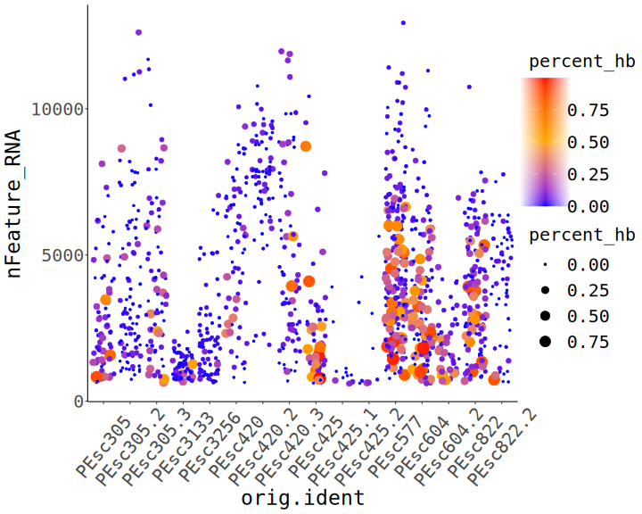<!-- -->

``` r
rm(cf_hemo)
```

------------------------------------------------------------------------

# Metadata

## Cells

Assign cells to the patient, …

``` r
full_names <- colnames(ds_cf)
reg.pat <- regmatches(full_names, regexpr("PEsc[0-9]{1,6}", full_names))
reg.pat <- gsub("PEsc", "", reg.pat)
ds_cf@meta.data$pat <- reg.pat
```

…the replicate…

``` r
reg.rep <- regmatches(full_names, regexpr("PEsc[0-9]{1,6}(.|_)[0-9]", full_names))
reg.rep <- gsub("PEsc[0-9]{1,6}(.|_)", "", reg.rep)
ds_cf@meta.data$rep <- reg.rep
```

…and diagnosis and type of biopsy.

``` r
metd <- fread("PEpatients_2_edited.csv")
metd[, c("type", "diag") := lapply(.SD, factor), .SDcols = c("type", 'diag')]
metd[, pat_numb := regmatches(metd[, pat_numb], regexpr("[0-9]{3,5}", metd[, pat_numb]))]

# replace missing type values ("") with "unknown".
metd[type == "", type := "unknown"]

patd <- as.data.table(reg.pat)
colnames(patd) <- "pat_numb"
met.full <- metd[patd, on = .(pat_numb)]


ds_cf@meta.data$type <- met.full[, type]
ds_cf@meta.data$diag <- met.full[, diag]

rm(list = c("reg.rep", "reg.pat"))
```

------------------------------------------------------------------------

# Clustering analysis

## Cells

### Normalization, scaling and dimensionality reduction

**Normalization was done using the SC transform described here:
<https://genomebiology.biomedcentral.com/articles/10.1186/s13059-019-1874-1>
as it is supposed to be depth-independent, which justifies its use in
Smartseq3 EV sequencing.**

**During the analysis a change in mapping occurred, without
significantly affecting its overall profile, possibly due to package
update on the server.**

``` r
ds_cf <- SCTransform(ds_cf, vst.flavor = "v2", verbose = FALSE) %>%
  RunPCA(npcs = 30, verbose = FALSE) %>%
  RunUMAP(reduction = "pca", dims = 1:30, verbose = FALSE)
  # RunUMAP(reduction = "pca", dims = 1:30, verbose = FALSE, n.components = 2)
# table(ds_cf@meta.data[c("pat", "diag", "type")])
```

Data allows to stratify cells according to their origin and diagnosis,
however different populations seem to be too mixed.

``` r
DimPlot(ds_cf, group.by = c("pat", "diag", "type", "rep"))
```

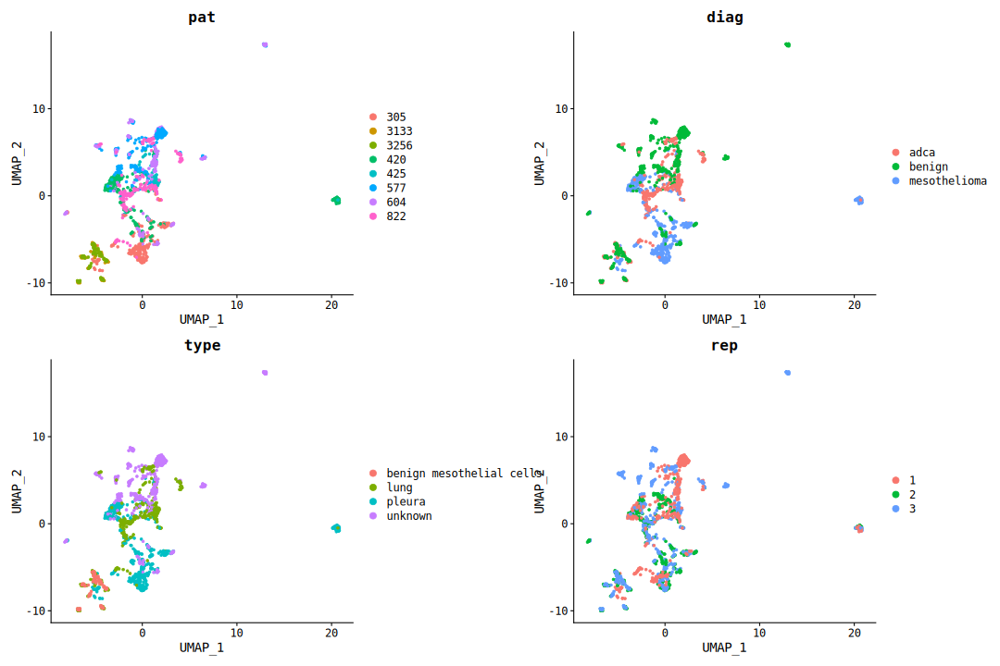<!-- -->

### PCs

Inspect PCs - Jackstraw doesn’t work with SCTransformed data.

**Elbow Plot - around 10 top PCs should be enough to obtain proper clustering.**

``` r
ElbowPlot(ds_cf)
```

<!-- -->

### Variable features

**Top 10 most variable genes:**

``` r
top10_c <- head(VariableFeatures(ds_cf), 10) # No need to use FindVariableFeatures, as SCTransform does that

p_var_c <- VariableFeaturePlot(ds_cf)
LabelPoints(p_var_c, points = top10_c, repel = T)
```

    ## When using repel, set xnudge and ynudge to 0 for optimal results

<!-- -->


| Gene            | Protein                                        | Description (from genecards)                                                                                                                                                                         |
|-----------------|------------------------------------------------|------------------------------------------------------------------------------------------------------------------------------------------------------------------------------------------------------|
| COL1A1, COL1A2  | Collagen 1                                     |                                                                                                                                                                                                      |
| SFTPB           | pulmonary-associated surfactant protein B      |                                                                                                                                                                                                      |
| SPARC           | cysteine-rich acidic matrix-associated protein | involved in extracellular matrix synthesis                                                                                                                                                           |
| SPP1            | Secreted Phosphoprotein 1                      | bone-osteoclasts interaction and a cytokine that upregulates expression of interferon-gamma and interleukin-12                                                                                       |
| ENSG00000203396 | WDR45-like pseudogene                          |                                                                                                                                                                                                      |
| TAGLN           | Transgelin                                     | calponin, a shape change and transformation sensitive actin-binding protein, early marker of smooth muscle differentiation, a tumor suppressor                                                       |
| IGFBP4          | insulin-like growth factor binding protein 4   | binds both insulin-like growth factors I and II and circulates in the plasma prolonging their half-life and changing interactions                                                                    |
| IGF2            | Insulin Like Growth Factor 2                   | epigenetic changes at its locus are associated with Wilms tumour, Beckwith-Wiedemann syndrome, rhabdomyosarcoma, and Silver-Russell syndrome, involved in Apoptotic Pathways in Synovial Fibroblasts |
| COL6A1          | Collagen Type VI Alpha 1 Chain                 | its mutations result in Bethlem myopathy and Ullrich muscular dystrophy, involved in platelet-derived growth factor binding                                                                          |


**Top 10 variable genes and gene and RNA counts.** Most of the variable
genes are upregulated in cells from patients 3133 and 3256.

``` r
FeaturePlot(ds_cf, features = c('nFeature_RNA','nCount_RNA', top10_c), pt.size = 1, reduction = 'umap', slot = "scale.data")
```

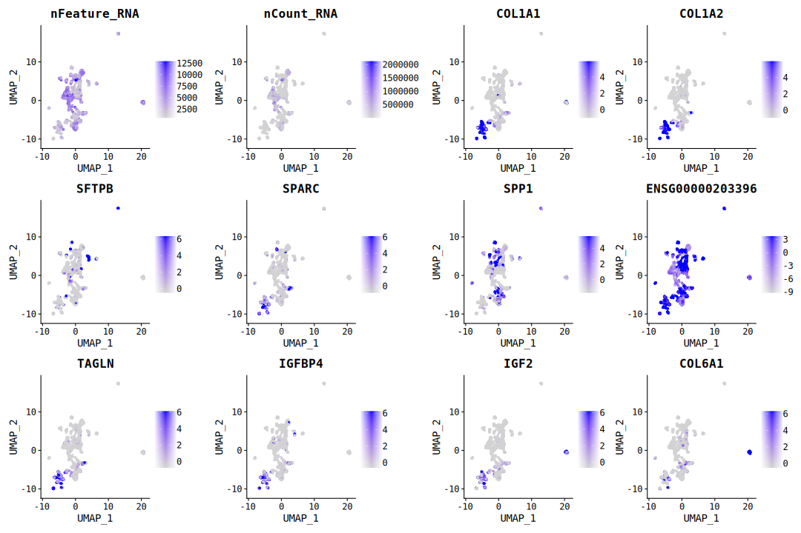<!-- -->

### Feature plot - Umap

**RNA and gene counts seem to not influence the clustering outcome.**

``` r
FeaturePlot(ds_cf, features = c("nCount_RNA", "nFeature_RNA"), pt.size = 2, reduction = 'umap')
```

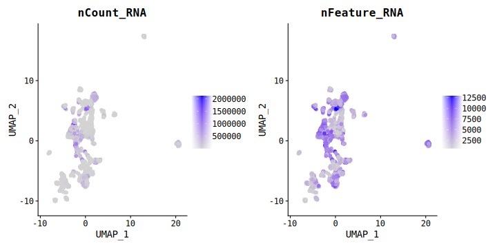<!-- -->

### Clustering

``` r
ds_cf <- FindNeighbors(ds_cf, reduction = "umap", verbose = FALSE, dims = 1:2) %>%
  FindClusters(resolution = 0.5, verbose = FALSE)

p1 <- DimPlot(ds_cf, group.by = c("pat", "diag", "type"), pt.size = 1.5, reduction = "umap")

alpha_colors <- hue_pal()(27) #  number of colors equal to number of clusters - required to change the alpha

p2 <- DimPlot(ds_cf, pt.size = 2, label = T, cols = alpha(alpha_colors, .6), reduction = "umap") + 
  labs(title = "clusters") + 
  theme(plot.title = element_text(hjust = .5))


p1 + p2
```

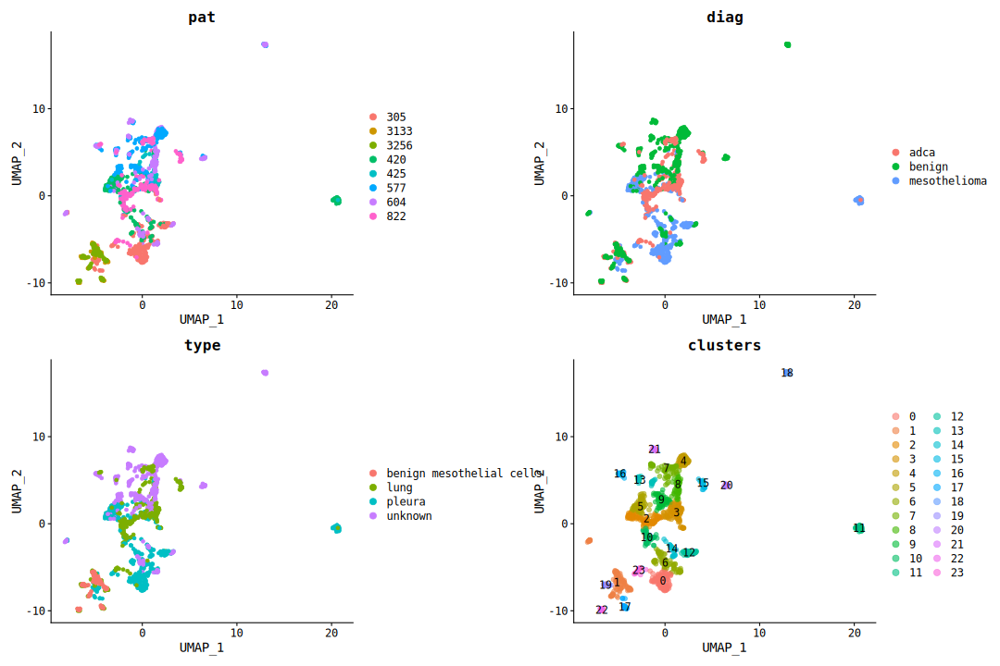<!-- -->

**If clusters are found using PCA:**

``` r
ds_cf <- FindNeighbors(ds_cf, reduction = "pca", dims = 1:10, verbose = FALSE) %>%
  FindClusters(resolution = 0.7, verbose = FALSE)

p1 <- DimPlot(ds_cf, group.by = c("pat", "diag", "type"), pt.size = 1.5, reduction = "umap")


alpha_colors <- hue_pal()(14) #  number of colors equal to number of clusters - required to change the alpha

p2 <- DimPlot(ds_cf, pt.size = 2, label = T, cols = alpha(alpha_colors, .6), reduction = "umap") + 
  labs(title = "clusters") + 
  theme(plot.title = element_text(hjust = .5))


p1 + p2
```

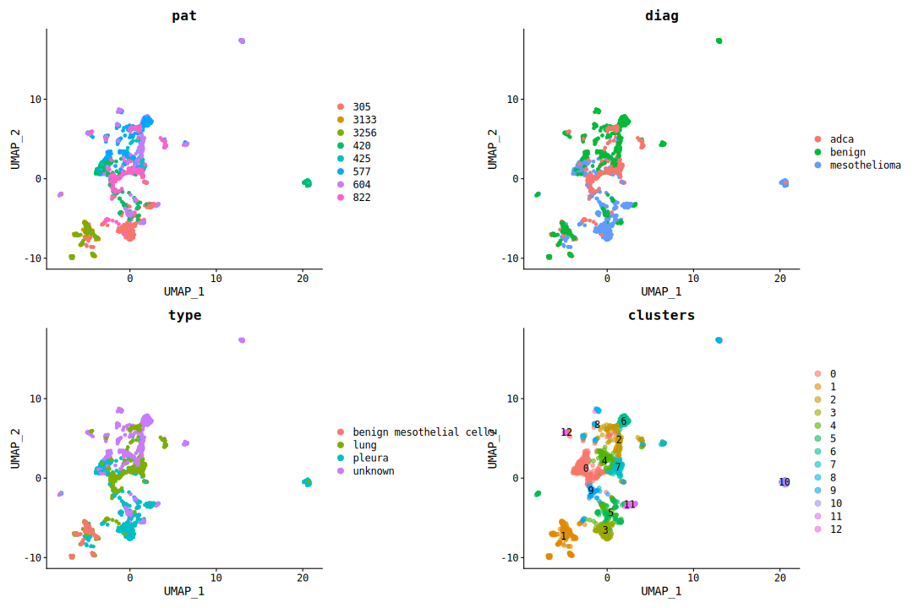<!-- -->

### Post-clustering QC

**Data was further explored to exclude possible confounding effects in
data quality:**

#### Inter-replicate variance

``` r
p1 <- DimPlot(ds_cf, split.by = "pat", group.by = "rep", reduction = "pca")
p2 <- DimPlot(ds_cf, split.by = "pat", group.by = "rep")

p1 + p2
```

<!-- -->

#### Heatmaps of genes with highest PC scores.

##### All patients

``` r
dim_plot_pca <- DimHeatmap(ds_cf, dims = 1:6, balanced = TRUE, reduction = "pca", fast = F, combine = F)

for (i in 1:length(dim_plot_pca)) {
  
  pc <- paste0("PC_", i)
  
  dim_plot_pca[[i]] <- dim_plot_pca[[i]] + theme(legend.position = "none", axis.text.y = element_text(size = 11),
          plot.title = element_text(size = 14)) +
          ggtitle(label = pc)
  
}

ggarrange(plotlist = dim_plot_pca, align = "v", common.legend = T, legend = "right")
```

<!-- -->

##### PC1 of each patient

```
plot_pat_dim_heat <- function (data, patient) {

  DimHeatmap(subset(data, subset = pat == patient), nfeatures = 30,  dims = 1, balanced = TRUE, fast = F) +
    theme(legend.position = "none", axis.text.y = element_text(size = 11),
          plot.title = element_text(size = 14)) +
    ggtitle(label = patient)

  }

pat_dim_heat <- lapply(unique(ds_cf$pat), plot_pat_dim_heat, data = ds_cf)
ggarrange(plotlist  = pat_dim_heat, common.legend = T, legend = "right")
```

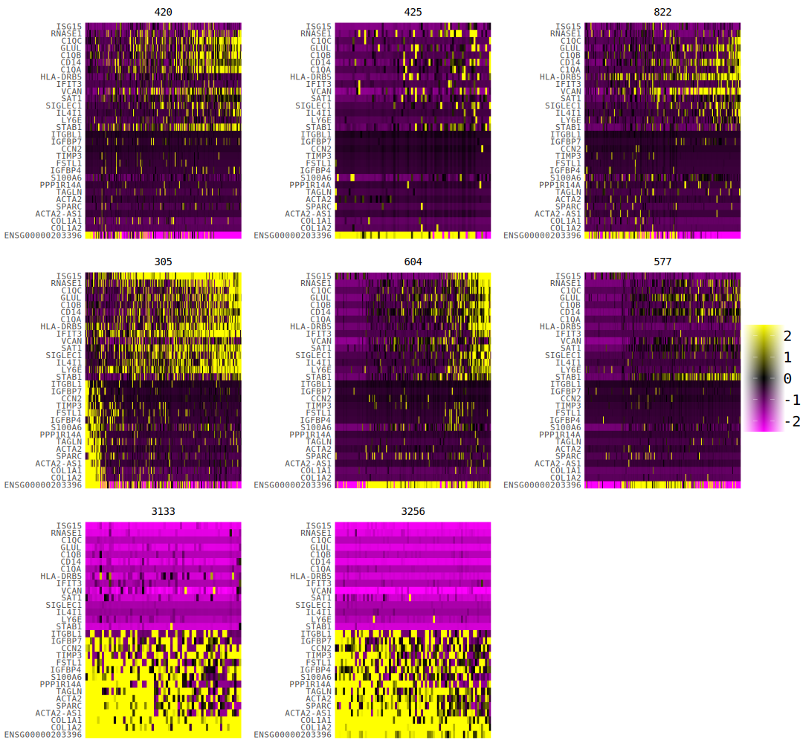<!-- -->

#### Patients 3133 and 3256

**Cells of patients 3133, 3256 have nearly identical expression profile
despite different diagnoses - Both patients will be removed from the
analysis.**

``` r
list_heatmaps <- DimHeatmap(subset(ds_cf, subset = pat %in% c(3133, 3256)), dims = 1:6, balanced = TRUE, fast = F, combine = F) 
  

plot_dim_heat <- function (x) {
  
  heatmap_x <- list_heatmaps[[x]] + 
    ggtitle(paste0("PC_", x)) +
    theme(axis.text.y = element_text(size = 12),
          plot.title = element_text(size = 14),
          legend.position = "none")
  
  return(heatmap_x)
}

heatmaps <- lapply(1:length(list_heatmaps), plot_dim_heat)

ggarrange(plotlist = heatmaps, align = "v", common.legend = T, legend = "right")
```

<!-- -->

#### All patients - most expressed and most variable genes

``` r
list_heatmap <- names(sort(colSums(most_expr_counts_cells), decreasing = T))

p1 <- DoHeatmap(ds_cf, features = list_heatmap, group.by = "pat", slot = 'counts') + 
    guides(color = "none") +
    theme(axis.text.y = element_text(size = 11), title = element_text(size = 13)) +
    ggtitle(label = "top 10 most expressed")
p2 <- DoHeatmap(ds_cf, features = top10_c, group.by = "pat", slot = "scale.data") + 
    guides(color = "none") +
    theme(axis.text.y = element_text(size = 11), title = element_text(size = 13)) +
    ggtitle(label = "top 10 most variable (scaled data)")

p1 + p2
```

<!-- -->

``` r
DimPlot(ds_cf, group.by = c("pat", "diag", "type", "rep"))
```

## Cells without patients 3133 and 3256

### PCA

``` r
# Subset the dataset
pat2 <- unique(ds_cf$pat)
pat2 <- pat2[1:6]

ds_cf2 <- subset(ds_cf, subset = pat %in% pat2)

ds_cf2 <- SCTransform(ds_cf2, vst.flavor = "v2", verbose = FALSE) %>%
  RunPCA(npcs = 30, verbose = FALSE) %>%
  RunUMAP(reduction = "pca", dims = 1:15, verbose = FALSE)
```

### Elbow Plot

Around 15 top PCs should be enough to obtain proper clustering.

``` r
ElbowPlot(ds_cf2, ndims = 30)
```

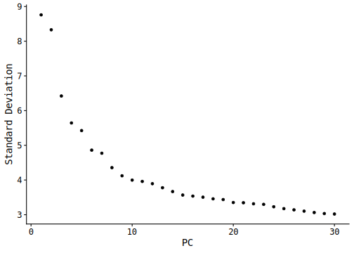<!-- -->

**Top 10 PCs allowed to obtain lesser separation of cells with regard to
replicates, however, 15 provided with better resolution of clusters.**

### UMAP

``` r
title_list <- c("patient", "diagnosis", "type of biopsy", "replicate")
plot_list <- DimPlot(ds_cf2, group.by = c("pat", "diag", "type", "rep"), combine = F)

for (i in 1:length(plot_list)) {

  plot_list[[i]] <- plot_list[[i]] + ggtitle(label = title_list[i])
}

plot <- ggarrange(plotlist = plot_list, align = "v")

annotate_figure(plot, top = text_grob("UMAP of PCA results", face = "bold", size = 18))
```

<!-- -->

### Correlation of metadata and PCs

``` r
# adapted from https://jdblischak.github.io/singlecell-qtl/pca-variable.html
get_r2 <- function(x, y) {
  stopifnot(length(x) == length(y))
  model <- lm(y ~ x)
  stats <- summary(model)
  return(stats$adj.r.squared)
}
covariates <- ds_cf2@meta.data

pcs <- ds_cf2@reductions$pca@cell.embeddings[,1:30]

r2 <- matrix(NA, nrow = ncol(covariates), ncol = ncol(pcs),
             dimnames = list(colnames(covariates), colnames(pcs)))
for (cov in colnames(covariates)) {
  for (pc in colnames(pcs)) {
    r2[cov, pc] <- get_r2(covariates[, cov], pcs[, pc])
  }
}

heatmap(r2, cexCol = 1)
```

<!-- -->

### PCs

``` r
DimPlot(ds_cf2, group.by = c("pat", "diag", "type", "rep"), reduction = "pca")
```

<!-- -->

### Inter-replicate variance

``` r
p1 <- DimPlot(ds_cf2, split.by = "pat", group.by = "rep", reduction = "pca")
p2 <- DimPlot(ds_cf2, split.by = "pat", group.by = "rep")

p1 + p2
```

<!-- -->

### Heatmaps of genes with highest PC scores

#### First 20 PCs of all patients

``` r
dim_plot_pca <- DimHeatmap(ds_cf2, dims = 1:20, nfeatures = 20, balanced = TRUE, fast = F, combine = F)

for (i in 1:length(dim_plot_pca)) {
  
  pc <- paste0("PC_", i)
  
  dim_plot_pca[[i]] <- dim_plot_pca[[i]] + theme(legend.position = "none", axis.text.y = element_text(size = 11),
          plot.title = element_text(size = 14)) +
          ggtitle(label = pc)
  
}

ggarrange(plotlist = dim_plot_pca, align = "v", ncol = 3, nrow = 7, common.legend = T, legend = "right")
```

<!-- -->

#### PC1 of each patient

``` r
plot_pat_dim_heat <- function (data, patient) {

  DimHeatmap(subset(data, subset = pat == patient), nfeatures = 30,  dims = 1, balanced = TRUE, fast = F) +
    theme(legend.position = "none", axis.text.y = element_text(size = 11),
          plot.title = element_text(size = 14)) +
    ggtitle(label = patient)

  }

pat_dim_heat <- lapply(unique(ds_cf2$pat), plot_pat_dim_heat, data = ds_cf)
ggarrange(plotlist  = pat_dim_heat, align = "v", common.legend = T, legend = "right")
```

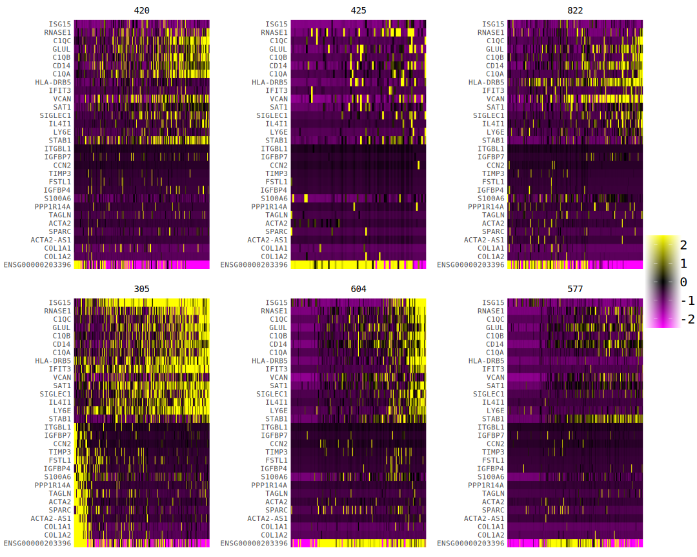<!-- -->

### Variable features

Top 22 variable genes are annotated.

``` r
top22_c <- head(VariableFeatures(ds_cf2), 22)

p_var_c <- VariableFeaturePlot(ds_cf2)
LabelPoints(p_var_c, points = top22_c, repel = T, xnudge = .2, ynudge = 1, max.overlaps = 20)
```

    ## When using repel, set xnudge and ynudge to 0 for optimal results

<!-- -->

**Top 22 most variable genes**

``` r
FeaturePlot(ds_cf2, features = c('nFeature_RNA','nCount_RNA', top22_c), pt.size = 1, reduction = 'umap', slot = "scale.data") & 
  theme(plot.title = element_text(size = 12),
        legend.text = element_text(size = 9),
        axis.title = element_text(size = 10))
```

<!-- -->

``` r
top22_c_an <- data.table(symbol = top22_c)
gt_s_an <- setDT(grch38[c("symbol", "description")])

top22_c_an <- gt_s_an[top22_c_an, on = .(symbol), mult = 'first']

knitr::kable(top22_c_an, caption = "**Top 22 most variable genes**")
```

| symbol          | description                                              |
|:----------------|:---------------------------------------------------------|
| SPP1            | secreted phosphoprotein 1                                |
| SFTPB           | surfactant protein B                                     |
| ENSG00000203396 | NA                                                       |
| KRT18           | keratin 18                                               |
| ZNF717          | zinc finger protein 717                                  |
| COL14A1         | collagen type XIV alpha 1 chain                          |
| COL6A1          | collagen type VI alpha 1 chain                           |
| KRT19           | keratin 19                                               |
| CRYAB           | crystallin alpha B                                       |
| COL3A1          | collagen type III alpha 1 chain                          |
| ISG15           | ISG15 ubiquitin like modifier                            |
| LTBP2           | latent transforming growth factor beta binding protein 2 |
| COL18A1         | collagen type XVIII alpha 1 chain                        |
| SAA1            | serum amyloid A1                                         |
| COL1A1          | collagen type I alpha 1 chain                            |
| LTB             | lymphotoxin beta                                         |
| IGF2            | insulin like growth factor 2                             |
| SAMD15          | sterile alpha motif domain containing 15                 |
| COL11A1         | collagen type XI alpha 1 chain                           |
| PTGDS           | prostaglandin D2 synthase                                |
| AHNAK2          | AHNAK nucleoprotein 2                                    |
| COL1A2          | collagen type I alpha 2 chain                            |


### Clustering

``` r
ds_cf2 <- FindNeighbors(ds_cf2, verbose = FALSE, dims = 1:15) %>%
  FindClusters(resolution = 0.5, verbose = FALSE)
```

``` r
title_list <- c("patient", "diagnosis", "type of biopsy", "replicate")
plot_list <- DimPlot(ds_cf2, group.by = c("pat", "diag", "type", "rep"),  pt.size = 1, combine = F)

for (i in 1:length(plot_list)) {

  plot_list[[i]] <- plot_list[[i]] + ggtitle(label = title_list[i])
}

p1 <- ggarrange(plotlist = plot_list, align = "v")

alpha_colors <- hue_pal()(10) #  number of colors equal to number of clusters - required to change the alpha

p2 <- DimPlot(ds_cf2, pt.size = 2, label = T, cols = alpha(alpha_colors, .6), reduction = "umap") + 
  labs(title = "clusters") + 
  theme(plot.title = element_text(hjust = .5))


plot <- ggarrange(p1, p2, widths = c(3, 2))

annotate_figure(plot, top = text_grob("UMAP of PCA results and clustering analysis", face = "bold", size = 18))
```

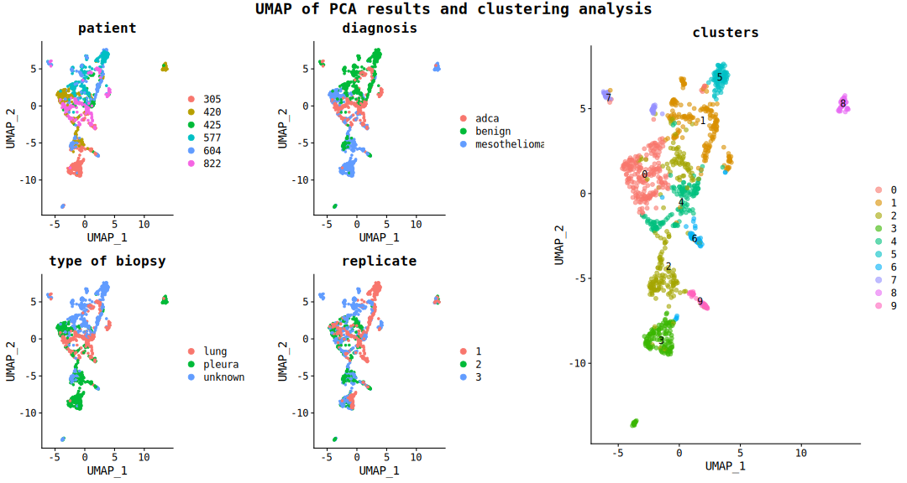<!-- -->

## DE analysis

### DE with MAST

**Possibly the best algorithm for sc data.**

``` r
c_markers_mast <- FindAllMarkers(ds_cf2, verbose = T, test.use = "MAST")
```

Plot most differentially expressed genes

``` r
setDT(c_markers_mast)
highest_de <- c_markers_mast[order(avg_log2FC, decreasing = T), .SD[1:5] ,by = cluster][p_val < 5e-2][order(cluster)]
lowest_de <- c_markers_mast[order(avg_log2FC), .SD[1:5] ,by = cluster][p_val < 5e-2][order(cluster)]

most_diff_c <- merge(highest_de, lowest_de, all = T)

ggplot(c_markers_mast, aes(x = cluster, y = avg_log2FC, color = -log10(p_val))) +
  geom_point(position = position_quasirandom()) +
  geom_text_repel(most_diff_c, mapping = aes(label = gene),
                  size = 5, color = "red", fontface = "bold", 
                  force = 3, min.segment.length = 0,
                  segment.size = 1) +
  geom_hline(yintercept = 0) +
  scale_color_continuous(trans = "log", breaks = c(1, 10, 50, 115)) + 
  ggtitle(label = "Fold change and p-values of differentially expressed genes among clusters", 
          subtitle = "most differentially expressed genes are labeled") +
  theme(legend.title.align = 1,
      legend.justification = c("center"))  
```

    ## Warning: ggrepel: 3 unlabeled data points (too many overlaps). Consider
    ## increasing max.overlaps

<!-- -->

``` r
highest_de <- c_markers_mast[order(avg_log2FC, decreasing = T), .SD[1:10] ,by = cluster][p_val < 5e-2][order(cluster)]

heat_cols <- hcl.colors(3, palette = "gnbu")

DoHeatmap(ds_cf2, group.by = "seurat_clusters", features = highest_de$gene, angle = 0) + 
  guides(color = "none") +
  scale_fill_gradient2("Average log2 fold change", low = heat_cols[1], mid = heat_cols[2], high = heat_cols[3], guide = guide_colourbar(title.position = "top")) +
  ggtitle(label = "Expression of top markers of clusters of cells found in the dataset")
```

    ## Warning in DoHeatmap(ds_cf2, group.by = "seurat_clusters", features =
    ## highest_de$gene, : The following features were omitted as they were not found
    ## in the scale.data slot for the SCT assay: SLC5A3, ENSG00000268854, MASP1,
    ## ENSG00000271755, SDC2, GPAM, FARP1, STK24, COL8A1, HHIP-AS1, CENPW, PTTG1,
    ## STMN1, TBC1D20, ERICH2-DT, KDELR2, HBP1, KARS1, DSE, LMO2, EMC3, LDLR, HNRNPAB,
    ## MCRIP2, ZNF273, BICD2, TGFBR2, LRP1, TNFSF12-TNFSF13, MRC1, TNFSF13, ITGAM

    ## Scale for fill is already present.
    ## Adding another scale for fill, which will replace the existing scale.

<!-- -->

``` r
highest_de <- c_markers_mast[order(avg_log2FC, decreasing = T), .SD[1:10] ,by = cluster][p_val < 5e-2][order(cluster)]

heat_cols <- hcl.colors(3, palette = "gnbu")

DoHeatmap(ds_cf2, group.by = "diag", features = highest_de$gene, angle = 0) + 
  guides(color = "none") +
  scale_fill_gradient2("Average log2 fold change", low = heat_cols[1], mid = heat_cols[2], high = heat_cols[3], guide = guide_colourbar(title.position = "top")) +
  ggtitle(label = "Expression of top markers of clusters of cells across diagnoses")
```

    ## Warning in DoHeatmap(ds_cf2, group.by = "diag", features = highest_de$gene, :
    ## The following features were omitted as they were not found in the scale.data
    ## slot for the SCT assay: SLC5A3, ENSG00000268854, MASP1, ENSG00000271755, SDC2,
    ## GPAM, FARP1, STK24, COL8A1, HHIP-AS1, CENPW, PTTG1, STMN1, TBC1D20, ERICH2-DT,
    ## KDELR2, HBP1, KARS1, DSE, LMO2, EMC3, LDLR, HNRNPAB, MCRIP2, ZNF273, BICD2,
    ## TGFBR2, LRP1, TNFSF12-TNFSF13, MRC1, TNFSF13, ITGAM

    ## Scale for fill is already present.
    ## Adding another scale for fill, which will replace the existing scale.

<!-- -->


## Cells - diagnosis separated

### Cells

#### Normalization, scaling and dimensionality reduction

Cells were split depending on patient’s diagnosis to look at
inter-diagnosis variation.

``` r
ds_cf_diag <- SplitObject(ds_cf2, split.by = "diag")

map.list.seurat <- function(x) {
  SCTransform(x, vst.flavor = "v2", verbose = FALSE) %>%
  RunPCA(npcs = 30, verbose = FALSE) %>%
  RunUMAP(reduction = "pca", dims = 1:30, verbose = FALSE)  
}
  

ds_cf_diag <- lapply(ds_cf_diag, map.list.seurat)

# ds_cf_diag <- merge(ds_cf_diag_list[[1]], y = ds_cf_diag_list[-1])
```

#### PCs

**Elbow Plot** 13 top PCs should be enough to obtain proper clustering for each diagnosis.

``` r
plots.names <- names(ds_cf_diag)

plot.list <- lapply(plots.names, FUN = function(x) { ElbowPlot(ds_cf_diag[[x]]) +
                                                               plot_annotation(title = x)
                                                             })

ggarrange(plotlist = plot.list, ncol = 1, nrow = 3)
```

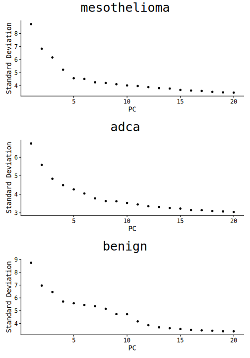<!-- -->

**Top variable genes**

``` r
plots.names <- names(ds_cf_diag)

top10_c_diag <- function(x) {
  
  top10_c <- head(VariableFeatures(ds_cf_diag[[x]]), 10) # No need to use FindVariableFeatures, as SCTransform does that
  p_var_c <- VariableFeaturePlot(ds_cf_diag[[x]]) + 
                  plot_annotation(title = x)
  
  LabelPoints(p_var_c, points = top10_c, repel = T)
  
  }

plot.list <- lapply(plots.names, top10_c_diag)
```

    ## When using repel, set xnudge and ynudge to 0 for optimal results
    ## When using repel, set xnudge and ynudge to 0 for optimal results
    ## When using repel, set xnudge and ynudge to 0 for optimal results

``` r
ggarrange(plotlist = plot.list, ncol = 1, nrow = 3)
```

    ## Warning: ggrepel: 3 unlabeled data points (too many overlaps). Consider
    ## increasing max.overlaps

<!-- -->

#### UMAP

``` r
plots.names <- names(ds_cf_diag)

plot.list <- lapply(plots.names, FUN = function(x) { DimPlot(ds_cf_diag[[x]], group.by = c("pat", "rep")) +
                                                               plot_annotation(title = x)
                                                             })

ggarrange(plotlist = plot.list, ncol = 1, nrow = 3)
```

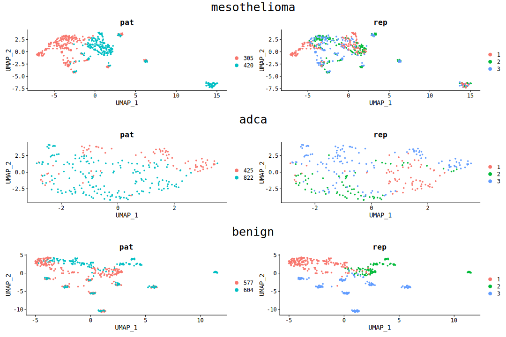<!-- -->

``` r
plots.names <- names(ds_cf_diag)

plot.list <- lapply(plots.names, FUN = function(x) { FeaturePlot(ds_cf_diag[[x]], features = c("nCount_RNA", "nFeature_RNA")) +
                                                               plot_annotation(title = x)
                                                             })

ggarrange(plotlist = plot.list, ncol = 1, nrow = 3)
```

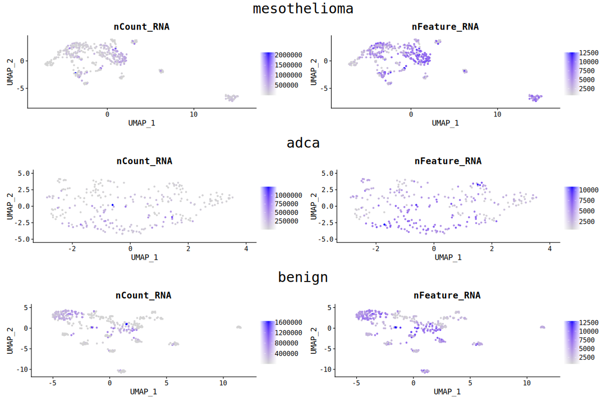<!-- -->
